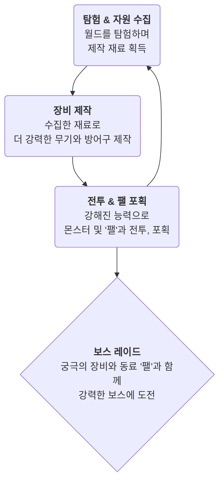
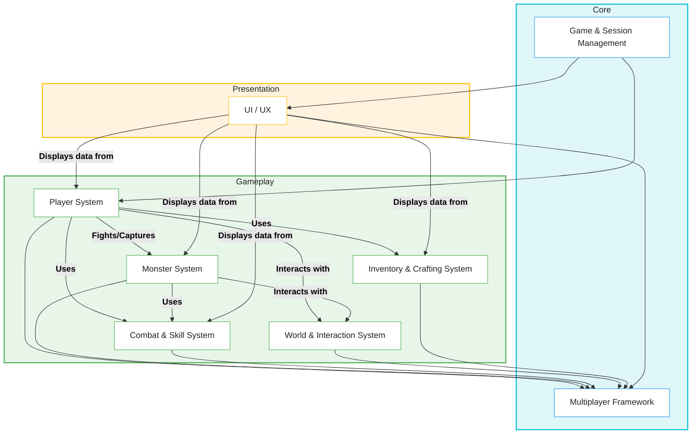

# 1.1. 프로젝트 개요 (Project Overview)

## 1.1.1. 프로젝트 비전과 목표

#### 프로젝트명: Sonheim
#### 장르: 멀티플레이어 3인칭 액션 RPG

**Sonheim**은 단순히 화려한 액션을 선보이는 게임을 넘어, 플레이어가 동료들과 함께 월드를 탐험하고, 신비로운 생명체 '팰(Pal)'을 포획하며, 강력한 장비를 제작하여 함께 성장하는 **지속 가능한 온라인 RPG 세계**를 만드는 것을 목표로 합니다.

이 프로젝트는 Palworld, Genshin Impact, Legend of Zelda 등에서 영감을 받은 핵심 메카닉들을 Unreal Engine 5의 강력한 기능을 기반으로 재해석하고, 안정적인 멀티플레이어 환경에서 유기적으로 결합하는 기술적 도전을 담고 있습니다.

---

## 1.1.2. 핵심 게임플레이 루프

Sonheim의 플레이어는 다음과 같은 핵심 활동을 반복하며 성장합니다.

*   **탐험과 수집**: 광활한 월드를 탐험하며 채집, 채광, 벌목, 사냥 등 다양한 방법으로 제작에 필요한 재료를 수집합니다.
*   **제작과 성장**: 수집한 재료를 사용하여 무기, 방어구, 악세서리, 도구 등 다양한 아이템을 제작하고 캐릭터를 성장시킵니다.
*   **전투와 포획**: 실시간 액션 전투를 통해 몬스터를 사냥하고, 특별한 생명체인 '팰'을 포획하여 동료로 삼습니다.
*   **협력**: 친구들과 함께 탐험하고, 강력한 보스를 공략하며, 자원을 공유하는 등 멀티플레이어 환경에서 협력의 재미를 느낄 수 있습니다.

---

## 1.1.3. 핵심 설계 원칙

지속 가능한 확장성을 위해 다음과 같은 핵심 설계 원칙을 수립했습니다. 각 원칙에 대한 상세한 구현 방식은 이어지는 문서에서 확인할 수 있습니다.

#### 1. 서버 권위 구조 (Server-Authoritative)
모든 게임 규칙과 상태의 최종 판정은 서버에서만 이루어집니다. 이는 플레이어 간의 공정성을 보장하고, 클라이언트 변조를 통한 치트를 원천적으로 방지하는 가장 중요한 설계 원칙입니다. (자세한 내용은 [[2.1 서버 권위 원칙|2.1_Server_Authority_Architecture]]에서 확인)

#### 2. 컴포넌트 기반 설계 (Component-Based)
HP, 인벤토리 등 재사용 가능한 기능들을 독립적인 부품(컴포넌트)으로 만들어, 필요에 따라 조립하여 사용하는 설계 방식입니다. 이는 코드의 재사용성과 확장성을 극대화합니다. (자세한 내용은 [[2.3 컴포넌트 기반 설계|2.3_Component_Based_Design]]에서 확인)

#### 3. 데이터 주도 설계 (Data-Driven)
아이템의 능력치, 몬스터의 스탯 등 게임의 핵심 내용을 코드에서 분리하여 데이터 테이블로 관리합니다. 이를 통해 프로그래머의 개입 없이 기획자가 직접 콘텐츠를 수정하고 확장할 수 있습니다. (자세한 내용은 [[2.2 데이터 주도 설계|2.2_Data_Driven_Design]]에서 확인)

#### 4. 관심사의 분리 (Separation of Concerns)
플레이어의 입력(`PlayerController`), 데이터(`PlayerState`), 외형(`Pawn`)처럼 각 클래스와 시스템이 하나의 명확한 책임만 갖도록 설계하여 코드의 복잡도를 낮추고 유지보수성을 높입니다. (자세한 내용은 [[2.4 플레이어 클래스 아키텍처|2.4_Player_Class_Architecture]]에서 확인)

---

## 1.1.4. 아키텍처 (Architecture)

Sonheim의 아키텍처는 크게 **코어(Core)**, **게임플레이(Gameplay)**, **프레젠테이션(Presentation)** 의 3개 계층으로 나눌 수 있습니다.

이 아키텍처를 기반으로, 플레이어는 세션에 참여하고, 월드와 상호작용하며, 전투와 제작을 통해 성장하는 핵심 게임플레이 루프를 경험하게 됩니다. 각 시스템의 상세한 구현 방식은 이어지는 문서들에서 설명합니다.

1.  **세션 참여:** 플레이어는 로비 UI를 통해 게임 세션에 참여하여 멀티플레이 월드에 진입합니다.
2.  **탐험 및 상호작용:** 월드를 탐험하며 `InteractableInterface`를 구현한 자원, 건물 등과 상호작용합니다.
3.  **전투 및 포획:** 서버 주도 AI를 가진 몬스터와 전투를 벌이고, 약화시킨 몬스터를 포획하여 `PalInventoryComponent`에 추가합니다.
4.  **제작 및 성장:** 획득한 자원으로 아이템을 제작하고, 전투를 통해 캐릭터의 레벨과 장비를 성장시킵니다.
5.  **순환:** 성장한 능력을 바탕으로 더 어려운 지역을 탐험하고 강력한 몬스터에 도전하는 과정이 반복됩니다.