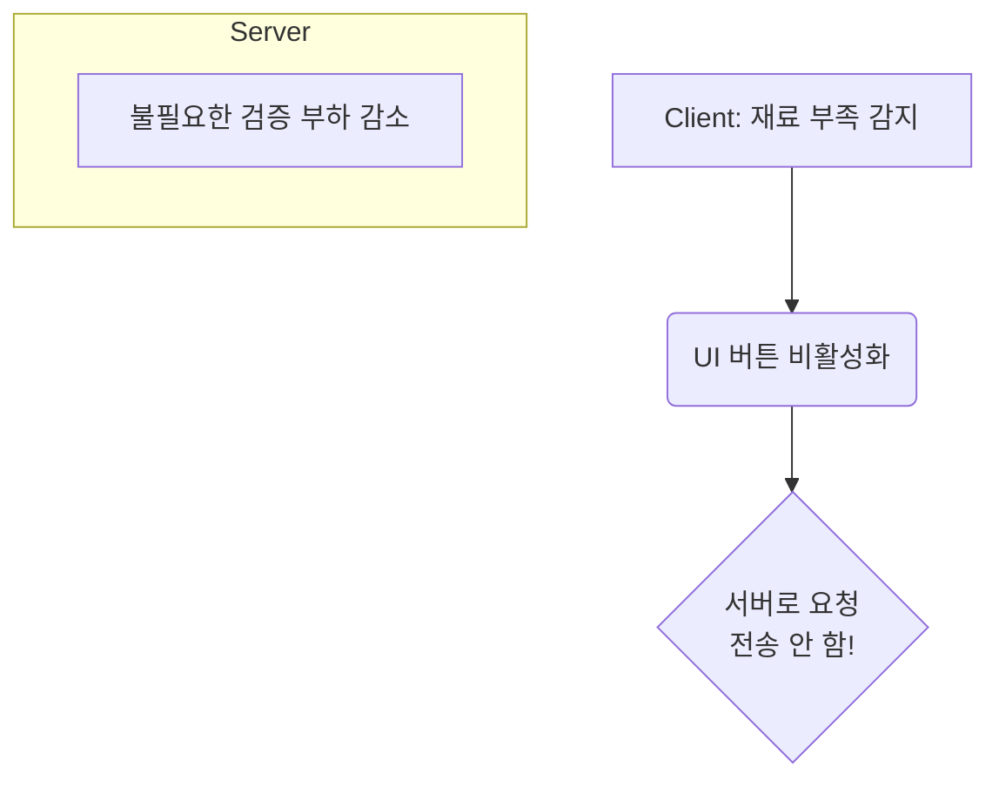
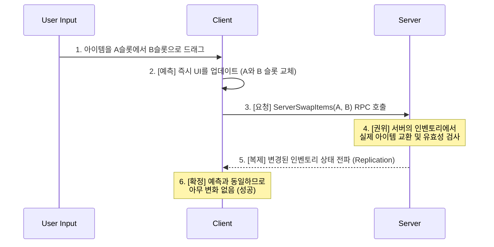

# 2.1. 서버 권위 아키텍처: 신뢰할 수 없는 클라이언트와의 동기화

> ### 모든 클라이언트의 요청은 서버에서 검증되고, 모든 게임의 상태는 서버로부터 동기화된다.
> Sonheim은 멀티플레이어 게임의 보안과 데이터 일관성을 위해, 모든 게임 로직의 최종 판정권을 서버만 갖는 **서버 권위(Server-Authoritative)** 아키텍처를 채택했습니다. 이 문서는 Sonheim이 어떻게 다음의 핵심 기술들을 통해 안정적이고 효율적인 멀티플레이 환경을 구축했는지 실제 구현 사례를 통해 증명합니다.
> 
> *   **핵심 원칙:** **RPC**와 **Replication**의 역할을 명확히 분리하여 데이터 정합성 문제를 근본적으로 해결한 방법
> *   **지능적인 상태 동기화:** `PreReplication`, `COND_OwnerOnly`, `FastArraySerializer` 등 언리얼의 고급 복제 기술로 대규모 월드의 **네트워크 부하를 최적화**한 방법
> *   **서버 검증과 최적화:** **단일 진입점, 역할 분기** 패턴으로 서버 권위 로직을 캡슐화하고, **클라이언트 사전 검증**을 통해 서버의 부하를 줄이는 방법
> *   **반응성 높은 UX:** 서버 권위를 해치지 않으면서 **클라이언트 예측**을 보완적으로 사용하여 쾌적한 사용자 경험을 제공하는 방법

---

## 2.1.1. 핵심 원칙: RPC와 Replication의 역할 분리

안정적인 멀티플레이 환경을 구축하기 위한 첫걸음은 언리얼 엔진의 두 가지 핵심 동기화 도구인 RPC와 Replication의 역할을 명확히 이해하고 분리하는 것입니다.

### 2.1.1.1. 상태는 Replication으로 (State is for Replication)

> **어떻게 나중에 접속한 플레이어가 이미 죽은 몬스터를 보게 할 것인가?**

이 질문은 **왜 '상태' 동기화에 Replication을 반드시 사용해야 하는지**를 명확하게 보여줍니다. 만약 몬스터의 죽음을 `NetMulticast` RPC로 처리했다면, 그 RPC가 발송된 이후에 게임에 접속한 플레이어는 죽음 신호를 받지 못해 이미 죽은 몬스터를 살아있는 것으로 보는 심각한 데이터 불일치 문제를 겪게 됩니다.

Sonheim은 이 문제를 **상태 변수 복제**로 해결합니다. `AAreaObject`의 `bIsDead`라는 `bool` 상태 변수는 `ReplicatedUsing`으로 지정되어, 서버에서 값이 변경되면 모든 클라이언트(나중에 접속한 클라이언트 포함)에게 `bIsDead = true`라는 '상태'가 전파됩니다. 이 값을 수신한 클라이언트는 `OnRep_OnDie`를 실행하여 죽음에 따른 시각적 처리를 수행함으로써, 언제나 정확한 게임 상태를 보장받습니다.

> [View on GitHub](https://github.com/chungheonLee0325/Sonheim/blob/main/Sonheim/Source/Sonheim/AreaObject/Base/AreaObject.h#L133)
```cpp
// Source/Sonheim/AreaObject/Base/AreaObject.h
UPROPERTY(ReplicatedUsing = OnRep_OnDie)
	bool bIsDead = false;
```

### 2.1.1.2. 행위는 RPC로 (Actions are for RPC)

RPC(Remote Procedure Call)는 상태(Replication)만으로 처리하기 어려운 **일회성 행위**를 동기화하는 데 필수적입니다. Sonheim에서는 RPC를 다음 세 가지 주요 목적으로 사용합니다.

1.  **행위 요청 (Client-to-Server):** 클라이언트가 특정 행동을 하고 싶다고 서버에 **요청**하는 가장 일반적인 경우입니다. (예: `ServerAddItem`)
2.  **일회성 명령 (Server-to-Client):** 서버가 검증을 마친 후, 특정 클라이언트에게 UI를 열거나 특정 효과를 재생하라고 **명령**하는 경우입니다. (예: `Client_OpenCraftingUI`)
3.  **전파되는 시각 효과 (Multicast):** 상태와 무관하게, 모든 클라이언트에게 동시에 보여줘야 하는 순수한 시각/청각 효과(VFX/SFX)를 **전파**하는 경우입니다. (예: `Multicast_PlayHitEffect`)

이처럼 "지속되어야 할 정보는 Replication으로, 일회성 사건은 RPC로" 처리하는 명확한 역할 분리는 Sonheim의 모든 시스템을 관통하는 핵심 설계 원칙입니다.

---

## 2.1.2. 지능적인 상태 동기화 (Advanced Replication)

> **어떻게 수백 개의 보관함과 인벤토리 정보를 효율적으로 동기화하는가?**

Sonheim은 언리얼 엔진의 고급 복제 기능을 적극 활용하여, 대규모 월드에서도 네트워크 부하를 최소화하는 지능적인 동기화 시스템을 구축했습니다.

### 2.1.2.1. 사례 1: 구독 기반 복제 (Subscription-based Replication)
월드에 수백 개의 보관함이 있어도, 플레이어가 상호작용하지 않는 보관함의 아이템 정보를 동기화하는 것은 심각한 네트워크 낭비입니다. `UContainerComponent`는 **`PreReplication`** 함수를 오버라이드하여 이 문제를 해결합니다. (상세: [[6.4 보관함 시스템|6.4_Container_System]])

> [View on GitHub](https://github.com/chungheonLee0325/Sonheim/blob/main/Sonheim/Source/Sonheim/GameObject/Buildings/Utility/ContainerComponent.cpp#L26)
```cpp
// Source/Sonheim/GameObject/Buildings/Utility/ContainerComponent.cpp
void UContainerComponent::PreReplication(IRepChangedPropertyTracker& ChangedPropertyTracker)
{
	Super::PreReplication(ChangedPropertyTracker);

	// 구독자(UI를 열어본 플레이어)가 있을 때만 아이템 목록을 복제하도록 동적으로 설정
	const bool bActive = Subscribers.Num() > 0;
	DOREPLIFETIME_ACTIVE_OVERRIDE(UContainerComponent, RepContainerItems, bActive);
}
```
이 코드는 보관함의 아이템 목록(`RepContainerItems`)을 복제하기 직전에, 현재 이 보관함의 UI를 열어보고 있는 플레이어(`Subscribers`)가 한 명이라도 있는지 확인합니다. 만약 구독자가 아무도 없다면 `DOREPLIFETIME_ACTIVE_OVERRIDE` 매크로를 통해 해당 변수의 복제를 동적으로 건너뜁니다. 이 **구독 기반 동적 복제** 덕분에, 유휴 상태의 모든 보관함은 서버에 어떠한 네트워크 부하도 발생시키지 않습니다.

### 2.1.2.2. 사례 2: 델타 복제 및 소유권 기반 복제
플레이어의 인벤토리는 데이터가 크고 변경이 잦지만, 오직 자기 자신에게만 정보가 보이면 됩니다. `UInventoryComponent`는 두 가지 기술로 이 문제를 해결합니다. (상세: [[4.2 인벤토리 시스템|4.2_Inventory_System]])

*   **소유권 기반 복제 (`COND_OwnerOnly`):** 인벤토리 데이터는 `COND_OwnerOnly` 조건으로 복제되어, 각 플레이어가 오직 **자기 자신의 인벤토리 데이터만** 수신하도록 하여 불필요한 정보 전송을 막고 보안을 강화합니다.
*   **델타 복제 (`FastArraySerializer`):** 아이템 목록을 일반 `TArray`가 아닌 `FFastArraySerializer` 기반의 커스텀 구조체로 관리합니다. 이는 배열 전체가 아닌, **변경된 아이템 슬롯만** 클라이언트에 전송하는 **델타 복제**를 가능하게 하여 네트워크 효율을 극대화합니다.

> [View on GitHub](https://github.com/chungheonLee0325/Sonheim/blob/main/Sonheim/Source/Sonheim/AreaObject/Player/Utility/InventoryComponent.cpp#L23)
```cpp
// Source/Sonheim/AreaObject/Player/Utility/InventoryComponent.cpp
void UInventoryComponent::GetLifetimeReplicatedProps(...) const
{
    // ...
    // 1. 소유자에게만 복제
    DOREPLIFETIME_CONDITION(UInventoryComponent, RepItems, COND_OwnerOnly);
}

// Source/Sonheim/AreaObject/Player/Utility/InventoryComponent.h
USTRUCT(BlueprintType)
struct FRepInventoryList : public FFastArraySerializer // 2. 델타 복제
{
    GENERATED_BODY()
    // ...
};
```

#### 설계 결정 (The Why)
초기에는 모든 데이터를 일반 `TArray`로 복제하려 했으나, 이는 대규모 월드에서 심각한 성능 저하를 유발했습니다. **"데이터는 누구에게, 언제, 어떤 내용이 필요한가?"** 라는 관점에서 문제를 재분석했고, 그 결과 언리얼 엔진의 저수준 복제 제어 기능을 학습하여 도입했습니다. 이 결정은 직접 복잡한 시스템을 구현하는 것보다 훨씬 효율적이고 안정적인 결과를 가져왔으며, 대규모 멀티플레이 환경의 성능을 극적으로 최적화할 수 있다는 귀중한 경험을 얻게 했습니다.

---

## 2.1.3. 서버 검증과 최적화

### 2.1.3.1. 구현 패턴: 단일 진입점, 역할 분기 (Single Entry Point, Role-Splitting)

> **어떻게 네트워크 로직을 캡슐화하여 깔끔한 API를 제공하는가?**

Sonheim의 많은 컴포넌트들은 외부에는 단일 공개 API(예: `AddItem`)를 제공하지만, 내부적으로는 호출자의 권한(서버/클라이언트)에 따라 역할을 분기하는 패턴을 사용합니다. 이는 네트워크 관련 복잡성을 컴포넌트 내부에 완벽하게 캡슐화하여, 외부 호출자가 네트워크를 신경 쓸 필요 없이 API를 사용할 수 있게 합니다.

`UInventoryComponent::AddItem`이 이 패턴의 완벽한 예시입니다.

> [View on GitHub](https://github.com/chungheonLee0325/Sonheim/blob/main/Sonheim/Source/Sonheim/AreaObject/Player/Utility/InventoryComponent.cpp#L288)
```cpp
// Source/Sonheim/AreaObject/Player/Utility/InventoryComponent.cpp
bool UInventoryComponent::AddItem(int32 ItemID, int32 Count, bool bIsDirectAcquisition)
{
    // 서버일 경우, 실제 아이템 추가 로직을 수행
	if (GetOwnerRole() == ROLE_Authority)
	{
		// ... (실제 데이터 변경 로직)
	}
    // 클라이언트일 경우, 서버에 RPC로 '요청'
	else
	{
		ServerAddItem(ItemID, Count, bIsDirectAcquisition);
	}
	return true; // 클라이언트는 성공 여부를 예측하고 즉시 반환
}
```
어떤 액터든 `InventoryComponent`에 아이템을 추가하고 싶을 때, `HasAuthority()`를 직접 체크할 필요 없이 그저 `AddItem` 함수를 호출하기만 하면 됩니다. 함수가 알아서 서버에서는 실제 로직을, 클라이언트에서는 서버로의 RPC 요청을 실행해주므로, API의 사용성이 크게 향상되고 코드의 가독성과 유지보수성이 높아집니다.

### 2.1.3.2. 사례: 동시성 제어 (Concurrency Control)
여러 플레이어가 하나의 제작대를 동시에 조작하려 할 때 발생할 수 있는 데이터 충돌(Race Condition) 문제는 `ACraftingStation`의 `UIOwner` 변수를 통해 서버에서 통제됩니다. (상세: [[6.5 제작 시스템|6.5_Crafting_System]])

> [View on GitHub](https://github.com/chungheonLee0325/Sonheim/blob/main/Sonheim/Source/Sonheim/GameObject/Buildings/Crafting/CraftingStation.cpp#L438)
```cpp
// Source/Sonheim/GameObject/Buildings/Crafting/CraftingStation.cpp
void ACraftingStation::ServerRequestOpenUI_Implementation(ASonheimPlayer* Player)
{
    if (!HasAuthority() || !Player) return;

    // [서버 검증] 이미 다른 플레이어가 UI를 사용 중인지 확인한다.
    if (UIOwner && UIOwner != Player) return;
    
    // 검증 통과 시, 해당 플레이어를 '소유자'로 지정하여 잠근다.
    UIOwner = Player;
    
    // [서버 명령] 클라이언트에게 UI를 열도록 명령(Command)한다.
    if (auto* PC = Cast<ASonheimPlayerController>(Player->GetController()))
    {
        PC->Client_OpenCraftingUI(this);
    }
}
```
이 코드에서 RPC는 두 가지 역할을 명확히 보여줍니다. `ServerRequestOpenUI`는 클라이언트의 **요청(Request)**이고, `Client_OpenCraftingUI`는 서버의 검증이 끝난 후 클라이언트에게 내리는 일회성 **명령(Command)**입니다. 이처럼 서버의 단일 상태 변수(`UIOwner`)를 통한 검증 로직 하나만으로, 복잡한 동시성 문제를 간단하고 명확하게 해결했습니다.

### 2.1.3.3. 최적화: 클라이언트 사전 검증 (Client-Side Pre-Validation)
서버는 보안을 위해 모든 요청을 반드시 검증해야 하지만, 클라이언트가 명백히 실패할 요청을 미리 차단해주면 서버의 부하를 크게 줄일 수 있습니다. 예를 들어, 제작에 필요한 재료가 부족할 경우, 클라이언트의 제작 UI는 제작 버튼 자체를 비활성화합니다. 이 **클라이언트 사전 검증** 덕분에 사용자는 즉각적인 피드백을 받고, 서버는 **유효하지 않은 요청을 처리하는 데 드는 불필요한 검증 부하를 줄일 수 있습니다.**



---

## 2.1.4. 보완 기술: 클라이언트 예측 (Client-Side Prediction)

서버 권위 아키텍처는 안정성을 보장하지만, 모든 행동이 서버의 응답을 기다려야 한다면 네트워크 지연(Lag)으로 인해 사용자 경험이 저하될 수 있습니다. Sonheim은 이를 보완하기 위해, UI와 같이 반응성이 중요한 일부 시스템에 **클라이언트 예측** 기술을 제한적으로 적용합니다. (상세: [[8.4 반응형 인벤토리 UX|8.4_Case_Study_Inventory_Interaction]])

인벤토리에서 아이템을 드래그 앤 드롭으로 옮기는 과정이 대표적인 예시입니다.



1.  **즉각적인 예측:** 사용자가 아이템을 옮기면, 클라이언트는 서버의 응답을 기다리지 않고 **즉시 UI를 업데이트**합니다.
2.  **비동기 요청:** 동시에, 서버에 `ServerSwapItems` RPC를 보내 실제 데이터 변경을 요청합니다.
3.  **서버의 검증 및 확정:** 서버는 요청을 검증하고 실제 데이터를 변경합니다. 이 변경된 상태는 일반적인 변수 복제(Replication)를 통해 다시 클라이언트에 전달됩니다.

만약 예측이 맞았다면 클라이언트에서는 아무런 변화도 일어나지 않으며, 사용자는 자신의 행동이 즉각적으로 처리된 것처럼 느끼게 됩니다. 이처럼 클라이언트 예측은 서버의 권위를 침범하지 않으면서, 네트워크 지연을 감추고 쾌적한 사용자 경험을 제공하는 매우 효과적인 보완 기술입니다.

---

## 2.1.5. 관련 시스템 (Related Systems)

*   [[4.2 인벤토리 시스템|4.2_Inventory_System]]
*   [[6.4 보관함 시스템|6.4_Container_System]]
*   [[6.5 제작 시스템|6.5_Crafting_System]]
*   [[7.1 이벤트 기반 UI 아키텍처|7.1_Event-Driven_UI_Architecture]]
*   [[8.4 반응형 인벤토리 UX|8.4_Case_Study_Inventory_Interaction]]
