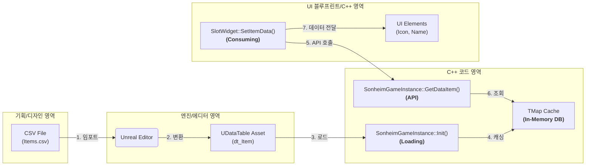

# 2.2. 데이터 주도 설계: SonheimGameType.h를 통한 월드 구축

> ### Sonheim에서는 어떻게 코드 한 줄 없이, 데이터 테이블에 행을 추가하는 것만으로 새로운 스킬, 몬스터, 아이템을 만들어내는가?
> Sonheim 프로젝트의 가장 핵심적인 설계 원칙은 **데이터 주도 아키텍처(Data-Driven Architecture)**입니다. 이는 게임의 '내용'(아이템, 스킬, 몬스터 스탯 등)을 코드에서 완전히 분리하여, 기획자가 프로그래머의 개입이나 재컴파일 없이 데이터 수정만으로 게임의 밸런스와 콘텐츠를 자유롭게 확장할 수 있도록 만드는 것을 목표로 합니다.
> 
> *   **중앙 설계도 (`SonheimGameType.h`):** 게임에 존재하는 모든 데이터의 구조를 단일 헤더 파일에 정의하여, 프로젝트의 데이터 청사진을 한눈에 파악하고 일관성을 유지합니다.
> *   **인메모리 DB (`GameInstance`):** 게임 시작 시 모든 데이터 테이블을 `GameInstance`의 `TMap`에 캐싱하여, 런타임 중에는 파일 I/O 없이 O(1)의 매우 빠른 속도로 데이터에 접근합니다.
> *   **기획자 친화적 편집 환경:** `EditCondition`과 같은 언리얼 엔진의 메타데이터를 적극 활용하여, 복잡하게 연결된 데이터도 기획자가 실수 없이 직관적으로 편집할 수 있는 환경을 제공합니다.

---

## 2.2.1. 게임 월드의 설계도, SonheimGameType.h

모든 데이터 주도 설계의 시작은 **데이터의 구조를 정의**하는 것입니다. Sonheim에서는 `Source/Sonheim/ResourceManager/SonheimGameType.h` 라는 단일 헤더 파일에, 게임에 필요한 모든 데이터 구조체를 중앙 관리합니다. 이 파일은 단순한 타입 정의 헤더를 넘어, **게임 월드의 모든 것을 규정하는 거대한 설계도(Grand Schema)** 역할을 수행합니다.

`FItemData`, `FSkillData`, `FAreaObjectData` 등 게임의 모든 핵심 요소가 이 파일 안에서 `FTableRowBase`를 상속받는 `USTRUCT`로 정의되어 있으며, 이는 데이터 구조의 일관성을 유지하고, 모든 데이터의 청사진을 한눈에 파악할 수 있게 하는 매우 강력한 설계적 선택입니다.

> [View on GitHub](https://github.com/chungheonLee0325/Sonheim/blob/main/Sonheim/Source/Sonheim/ResourceManager/SonheimGameType.h)
```cpp
// Source/Sonheim/ResourceManager/SonheimGameType.h

// 아이템의 모든 것을 정의합니다.
USTRUCT(BlueprintType)
struct FItemData : public FTableRowBase { ... };

// 스킬의 모든 것을 정의합니다.
USTRUCT(BlueprintType)
struct FSkillData : public FTableRowBase { ... };

// 캐릭터의 모든 것을 정의합니다.
USTRUCT(BlueprintType)
struct FAreaObjectData : public FTableRowBase { ... };

// 레벨업 경험치를 정의합니다.
USTRUCT(BlueprintType)
struct FLevelData : public FTableRowBase { ... };

// ... 그 외 수많은 데이터 구조체들 ...
```

## 2.2.2. 데이터 파이프라인: GameInstance를 활용한 인메모리 DB

Sonheim의 데이터는 **`CSV 파일 -> UDataTable -> GameInstance 캐시 -> 게임 시스템`** 으로 이어지는 명확한 단방향 파이프라인을 통해 흐릅니다.



게임이 시작될 때, `USonheimGameInstance`의 `Init()` 함수는 에디터에 임포트된 모든 `UDataTable` 애셋을 로드하여, 런타임에 빠르게 접근할 수 있도록 `TMap<ID, Struct>` 형태의 메모리 캐시에 저장합니다. `GameInstance`는 게임 세션 내내 유지되는 싱글턴 객체이므로, 이 `TMap` 캐시가 바로 게임 세션 내내 유지되는 **인메모리 데이터베이스(In-Memory Database)** 역할을 수행하며, `GetDataItem(ItemID)`과 같은 표준화된 API를 통해 O(1)의 매우 빠른 속도로 데이터를 제공합니다.

> [View on GitHub](https://github.com/chungheonLee0325/Sonheim/blob/main/Sonheim/Source/Sonheim/GameManager/SonheimGameInstance.cpp#L93)
```cpp
// Source/Sonheim/GameManager/SonheimGameInstance.cpp
void USonheimGameInstance::Init()
{
    // ... 
    // dt_Item.dt_Item 애셋을 로드
    UDataTable* ItemDataTable = LoadObject<UDataTable>(...);
    if (nullptr != ItemDataTable)
    {
        // 모든 행을 순회하며
        for (const FName& RowName : ItemDataTable->GetRowNames())
        {
            FItemData* Row = ItemDataTable->FindRow<FItemData>(...);
            if (nullptr != Row)
            {
                // ItemID를 키로 하여 TMap 캐시에 저장
                dt_Item.Add(Row->ItemID, *Row);
            }
        }
    }
    // ... (다른 모든 데이터 테이블에 대해 반복) ...
}
```

## 2.2.3. 적용 사례: 데이터로 정의되는 Sonheim의 모든 것

이 아키텍처의 진정한 위력은 실제 게임 콘텐츠 제작 과정에서 드러납니다. 프로그래머는 데이터의 '구조'만 잘 정의해두면, 기획자는 데이터 테이블에 새로운 행을 추가하는 것만으로 게임의 콘텐츠를 무한히 확장할 수 있습니다.

### 사례 1: 데이터 기반 스킬 (`FSkillData`)
새로운 스킬을 추가하기 위해 코드를 작성할 필요가 없습니다. 기획자는 `dt_Skill` 데이터 테이블에 새로운 행을 추가하고, 다음과 같은 속성들을 채워 넣기만 하면 됩니다.

*   `SkillClass`: 스킬의 기본 로직을 담고 있는 `UBaseSkill` 자식 클래스
*   `StaminaCosts`: 스태미나 소모량과 소모 시점
*   `CoolTime`: 스킬 재사용 대기시간
*   `Montage`: 스킬 사용 시 재생할 애니메이션 몽타주
*   `AttackData`: 피해량, 공격 타입, 히트박스 크기, 넉백 강도, 피격 이펙트 등 **모든 전투 관련 정보를 담고 있는 데이터 배열**

> [View on GitHub](https://github.com/chungheonLee0325/Sonheim/blob/main/Sonheim/Source/Sonheim/ResourceManager/SonheimGameType.h#L500)
```cpp
// Source/Sonheim/ResourceManager/SonheimGameType.h
USTRUCT(BlueprintType)
struct FSkillData : public FTableRowBase
{
	GENERATED_BODY()
	UPROPERTY(EditAnywhere) int SkillID = 0;
	UPROPERTY(EditAnywhere) TSubclassOf<UBaseSkill> SkillClass = nullptr;
	UPROPERTY(EditAnywhere) TArray<FSkillStaminaCost> StaminaCosts;
	UPROPERTY(EditAnywhere) float CoolTime = 0.0f;
	UPROPERTY(EditAnywhere) UAnimMontage* Montage = nullptr;
	UPROPERTY(EditAnywhere) TArray<FAttackData> AttackData;
    // ...
};
```

### 사례 2: 데이터 기반 캐릭터 (`FAreaObjectData`)
새로운 몬스터를 추가하는 과정 역시 마찬가지입니다. `dt_AreaObject` 테이블에 새로운 행을 추가하고, 몬스터의 HP, 이동 속도, 방어 속성, 사용 스킬 목록, 드롭 아이템 목록 등을 데이터로 정의하면, 즉시 월드에 배치 가능한 새로운 몬스터가 완성됩니다.

> [View on GitHub](https://github.com/chungheonLee0325/Sonheim/blob/main/Sonheim/Source/Sonheim/ResourceManager/SonheimGameType.h#L324)
```cpp
// Source/Sonheim/ResourceManager/SonheimGameType.h
USTRUCT(BlueprintType)
struct FAreaObjectData : public FTableRowBase
{
	GENERATED_BODY()
	UPROPERTY(EditAnywhere) int AreaObjectID = 0;
	UPROPERTY(EditAnywhere) float HPMax = 1.0f;
	UPROPERTY(EditAnywhere) float WalkSpeed = 400.0f;
	UPROPERTY(EditAnywhere) TSet<int> SkillList;
	UPROPERTY(EditAnywhere) TMap<int, int> PossibleDropItemID;
    // ...
};
```

### 사례 3: 데이터 소비의 단순성 (The Payoff)
이 아키텍처의 최종적인 결과물은 **압도적인 개발 편의성**입니다. `GameInstance`라는 중앙 데이터 제공자가 존재하기 때문에, 게임 내 어떤 시스템이든 `ItemID`와 같은 `int` ID값 하나만 알면, 필요한 모든 원본 데이터에 즉시 접근할 수 있습니다.

예를 들어, 인벤토리 슬롯 위젯(`USlotWidget`)은 `ItemID`와 `수량`이라는 최소한의 정보만 가지고 있습니다. 하지만 `GameInstance`의 API를 통해 `FItemData` 전체를 가져와, 아이콘, 이름, 등급별 배경색 등 풍부한 시각적 정보를 손쉽게 구성할 수 있습니다.

> [View on GitHub](https://github.com/chungheonLee0325/Sonheim/blob/main/Sonheim/Source/Sonheim/UI/Widget/Player/Inventory/SlotWidget.cpp#L31)
```cpp
// Source/Sonheim/UI/Widget/Player/Inventory/SlotWidget.cpp
void USlotWidget::SetItemData(const FItemData* ItemData, int32 NewQuantity)
{
	// ... (수량, 무게 텍스트 설정) ...

	// 등급에 따른 배경색 변경
	if (IMG_BackGround)
	{
		IMG_BackGround->SetColorAndOpacity(USonheimUtility::GetRarityColor(ItemData->ItemRarity, 0.2f));
	}

	IMG_Item->SetBrushFromTexture(ItemData->ItemIcon);
	ItemID = ItemData->ItemID;
    // ...
}
```
이러한 단순성은 UI뿐만 아니라, 제작, 상점, 퀘스트 등 아이템 데이터가 필요한 모든 시스템에서 반복되어, 전체 프로젝트의 개발 속도와 유지보수성을 극적으로 향상시킵니다.

---

## 2.2.4. 기획자 친화적 편집 환경: `EditCondition`

데이터 구조가 복잡해질수록, 에디터의 데이터 테이블 뷰는 불필요한 속성들로 가득 차 기획자의 실수를 유발할 수 있습니다. Sonheim은 `UPROPERTY`의 `meta` 지정자 중 **`EditCondition`**을 적극적으로 사용하여, 특정 속성이 다른 속성의 값에 따라 동적으로 보이거나 숨겨지도록 설계했습니다.

예를 들어, `FItemData` 구조체에서 `bStackable`(중첩 가능) 체크박스를 해제하면, `MaxStackSize`(최대 중첩 개수) 속성이 에디터에서 즉시 사라집니다. 이는 기획자가 관련 없는 데이터를 보거나 편집하는 실수를 원천적으로 방지하여, 데이터 작업의 효율성과 안정성을 극대화합니다.

> [View on GitHub](https://github.com/chungheonLee0325/Sonheim/blob/main/Sonheim/Source/Sonheim/ResourceManager/SonheimGameType.h#L630)
```cpp
// Source/Sonheim/ResourceManager/SonheimGameType.h
UPROPERTY(EditAnywhere, BlueprintReadWrite, Category="Data")
bool bStackable = true;

UPROPERTY(EditAnywhere, BlueprintReadWrite, Category="Data", meta=(EditCondition="bStackable"))
int MaxStackSize = 99;
```

---

## 2.2.5. 설계 결정 (The Why)

> **왜 모든 데이터를 게임 시작 시점에 미리 로드하는가?**

데이터를 필요할 때마다 디스크에서 비동기적으로 로드하는 방식(On-Demand Loading)도 존재하지만, Sonheim은 **게임 시작 시 모든 데이터를 메모리에 선제적으로 캐싱**하는 방식을 택했습니다. 이는 다음과 같은 명확한 장점을 가지기 때문입니다.

*   **런타임 안정성 및 속도:** 게임플레이 도중에는 디스크 I/O 작업이 전혀 발생하지 않으므로, 데이터를 읽어올 때 발생할 수 있는 미세한 끊김(Hitch) 현상을 원천적으로 방지하고, 모든 데이터에 O(1)의 매우 빠른 속도로 접근할 수 있습니다.
*   **구현의 단순성:** 모든 데이터가 항상 메모리에 존재한다고 가정할 수 있으므로, 각 시스템은 데이터 로딩 상태를 확인할 필요 없이 `GameInstance`의 API를 통해 즉시 데이터를 가져다 사용할 수 있습니다. 이는 코드의 복잡도를 크게 낮추고 개발 속도를 향상시킵니다.

물론 이 방식은 초기 로딩 시간을 다소 증가시키는 단점이 있지만, Sonheim의 게임 규모와 플레이 경험을 고려했을 때, **"약간의 초기 로딩 시간을 감수하더라도, 게임플레이 중의 완벽한 부드러움을 보장한다"**는 전략적 판단이 더 합리적이라고 결론 내렸습니다.

---

## 2.2.6. 회고 및 개선점

위에서 설명한 설계 결정 덕분에 Sonheim은 런타임 안정성과 개발 속도라는 목표를 성공적으로 달성할 수 있었습니다. 하지만 이 설계는 특정 트레이드오프의 결과물이므로, 만약 프로젝트가 더 큰 규모로 성장한다면 다음과 같은 한계점들을 마주하게 될 것이며, 이에 대한 개선 방향은 다음과 같습니다.

#### 1. 데이터 무결성 확보: 데이터 유효성 검증 (Data Validation)
*   **한계점**: 프로젝트가 커지면서 데이터 간의 참조 관계가 복잡해질 경우, 제작 레시피에 필요한 재료의 ID가 실수로 아이템 테이블에서 삭제되는 등 데이터 오류가 발생할 위험이 있습니다.
*   **개선 방안**: `GameInstance::Init()` 단계에서 **데이터 유효성 검증 로직**을 추가합니다. 예를 들어, 모든 제작 레시피를 순회하며 레시피에 사용된 ItemID가 실제로 아이템 데이터 테이블에 존재하는지 확인하고, 존재하지 않을 경우 명확한 에러 로그를 출력하도록 하여 데이터 오류를 개발 단계 초기에 발견하고 수정할 수 있도록 시스템을 개선합니다.

#### 2. 컴파일 시간 단축: 헤더 파일 분리 (Header File Refactoring)
*   **한계점**: 현재 모든 데이터 구조체가 `SonheimGameType.h`라는 단일 헤더 파일에 집중되어 있습니다. 이 파일이 수많은 다른 파일에 포함될 경우, 의존성이 복잡해지고 작은 데이터 구조 하나만 변경해도 수많은 파일이 재컴파일되어 개발 흐름을 방해할 수 있습니다.
*   **개선 방안**: `ItemTypes.h`, `SkillTypes.h`, `CharacterTypes.h` 와 같이, 데이터의 기능적 도메인에 따라 헤더 파일을 분리하는 리팩토링을 진행합니다. 이는 불필요한 의존성을 제거하고, 변경의 영향을 최소화하여 전체적인 컴파일 시간을 단축시킬 것입니다.

#### 3. 런타임 성능 최적화: 비동기 로딩 (Asynchronous Loading)
*   **한계점**: 현재 모든 데이터를 게임 시작 시점에 미리 로드하는 방식은, 게임의 규모가 커질수록 초기 로딩 시간을 증가시키고 더 많은 메모리를 사용하게 되는 명확한 한계를 가집니다.
*   **개선 방안**: 더 큰 규모의 프로젝트를 위해서는, `UDataAsset`과 `FStreamableManager`를 활용한 **비동기 데이터 로딩 시스템**으로의 전환을 고려해야 합니다. 이는 필요한 데이터만 선택적으로 로드하여 메모리 사용량을 최적화하고, 백그라운드 로딩을 통해 사용자가 느끼는 초기 로딩 시간을 크게 단축시킬 수 있는 궁극적인 해결책입니다.

---

## 2.2.7. 관련 시스템

*   [[3.3 스킬 시스템|3.3_Skill_Architecture]]
*   [[4.2 인벤토리 시스템|4.2_Inventory_System]]
*   [[6.2 아이템 시스템|6.2_Item_System]]
*   [[6.5 제작 시스템|6.5_Crafting_System]]
