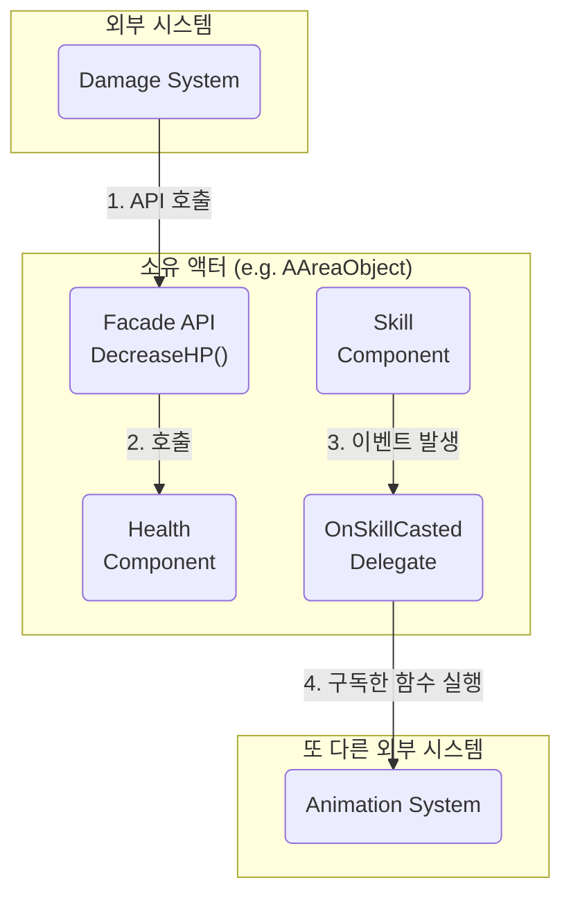

# 2.3. 컴포넌트 기반 설계: 단일 책임과 느슨한 결합

> ### 체력을 가진 캐릭터, 아이템을 담는 상자, 스킬을 쓰는 몬스터... 이 모든 액터들은 어떻게 각자의 기능을 명확히 분리하고, 필요에 따라 기능을 쉽게 추가하거나 제거할 수 있을까?
> Sonheim 프로젝트는 "갓 클래스(God Class)"를 방지하고 장기적인 유지보수성과 확장성을 확보하기 위해 **컴포넌트 기반 설계**를 아키텍처의 핵심 원칙으로 삼습니다. 이는 거대한 단일 클래스가 모든 기능을 상속받아 구현하는 대신, **"하나의 기능은 하나의 컴포넌트"** 라는 **단일 책임 원칙(SRP)**에 따라 기능을 독립적인 부품(`UActorComponent`)으로 만들고, 액터는 이 부품들을 '조립'하여 완성하는 설계 방식입니다.
>
> *   **명확한 책임 분리:** 각 컴포넌트는 체력 관리, 아이템 보관, 스킬 실행 등 단 하나의 명확한 책임만 갖습니다.
> *   **느슨한 결합 (Loosely Coupled):** 각 컴포넌트는 다른 컴포넌트의 존재를 직접 알지 못하며, 오직 소유자 액터가 제공하는 **퍼사드 API**와 **델리게이트**를 통해서만 소통하여 시스템 간의 의존성을 최소화합니다.
> *   **유연한 확장성:** 새로운 기능을 추가할 때, 기존 코드를 수정하는 대신 새로운 컴포넌트를 만들어 액터에 부착하기만 하면 되므로, 시스템을 안전하고 유연하게 확장할 수 있습니다.

---

## 2.3.1. 적용 사례: 단일 책임을 수행하는 기능 부품들

Sonheim의 모든 액터는 독립적인 기능 부품들의 조합으로 이루어져 있습니다. 각 컴포넌트는 자신의 책임에만 집중하며, 이는 코드의 응집도를 높이고 가독성과 유지보수성을 극대화합니다.

### 사례 1: 생명력 관리 (`UHealthComponent`)
*   **단일 책임:** 오직 '현재/최대 HP'를 관리하고, '피해를 받거나', '회복'하고, '사망'하는 로직에만 집중합니다. 이 컴포넌트는 자신이 플레이어에 붙어있는지, 몬스터에 붙어있는지, 심지어는 파괴 가능한 바위에 붙어있는지 전혀 알지 못합니다.
*   **느슨한 결합:** HP가 0이 되면, `OnDie` 델리게이트를 호출하여 "내가 죽었다"는 사실만 외부에 "방송"할 뿐, 그 결과 어떤 일이 벌어지는지에 대해서는 전혀 관여하지 않습니다.
*   **증명:** 이 명확한 책임 분리 덕분에, `UHealthComponent`는 캐릭터(`AAreaObject`)와 자원(`ABaseResourceObject`) 양쪽에 모두 재사용되어 "파괴 가능한" 속성을 부여하는, 매우 유연하고 강력한 부품이 되었습니다. (상세: [[3.2 어트리뷰트 시스템|3.2_Attribute_System]])

### 사례 2: 아이템 보관 (`UContainerComponent`)
*   **단일 책임:** 오직 '아이템 슬롯 배열'을 관리하고, '아이템 추가/제거/스왑'에 대한 순수한 데이터 조작 로직에만 집중합니다.
*   **느슨한 결합:** 이 컴포넌트는 자신이 보관 상자에 붙어있는지, 아니면 플레이어의 인벤토리 역할을 하는지 알지 못합니다. 아이템이 변경되면 `OnContainerChanged` 델리게이트를 통해 변경 사실만 외부에 알릴 뿐, 이로 인해 UI가 어떻게 변하는지는 전혀 신경 쓰지 않습니다.
*   **증명:** 이 컴포넌트 덕분에 `ABaseContainer` 액터는 복잡한 인벤토리 로직을 구현할 필요 없이, 오직 '보관함'이라는 겉모습과 상호작용에만 집중할 수 있습니다. (상세: [[6.4 보관함 시스템|6.4_Container_System]])

### 사례 3: 스킬 관리 및 실행 (`USonheimSkillComponent`)
*   **단일 책임:** 오직 '스킬 목록 소유', '스킬 시전/취소', '쿨타임 관리' 로직에만 집중합니다.
*   **느슨한 결합:** 이 컴포넌트는 스킬이 어떤 애니메이션을 재생하는지, 어떤 이펙트를 발생시키는지 직접 알지 못합니다. 스킬이 시전되면 `OnSkillCasted` 델리게이트를 호출하여, 애니메이션 시스템이나 이펙트 시스템이 이 신호를 받아 각자의 역할을 수행하도록 합니다.
*   **증명:** `AAreaObject`는 이 컴포넌트를 통해 스킬 시스템의 복잡한 내부를 알 필요 없이, `CastSkill`이라는 간단한 명령만으로 스킬을 사용할 수 있습니다. (상세: [[3.3 스킬 시스템|3.3_Skill_Architecture]])

---

## 2.3.2. 컴포넌트 간의 소통 방식: 느슨한 결합의 비밀

각 컴포넌트가 독립적인 부품으로 존재하기 위해서는, 서로를 직접 참조하지 않고 소통할 수 있는 약속된 방법이 필요합니다. Sonheim은 **퍼사드 패턴**과 **델리게이트**라는 두 가지 핵심적인 방법론을 통해 컴포넌트 간의 느슨한 결합을 유지합니다.

1.  **퍼사드 패턴 (외부 -> 컴포넌트):** 외부 시스템이 컴포넌트의 기능을 사용하고 싶을 때는, 컴포넌트를 직접 호출하는 대신 소유 액터가 제공하는 간단한 API(`DecreaseHP`)를 호출합니다. 그러면 소유 액터가 내부적으로 적절한 컴포넌트(`HealthComponent`)에 명령을 전달합니다. 이는 외부 시스템이 컴포넌트의 존재나 내부 구현을 알 필요가 없게 만들어 의존성을 제거합니다.

2.  **델리게이트 (컴포넌트 -> 외부):** 컴포넌트가 자신의 상태 변화를 외부에 알려야 할 때는, 다른 시스템을 직접 호출하는 대신 `OnSkillCasted`와 같은 델리게이트를 "방송"합니다. 이 방송에 관심 있는 다른 시스템(애니메이션 시스템 등)은 이 델리게이트를 "구독"하고 있다가, 신호가 오면 자신의 역할을 수행합니다. 이는 컴포넌트가 자신을 사용하는 외부 시스템에 대해 전혀 알 필요가 없게 만들어 의존성을 역전시킵니다.

---

## 2.3.3. 설계의 이점: 상상하는 모든 것을 조립하는 즐거움

이러한 컴포넌트 기반 설계가 제공하는 진정한 위력은, 기존에 없던 새로운 개체를 상상하고 그것을 매우 쉽게 만들어낼 수 있는 **압도적인 확장성**에 있습니다.

> **만약 '죽으면 아이템을 드롭하는 보물 고블린'을 만들어야 한다면 어떻게 해야 할까요?**

상속 기반 모델에서는 `AGoblin` 클래스가 `AMonster`(몬스터)와 `AContainer`(보관함)를 동시에 상속받을 수 없어 구조가 복잡해집니다. 하지만 Sonheim의 컴포넌트 기반 설계에서는 매우 간단합니다.

새로운 `AGoblin` 액터를 만들고, 그저 기존에 만들어 둔 기능 부품들인 **`UHealthComponent`**와 **`UContainerComponent`를 함께 '조립'하기만 하면 됩니다.**
*   `UHealthComponent`는 고블린에게 **생명력**과 **죽음 이벤트(`OnDie`)**를 제공합니다.
*   `UContainerComponent`는 고블린에게 아이템을 보관할 **인벤토리**를 제공합니다.

그리고 `OnDie` 델리게이트가 호출될 때, `UContainerComponent`가 가진 아이템들을 월드에 뿌리도록 연결해주기만 하면, 코드 변경 없이 완전히 새로운 '보물 고블린'이 탄생하는 것입니다. 이처럼 상속의 한계를 뛰어넘어 기능들을 자유롭게 조합하여 새로운 개체를 창조할 수 있다는 것이야말로, 컴포넌트 설계의 진정한 즐거움이자 강력함입니다.

---

## 2.3.4. 설계 결정: 왜 상속 대신 조립(Composition)을 선택했는가?

객체 지향 프로그래밍의 또 다른 강력한 기능인 '상속' 대신 컴포넌트 '조립' 방식을 선택한 이유는, 상속이 가진 근본적인 한계 때문입니다.

*   **상속의 한계:** 만약 `CanAttack`(공격 가능), `HasInventory`(인벤토리 소유)와 같은 기능들을 모두 부모 클래스로 만들어 다중 상속을 받는다고 가정해봅시다. 이는 C++에서 "다이아몬드 상속 문제"와 같은 복잡한 문제를 야기하며, 기능의 조합이 늘어날수록 클래스 계층 구조가 걷잡을 수 없이 복잡해지고 경직됩니다.
*   **조립의 유연성:** 반면, 컴포넌트 기반 설계는 각 기능을 독립적인 부품으로 취급하므로, 어떤 액터든 필요한 부품을 자유롭게 가져다 "조립"하기만 하면 됩니다. `UHealthComponent`를 캐릭터와 자원 오브젝트 양쪽에 모두 부착할 수 있었던 것처럼, 상속 관계와 무관하게 기능을 유연하게 추가하고 재사용할 수 있는 압도적인 확장성을 제공합니다.

---

## 2.3.5. 회고 및 개선점

컴포넌트 기반 설계는 Sonheim의 아키텍처를 유연하고 확장 가능하게 만든 핵심 동력이지만, 동시에 다음과 같은 잠재적인 한계와 개선 방향을 가지고 있습니다.

*   **한계점: 숨겨진 의존성:** 컴포넌트들이 서로를 직접 참조하지는 않지만, 특정 컴포넌트가 다른 컴포넌트의 존재를 암묵적으로 가정하고 동작할 경우(예: 스킬 컴포넌트가 스태미나 컴포넌트가 항상 존재할 것이라고 가정), 컴포넌트를 단독으로 재사용하기 어려워지는 '숨겨진 의존성' 문제가 발생할 수 있습니다.
*   **개선 방안: 명확한 인터페이스와 이벤트 버스:** 이 문제를 해결하기 위해, 컴포넌트 간의 상호작용을 더욱 공식화하는 **인터페이스(Interface)**를 도입하거나, 모든 컴포넌트가 중앙의 **이벤트 버스(Event Bus)**를 통해서만 메시지를 주고받도록 아키텍처를 개선하여, 컴포넌트의 독립성을 더욱 강화하는 방향을 고려할 수 있습니다.

---

## 2.3.6. 관련 시스템

*   [[3.1 AAreaObject 프레임워크|3.1_AreaObject_Framework]]
*   [[3.2 어트리뷰트 시스템|3.2_Attribute_System]]
*   [[3.3 스킬 시스템|3.3_Skill_Architecture]]
*   [[6.4 보관함 시스템|6.4_Container_System]]
