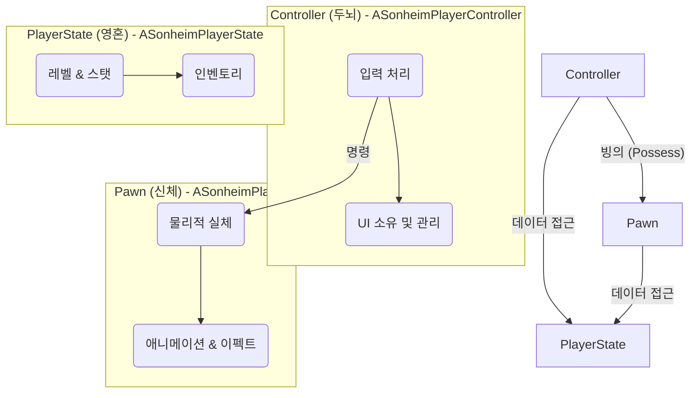
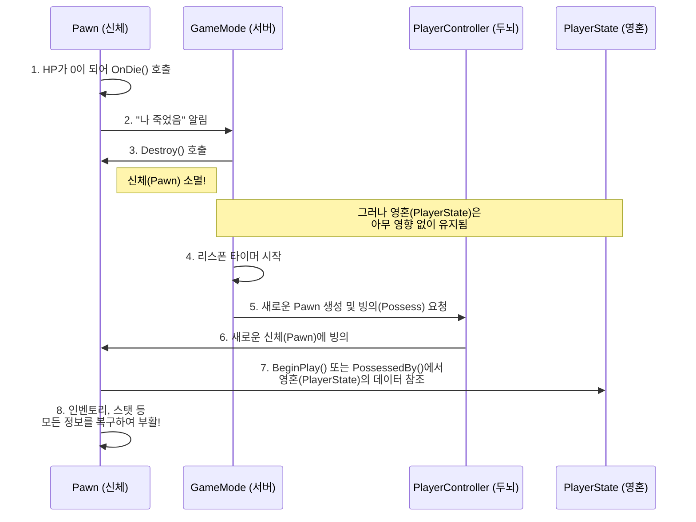

# 2.4. 플레이어 클래스 아키텍처: 죽음과 데이터 영속성

> ### 플레이어가 전투에서 패배하여 죽었습니다. 잠시 후, 다른 장소에서 부활했을 때, 그의 레벨과 힘들게 모은 아이템들은 어떻게 그대로 유지될 수 있을까요?
> 이 질문에 대한 해답은, 언리얼 엔진의 표준 아키텍처인 **Pawn-Controller-PlayerState**의 역할을 명확히 분리하는 데 있습니다. Sonheim은 이 원칙에 따라, 파괴 가능한 **신체(Pawn)**와, 파괴되지 않는 **영혼(PlayerState)**, 그리고 이 둘을 지휘하는 **두뇌(Controller)**를 완벽히 분리하여, 복잡한 멀티플레이어 환경에서의 **데이터 영속성**과 시스템 안정성을 확보했습니다.

---

## 2.4.1. 아키텍처: 신체(Pawn), 두뇌(Controller), 영혼(PlayerState)

플레이어는 세 개의 핵심 클래스가 유기적으로 결합하여 완성됩니다. 각 클래스의 역할을 **신체, 두뇌, 영혼**에 비유하여 이해할 수 있습니다.

*   **`ASonheimPlayerController` (두뇌):** 플레이어의 '의도'를 대변하는 지휘 센터입니다. 키보드/마우스 입력을 독점적으로 처리하고, UI 위젯을 소유하며, 어떤 액션을 할지 결정하여 `Pawn`에게 명령을 내립니다.
*   **`ASonheimPlayer` (신체):** 월드에 실제로 보여지는 물리적 실체입니다. `Controller`로부터 "점프해라"와 같은 명령을 받아 실제 액션을 수행하고, 애니메이션, 이펙트 등 시각적 표현을 담당합니다. **죽으면 파괴되고, 부활 시 새로 생성됩니다.**
*   **`ASonheimPlayerState` (영혼):** `Pawn`이 죽거나 사라져도 게임 세션 내내 유지되는 영속적인 데이터 저장소입니다. 레벨, 스탯, 인벤토리와 같은 핵심 데이터를 저장하고, 모든 클라이언트에게 복제되어 상태 공유의 기반이 됩니다. **절대 파괴되지 않습니다(세션 종료 전까지).**

---

## 2.4.2. 핵심 구현: 죽음과 부활 시퀀스

이 아키텍처가 어떻게 데이터 영속성을 보장하는지는, 플레이어의 '죽음과 부활' 시퀀스를 통해 가장 명확하게 증명됩니다.

1.  **죽음:** `Pawn`의 `HealthComponent`가 0이 되면, `Pawn`은 소멸(`Destroy`)됩니다. 하지만 `PlayerState`는 아무런 영향을 받지 않고 서버에 그대로 남아있습니다.
2.  **부활:** 잠시 후, `GameMode`는 새로운 `Pawn`을 생성하고, 플레이어의 `PlayerController`가 이 새로운 `Pawn`에 **빙의(Possess)**하도록 합니다.
3.  **데이터 복구:** 새로 빙의된 `Pawn`은 `BeginPlay()` 또는 `OnPossessed()`와 같은 초기화 함수에서, 자신의 `PlayerController`를 통해 `PlayerState`에 접근합니다. 그리고 `PlayerState`가 소유한 `InventoryComponent`, `StatComponent` 등의 데이터를 참조하여, 자신의 상태(UI, 스탯 등)를 완벽하게 복구합니다.

이처럼 **신체는 죽어도 영혼은 남는** 명확한 역할 분리 덕분에, 플레이어의 성장은 안전하게 유지됩니다.

---

## 2.4.3. 설계 결정: 왜 언리얼 표준을 따랐는가?

> **왜 모든 것을 Pawn 하나에 넣지 않았는가?**

프로젝트 초기에는 모든 기능(입력, 데이터, 이동)을 `ASonheimPlayer`(`Pawn`) 클래스 하나에 전부 구현하는 것이 가장 단순하고 직관적으로 보일 수 있습니다. 하지만 이 방식은 멀티플레이어 환경에서 치명적인 문제를 야기합니다. 바로 **데이터 영속성**입니다. `Pawn`은 월드에서의 물리적 실체이므로, 플레이어가 죽으면 파괴되고 새로운 `Pawn`으로 교체됩니다. 만약 `Pawn`이 인벤토리 데이터를 가지고 있다면, 부활하는 순간 모든 아이템이 사라지는 끔찍한 경험을 하게 될 것입니다.

이 문제를 해결하는 가장 확실하고 검증된 방법은 언리얼 엔진이 제시하는 표준 아키텍처를 그대로 따르는 것입니다. `APlayerState`는 플레이어가 세션에 접속해 있는 동안 절대 파괴되지 않는, 그야말로 플레이어의 '영혼'과 같은 클래스입니다. 따라서 `InventoryComponent`와 같이 영속성이 필요한 모든 데이터는 `PlayerState`가 소유하고, `Pawn`은 단지 그 데이터를 참조하여 '표현'하는 역할만 수행하도록 책임을 분리했습니다.

이 설계는 단순히 기능을 구현하는 것을 넘어, 언리얼 엔진의 네트워크 철학을 깊이 이해하고 올바르게 적용했음을 보여줍니다. 때로는 독창적인 해결책을 찾는 것보다, 수많은 프로젝트를 통해 검증된 업계 표준 아키텍처를 배우고 따르는 것이 훨씬 더 안정적이고 효율적인 결과를 가져온다는 중요한 교훈을 얻었습니다.

---

## 2.4.4. 회고 및 개선점

현재 아키텍처는 데이터 영속성과 책임 분리라는 목표를 성공적으로 달성했지만, 프로젝트가 더 복잡해질 경우를 대비하여 다음과 같은 잠재적인 한계와 개선 방향을 인지하고 있습니다.

*   **한계점: 비대해지는 PlayerController:** 현재 `PlayerController`는 플레이어의 입력 처리와 UI 관리라는 두 가지 큰 책임을 동시에 수행하고 있습니다. 새로운 UI나 입력 관련 기능이 추가될수록 `PlayerController`가 비대해지고 유지보수가 어려워질 수 있습니다.
*   **개선 방안: 입력 처리 로직 분리:** 미래에는 플레이어의 입력을 처리하는 로직을 별도의 `UPlayerInputComponent`와 같은 컴포넌트로 분리하는 것을 고려할 수 있습니다. 이를 통해 `PlayerController`는 UI 관리와 컴포넌트 간의 조율이라는 더 상위 레벨의 역할에만 집중하게 하여, 각 부분의 책임을 더욱 명확하게 만들 수 있습니다.

---

## 2.4.5. 관련 시스템

*   [[2.1 서버 권위 원칙|2.1_Server_Authority_Architecture]]
*   [[2.3 컴포넌트 기반 설계|2.3_Component_Based_Design]]
*   [[4.2 인벤토리 시스템|4.2_Inventory_System]]
*   [[4.3 스탯 시스템|4.3_Stat_System]]
