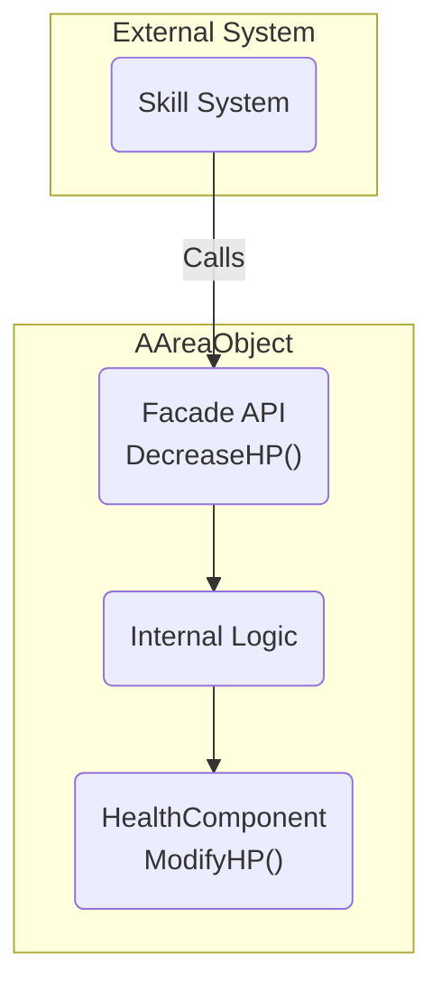

# 3.1. AAreaObject: 모든 개체의 통합 프레임워크

> ### 컴포넌트 기반 설계와 퍼사드 패턴으로, 모든 캐릭터의 일관되고 확장 가능한 기능의 기반을 제공하는 핵심 프레임워크를 구축했습니다.
>
> *   **역할: 기능의 조립과 조율:** `AAreaObject`는 HP, 스킬 등 개별 기능을 직접 구현하는 대신, 독립된 기능 컴포넌트들을 조립하고 이들의 상호작용을 조율하는 **프레임워크(Framework)** 역할을 합니다.
> *   **설계: 퍼사드 패턴 API:** 외부 시스템이 각 컴포넌트의 복잡한 내부를 알 필요 없이, `AAreaObject`가 제공하는 `DecreaseHP()`, `CastSkill()`과 같은 간단하고 통일된 API를 통해 기능에 접근하도록 설계하여 시스템 간 결합도를 낮췄습니다.
> *   **결과: 높은 확장성과 재사용성:** 이 구조 덕분에, 넉백에 저항하는 몬스터나 특수한 약점을 가진 보스 등 새로운 종류의 캐릭터를 기존 컴포넌트를 재조합하거나 일부 함수만 오버라이드하여 최소한의 코드로 구현할 수 있습니다.

---

## 3.1.1. 구현 기능 목록 (Feature List)

`AAreaObject`는 Sonheim의 모든 캐릭터에게 다음과 같은 표준화된 기능 프레임워크를 제공합니다.

*   **통합 속성 관리 프레임워크**
    *   모든 캐릭터의 핵심 능력치(`Health`, `Stamina`), 상태 이상(`Condition`), 레벨(`Level`)을 관리하는 컴포넌트들을 소유합니다.
    *   외부 시스템은 `DecreaseHP`, `AddCondition`과 같이 `AAreaObject`가 제공하는 간단한 퍼사드 API를 통해 안전하게 속성에 접근할 수 있습니다.
    *   (상세: **[[3.2 어트리뷰트 시스템|3.2_Attribute_System]]**)

*   **중앙화된 데미지 처리 파이프라인**
    *   언리얼 엔진의 `TakeDamage` 가상 함수를 오버라이드하여, 데미지 계산, 약점/속성 판정, 최종 피드백(넉백, 히트스톱)으로 이어지는 **전체 데미지 처리 흐름을 정의하는 중앙 허브** 역할을 합니다.
    *   (상세: **[[3.5 전투 및 피드백 시스템|3.5_Combat_and_Feedback_System]]**)

*   **통합 스킬 인터페이스**
    *   `USonheimSkillComponent`를 소유하고 관리하며, 스킬 시전(`CastSkill`), 애니메이션과의 연동(`Server_NotifySkillFire`) 등 스킬 시스템과 다른 시스템(애니메이션, UI)을 잇는 **중앙 통신 허브** 역할을 수행합니다.
    *   (상세: **[[3.3 스킬 시스템|3.3_Skill_Architecture]]**, **[[3.4 애니메이션 시스템|3.4_Animation_System]]**)

*   **데이터 기반 초기화 플로우**
    *   게임 시작 시, `dt_AreaObject` 데이터 테이블에서 자신의 ID에 맞는 데이터를 읽어와, 위에 언급된 모든 컴포넌트의 초기 상태(최대 HP, 보유 스킬, 이동 속도 등)를 결정하는 **표준화된 초기화 플로우**를 제공합니다.

*   **표준화된 사망 및 부활 관리**
    *   캐릭터의 사망(`OnDie`), 부활(`OnRevival`), 사망 시 처치자에게 보상을 지급하는 로직(`OnKill`)에 대한 **공통 프로세스**를 정의하고, 관련 시각 효과와 상태를 모든 클라이언트에 멀티캐스트로 전파합니다.

*   **네트워크 동기화된 공용 이펙트 API**
    *   `Multicast_PlayNiagaraEffect`, `Multicast_PlaySoundAtLocation`과 같이, 어떤 시스템이든 간단히 호출하여 모든 클라이언트에게 VFX/SFX를 안정적으로 재생할 수 있는 **공용 이펙트 API**를 제공하여, 각 시스템이 개별적으로 네트워크 처리를 할 필요가 없도록 합니다.

*   **공용 이동 및 회전 기능**
    *   `MoveUtilComponent`, `RotateUtilComponent`를 통해, 모든 캐릭터에게 AI의 내비게이션 이동이나 스킬로 인한 강제 이동/회전 등 **통일된 방식의 이동 및 회전 기능**을 제공합니다.

---

## 3.1.2. 기술 상세 (Technical Deep Dive)

### 3.1.2.1. 아키텍처: 조립(Composition)과 퍼사드(Facade)

`AAreaObject`는 거대한 단일 클래스가 되는 대신, 여러 개의 독립적인 기능 컴포넌트를 '조립'하여 완성됩니다. 그리고 이 컴포넌트들의 핵심 기능을 간단한 함수 호출로 외부에 노출하는 **퍼사드 패턴(Facade Pattern)**을 사용합니다.



이 구조를 통해, 스킬 시스템과 같은 외부 시스템은 `AAreaObject`에 `HealthComponent`가 어떻게 구현되어 있는지 전혀 알 필요 없이, 오직 `AAreaObject`의 `DecreaseHP()` 함수만 호출하면 됩니다. 이는 시스템 간의 결합도를 낮추고, 향후 `HealthComponent`의 내부 로직이 변경되더라도 외부 시스템에 미치는 영향을 최소화하는 매우 유연하고 안정적인 설계를 가능하게 합니다.

### 3.1.2.2. 핵심 구현: 프레임워크의 실제 동작

#### 1. 컴포넌트 조립 (in Constructor)
`AAreaObject`는 생성자에서 `CreateDefaultSubobject`를 통해 모든 공용 컴포넌트를 기본 서브오브젝트로 생성하여 "조립"합니다.

> [View on GitHub](https://github.com/chungheonLee0325/Sonheim/blob/main/Sonheim/Source/Sonheim/AreaObject/Base/AreaObject.cpp#L35)
```cpp
// Source/Sonheim/AreaObject/Base/AreaObject.cpp
AAreaObject::AAreaObject()
{
    // ...
	m_HealthComponent = CreateDefaultSubobject<UHealthComponent>(TEXT("HealthComponent"));
	m_StaminaComponent = CreateDefaultSubobject<UStaminaComponent>(TEXT("StaminaComponent"));
	m_ConditionComponent = CreateDefaultSubobject<UConditionComponent>(TEXT("ConditionComponent"));
	m_LevelComponent = CreateDefaultSubobject<ULevelComponent>(TEXT("LevelComponent"));
	m_SkillComponent = CreateDefaultSubobject<USonheimSkillComponent>(TEXT("SkillComponent"));
    // ...
}
```

#### 2. 데이터 기반 초기화 (in BeginPlay)
게임이 시작되면, `AAreaObject`는 자신의 ID(`m_AreaObjectID`)를 사용해 데이터 테이블에서 데이터를 가져와 모든 컴포넌트를 초기화하는 표준화된 흐름을 제공합니다.

> [View on GitHub](https://github.com/chungheonLee0325/Sonheim/blob/main/Sonheim/Source/Sonheim/AreaObject/Base/AreaObject.cpp#L173)
```cpp
// Source/Sonheim/AreaObject/Base/AreaObject.cpp
void AAreaObject::BeginPlay()
{
    // ...
	// 데이터 테이블에서 자신의 데이터 로드
	dt_AreaObject = m_GameInstance->GetDataAreaObject(m_AreaObjectID);

	// 서버에서만 컴포넌트 초기화
	if (HasAuthority() && dt_AreaObject)
	{
		// 데이터 테이블의 값으로 HealthComponent를 직접 초기화
		m_HealthComponent->InitHealth(dt_AreaObject->HPMax);
		
        // StaminaComponent 등 다른 컴포넌트도 동일한 방식으로 초기화
		m_StaminaComponent->InitStamina(...);
		
        // SkillComponent가 소유할 스킬 목록 전달
        m_SkillComponent->InitializeOwnedSkills(dt_AreaObject->SkillList);
	}
    // ...
}
```

#### 3. 퍼사드 API
`AAreaObject`의 Public 함수들은 대부분 내부 컴포넌트의 기능을 호출하는 간단한 래퍼(Wrapper) 역할을 수행합니다.

> [View on GitHub](https://github.com/chungheonLee0325/Sonheim/blob/main/Sonheim/Source/Sonheim/AreaObject/Base/AreaObject.cpp#L703)
```cpp
// Source/Sonheim/AreaObject/Base/AreaObject.cpp

// 외부에서는 이 함수만 호출하면 된다.
float AAreaObject::DecreaseHP(float Delta)
{
    // 실제 로직은 HealthComponent에 위임한다.
	m_HealthComponent->ModifyHP(-Delta);
	return m_HealthComponent->GetHP();
}

bool AAreaObject::AddCondition(EConditionBitsType AddConditionType, float Duration)
{
    // 실제 로직은 ConditionComponent에 위임한다.
	m_ConditionComponent->AddCondition(AddConditionType, Duration);
	return HasCondition(AddConditionType);
}
```
