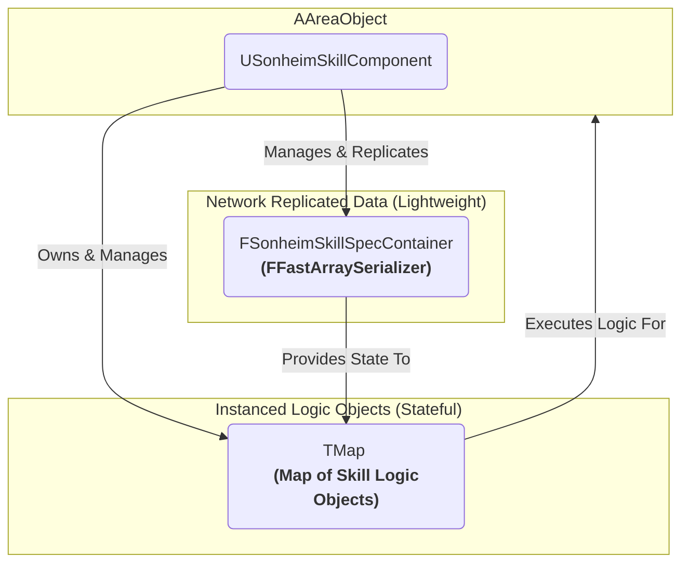

# 3.3. 스킬 아키텍처: 데이터, 상태, 로직의 분리

> ### 데이터-상태-로직 분리와 상태 머신으로 구현된 확장형 스킬 아키텍처
>
> *   **데이터, 상태, 로직의 분리:** 스킬의 기본 정보(**Data**)는 데이터 테이블로, 실시간 **상태**(쿨다운, 레벨)는 `FFastArraySerializer`로 효율적으로 복제하고, 실제 동작 **로직**(Logic)은 `UBaseSkill` 객체로 분리하여, 복잡한 스킬 메커니즘과 네트워크 성능을 모두 달성했습니다.
> *   **애니메이션 주도 타이밍:** 스킬 시스템은 스킬의 '실행'만 담당하고, 실제 효과가 발동하는 '타이밍'은 애니메이션의 `AnimNotify`가 결정하도록 하여, 로직과 시각적 표현의 결합도를 낮추고 애니메이터의 제어권을 보장합니다.
> *   **참조 카운팅 기반 Grant/Revoke:** 여러 장비나 버프가 동일한 스킬을 부여하더라도, `FGuid` 소유권과 참조 카운팅을 통해 충돌 없이 안전하게 스킬을 부여하고 회수하는 안정적인 시스템을 구축했습니다.

---

## 3.3.1. 설계 목표

1.  **확장성:** 단순한 공격 스킬뿐만 아니라, 채널링, 다단 히트, 버프/디버프 등 복잡한 상태를 가지는 다양한 종류의 스킬을 쉽게 추가할 수 있어야 합니다.
2.  **데이터 기반:** 스킬의 피해량, 쿨다운, 범위, 소모 비용 등 핵심 수치는 기획자가 데이터 테이블에서 쉽게 수정하고 밸런스를 조정할 수 있어야 합니다.
3.  **네트워크 효율성:** 수십 개의 스킬 상태(쿨다운, 레벨 등)가 변경되어도, 네트워크 부하를 최소화하며 모든 클라이언트에게 정확하게 동기화되어야 합니다.
4.  **데이터 무결성:** 스킬 비용을 여러 개 소모할 때, 중간에 실패할 경우 소모된 모든 비용이 안전하게 롤백(환불)되어야 합니다.

---

## 3.3.2. 구현 기능 목록 (Feature List)

이 시스템을 통해 플레이어와 기획자는 다음과 같은 기능을 경험하게 됩니다.

*   **유연한 스킬 상태 관리**
    *   모든 스킬의 쿨다운, 레벨, 현재 시전 상태가 서버 권위로 관리되며, `FFastArraySerializer`를 통해 변경된 정보만 효율적으로 클라이언트에 동기화됩니다.

*   **안전한 동적 스킬 부여/회수**
    *   무기를 장착하면, `Grant` API를 통해 해당 무기의 고유 스킬로 주 공격(좌클릭 스킬)이 대체됩니다.
    *   여러 장비가 동일한 스킬을 부여하더라도, 참조 카운팅을 통해 마지막 장비가 해제될 때까지 스킬이 안전하게 유지됩니다.

*   **정교한 비용 처리**
    *   **사전 검사:** 스킬 시전 전, `CheckCosts`를 통해 재료 부족 여부를 미리 확인하여 UI에 피드백을 제공할 수 있습니다.
    *   **원자적 소모:** `ApplyCosts`는 스태미나, 아이템 등 여러 종류의 비용을 소모할 때, 하나라도 실패하면 이전에 소모된 모든 비용을 안전하게 롤백(환불)합니다.

*   **애니메이션과 완벽한 연동**
    *   스킬의 실제 효과 발동(투사체 발사, 공격 판정 등) 타이밍은 C++ 코드가 아닌, 애니메이션 타임라인의 `AnimNotify`가 직접 제어합니다.

*   **구체적인 스킬 타입 구현 예시**
    *   **범용 근접 공격 (`UMeleeAttack`):** 애니메이션 기반의 정밀한 충돌 판정과 프레임 보간을 지원하는, 모든 종류의 근접 공격에 재사용 가능한 범용 스킬입니다.
    *   **산탄총 공격 (`UShotgunAttack`):** 한 번에 여러 개의 라인 트레이스를 원뿔 형태로 발사하여 산탄 효과를 시뮬레이션하는 스킬입니다.
    *   **화염방사기 (`UFlamethrower`):** 일정 시간 동안 전방에 원뿔 형태의 충돌 검사를 지속적으로 수행하여, 범위 내 모든 적에게 다단 히트 피해를 주는 채널링 스킬입니다.
    *   **로켓 발사 (`URocket`):** 타겟을 향해 유도되는 투사체를 발사하는 스킬입니다.
    *   **회복 스킬 (`URecoverHPSkill`):** 시전자 자신의 HP를 회복시키는 간단한 버프형 스킬입니다.

---

## 3.3.3. 기술 상세 (Technical Deep Dive)

### 3.3.3.1. 아키텍처 1: 데이터, 상태, 로직의 분리

Sonheim의 스킬 시스템은 **데이터(Data)**, **상태(State)**, 그리고 **로직(Logic)**을 명확하게 분리하는 것을 핵심으로 합니다.

*   **`FSkillData` (Data):** 데이터 테이블에 정의되는 스킬의 모든 **정적 스펙**입니다. (피해량, 쿨다운, 범위, 비용 등)
*   **`USonheimSkillComponent` (State 관리자):** 모든 전투 객체(`AAreaObject`)에 부착되어, `FSonheimSkillSpecContainer`(**`FFastArraySerializer`**)를 통해 해당 캐릭터가 가진 모든 스킬의 실시간 **상태**(현재 레벨, 남은 쿨다운 등)를 관리하고, 변경된 정보만 효율적으로 복제합니다.
*   **`UBaseSkill` (Logic 실행기):** 스킬의 실제 **동작 로직**을 담고 있는 `UObject`입니다. 이 객체는 서버와 클라이언트에 각각 존재하며, 복제된 `State` 정보를 바탕으로 각 머신에서 독립적으로 로직을 실행합니다.



### 3.3.3.2. 아키텍처 2: 왜 `UObject`가 아닌 `struct`를 복제하는가?

> **UObject 포인터 배열의 직접 복제는 불안정하고 비효율적입니다.**

언리얼 엔진에서 `TArray<UObject*>` 형태의 배열을 직접 복제하는 것은 매우 까다롭습니다. `UObject`는 `AActor`의 서브오브젝트(Subobject)로 소유되는 등 매우 엄격한 조건 하에서만 안정적인 복제가 가능한데, `TArray<UObject*>`와 같이 동적으로 변하는 배열을 직접 복제하려고 시도하면 클라이언트에서 각 객체의 생성/소멸 시점과 포인터 유효성을 보장하기 매우 어려워집니다. 이는 예측 불가능한 크래시나 동기화 오류를 유발하는, 사실상 **매우 불안정한(Unstable) 방식**입니다.

이 문제를 근본적으로 해결하기 위해, 스킬 시스템은 불안정한 `UBaseSkill` **객체(로직)**의 포인터를 직접 전송하는 대신, 복제가 보장되는 가벼운 `FSonheimSkillSpecItem` **구조체(상태)**만 `FFastArraySerializer`로 복제합니다. 이는 변경된 상태 정보만 선택적으로 전송하는 **델타 복제**를 가능하게 하여, 네트워크 부하를 극적으로 줄이고 안정성을 확보하는 핵심적인 설계 결정입니다.

### 3.3.3.3. 핵심 구현 1: 참조 카운팅 기반 Grant/Revoke 시스템

단순히 스킬을 추가/제거하는 것을 넘어, 여러 소스(장비, 버프 등)가 스킬을 안전하게 관리할 수 있도록 **소유권(`FGuid`)**과 **참조 카운팅(`GrantRefCounts`)** 개념을 도입했습니다.

1.  **부여 (Grant):** `GrantSkills` 함수가 호출되면, 고유한 `FGuid`를 생성하여 부여된 스킬 목록과 함께 `GrantsById` 맵에 저장합니다. 그리고 각 스킬 ID의 참조 카운트(`GrantRefCounts`)를 1씩 증가시킵니다.
2.  **회수 (Revoke):** `RevokeByGrantId` 함수가 호출되면, 해당 `FGuid`로 자신이 부여했던 스킬 목록을 찾아 각 스킬의 참조 카운트를 1씩 감소시킵니다. 참조 카운트가 0이 된 스킬만 최종적으로 캐릭터에게서 제거됩니다.

> [View on GitHub](https://github.com/chungheonLee0325/Sonheim/blob/main/Sonheim/Source/Sonheim/AreaObject/Skill/SonheimSkillComponent.cpp#L308)
```cpp
// Source/Sonheim/AreaObject/Skill/SonheimSkillComponent.cpp
void USonheimSkillComponent::RevokeByGrantId(const FGuid& GrantId)
{
    if (TArray<int32>* Skills = GrantsById.Find(GrantId))
    {
        // ...
        for (int32 SkillId : *Skills)
        {
            if (int32* Ref = GrantRefCounts.Find(SkillId))
            {
                *Ref = FMath::Max(0, *Ref - 1);
                if (*Ref == 0)
                {
                    // 참조 카운트가 0이 되면 스킬 제거
                    GrantRefCounts.Remove(SkillId);
                }
            }
        }
        // ...
        GrantsById.Remove(GrantId);
    }
}
```

이 설계를 통해, 여러 장비가 동일한 패시브 스킬을 부여하더라도, 마지막 장비가 해제되기 전까지는 스킬이 제거되지 않는 안정적인 로직을 구현했습니다.

### 3.3.3.4. 핵심 구현 2: 상태 머신과 애니메이션 주도 타이밍

> **왜 애니메이션 주도 타이밍을 선택했는가?**
> 만약 스킬 로직을 `Delay(0.3f)`와 같이 하드코딩된 타이머로 구현하면, 공격 속도 버프나 네트워크 지연으로 인해 애니메이션 재생 속도가 변했을 때, 눈에 보이는 동작과 실제 효과 발동 시점이 어긋나는 심각한 비동기 문제가 발생합니다. 이를 해결하기 위해, 스킬 시스템은 로직의 실행 타이밍을 **애니메이션 타임라인에 종속**시키는, 애니메이션 주도 방식을 채택했습니다.

모든 `UBaseSkill`은 `ESkillPhase` 상태 머신을 따르며, 핵심 로직의 **실행 타이밍**은 애니메이션 시스템이 제어합니다.

*   **`Activate()` (시작):** 스킬의 진입점입니다. `Casting` 상태로 전환하고, 데이터에 정의된 애니메이션 몽타주를 재생시킵니다.
*   **`Fire()` (효과 발동):** 투사체 발사, 공격 판정 시작 등 스킬의 실제 효과가 발생하는 함수입니다. 이 함수는 `Activate`에서 직접 호출되는 것이 아니라, 재생된 **애니메이션 몽타주의 특정 프레임에 삽입된 `USkillFireNotify`에 의해 호출**됩니다. 이는 스킬의 효과 발동 시점을 애니메이터가 시각적으로 완벽하게 제어할 수 있게 합니다.
*   **`Complete()` / `Cancel()` (종료):** 스킬의 모든 로직이 끝나거나 중간에 취소될 때 호출됩니다. 이 함수들 역시 **애니메이션 몽타주의 `OnMontageEnded` 또는 `OnMontageBlendOut` 델리게이트에 바인딩**되어, 애니메이션의 실제 종료 시점과 스킬의 논리적 종료 시점이 항상 일치하도록 보장합니다.

> [View on GitHub](https://github.com/chungheonLee0325/Sonheim/blob/main/Sonheim/Source/Sonheim/AreaObject/Skill/Base/BaseSkill.cpp#L95)
```cpp
// Source/Sonheim/AreaObject/Skill/Base/BaseSkill.cpp
void UBaseSkill::BindMontageDelegates(UAnimInstance* AnimInstance, UAnimMontage* Montage)
{
    if (!AnimInstance || !Montage) return;

    EndDelegate.BindUObject(this, &UBaseSkill::OnMontageEnded);
    AnimInstance->Montage_SetEndDelegate(EndDelegate, Montage);

    CompleteDelegate.BindUObject(this, &UBaseSkill::OnMontageBlendOut);
    AnimInstance->Montage_SetBlendingOutDelegate(CompleteDelegate, Montage);
}
```

### 3.3.3.5. 핵심 구현 3: 분리된 비용 처리 (Check & Apply)

스킬 비용 처리는 **사전 검사**와 **실제 소모**의 두 단계로 명확히 분리되어, UI 피드백과 데이터 무결성을 모두 보장합니다.

*   **`CheckCosts()` (검사):** 스킬을 사용하기에 스태미나나 아이템이 충분한지 **검사만** 합니다. 이 함수는 스킬 시전 전에 호출되어, 재료가 부족할 경우 UI에 이를 표시하거나 스킬 아이콘을 비활성화하는 등의 피드백을 제공하는 데 사용됩니다.
*   **`ApplyCosts()` (실행 및 롤백):** 서버에서 스킬이 실제로 `Activate`될 때 호출됩니다. 이 함수는 여러 종류의 비용(스태미나, 아이템 등)을 소모하며, 만약 하나라도 실패할 경우(예: 아이템 부족) 이전에 성공했던 모든 비용 소모를 되돌리는 **원자적 롤백(Atomic Rollback)** 로직을 포함하여 데이터의 정합성을 보장합니다.

> [View on GitHub](https://github.com/chungheonLee0325/Sonheim/blob/main/Sonheim/Source/Sonheim/AreaObject/Skill/Base/BaseSkill.cpp#L309)
```cpp
// Source/Sonheim/AreaObject/Skill/Base/BaseSkill.cpp
bool UBaseSkill::ApplyCosts(AAreaObject* Caster, ESkillCostPhase Phase)
{
    // ...
    // 아이템 소모
    TArray<TPair<int32, int32>> consumed;
    for (const FSkillItemCost& C : m_SkillData->ItemCosts)
    {
        // ...
        if (ItemID <= 0 || !Inv || !Inv->RemoveItem(ItemID, C.Count))
        {
            // 실패 → 지금까지 소모한 것 환불 (롤백)
            for (const auto& P : consumed) Inv->AddItem(P.Key, P.Value, false);
            return false;
        }
        // 성공 시, 소모 목록에 기록
        consumed.Emplace(ItemID, C.Count);
    }
    return true;
}
```

### 3.3.3.6. 핵심 구현 4: 데이터 기반의 범용 근접 공격 (`UMeleeAttack`)

이 아키텍처의 확장성을 가장 잘 보여주는 사례는 `UMeleeAttack` 클래스입니다. 이 클래스는 데이터와 애니메이션의 조합만으로 수많은 종류의 근접 공격을 표현하는, 데이터-로직 분리의 좋은 예시입니다.

> 이 스킬의 상세한 구현 방식과 설계 의도는 별도의 사례 연구 문서에서 심층적으로 다룹니다.
> *   **참고: [[8.3 데이터 기반 근접 공격|8.3_Case_Study_Melee_Attack]]**

### 3.3.3.7. 회고 및 개선점: 레거시 코드와 지연 인스턴스화의 필요성

*   **문제점 (레거시 코드):** 현재 스킬 시스템은 `AAreaObject`가 처음 생성될 때, 데이터 테이블에 정의된 모든 스킬을 미리 인스턴스화하여 `SkillInstances` 맵에 저장합니다. 이는 프로젝트 초기에 스킬 관리 컴포넌트가 부재하던 시절, 각 액터가 스킬을 직접 관리하던 방식의 흔적이 남은 것입니다.

*   **개선 방안 (지연 인스턴스화):** 이 구조는 사용하지 않는 수많은 스킬 객체까지 미리 생성하여 초기 로딩 시간과 메모리 사용량에 부담을 줍니다. 이상적으로는, `SkillInstances` 맵을 비워두고, `TryCastSkillById` 함수가 호출될 때 해당 스킬의 인스턴스가 없다면 그 순간에 `EnsureSkillInstance`를 통해 동적으로 생성하는 **지연 인스턴스화(Lazy Instantiation)** 방식으로 리팩토링해야 합니다. 이는 꼭 필요한 스킬만 메모리에 올리는 훨씬 효율적이고 확장성 있는 구조입니다.

*   **교훈:** 초기 설계의 중요성과 레거시 코드의 기술 부채를 명확히 보여주는 사례입니다. 잘 설계된 컴포넌트(`USonheimSkillComponent`)가 도입되었음에도, 초기 구현 방식이 완전히 제거되지 않으면 시스템의 잠재력을 100% 활용할 수 없다는 교훈을 얻었습니다.

## 3.3.4. 관련 시스템

*   [[3.1 AAreaObject 프레임워크|3.1_AreaObject_Framework]]
*   [[2.2 데이터 주도 설계|2.2_Data_Driven_Design]]
*   [[3.4 애니메이션 시스템|3.4_Animation_System]]
*   [[3.5 전투 및 피드백 시스템|3.5_Combat_and_Feedback_System]]
