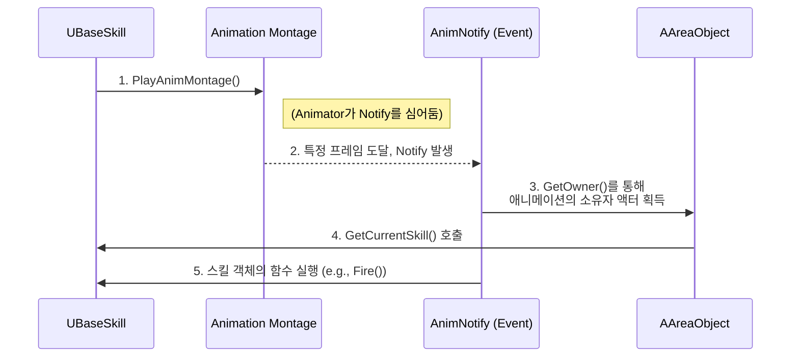

# 3.4. 애니메이션 주도 게임플레이 (Animation-Driven Gameplay)

> ### C++과 블루프린트의 역할을 명확히 분리하고, AnimNotify를 적극적으로 활용하여, 애니메이터가 직접 게임플레이의 핵심 타이밍(공격 판정, 무적, 캔슬)을 디자인하는 강력하고 유연한 애니메이션 주도 아키텍처를 구축했습니다.
> 
> *   **타이밍 제어권 위임:** 프로그래머가 코드에 `Delay(0.5f)`와 같이 타이밍을 하드코딩하는 대신, 모든 게임플레이 이벤트의 실행 시점을 애니메이터가 몽타주 에디터에서 프레임 단위로 제어하도록 책임을 위임했습니다.
> *   **범용적 Notify 시스템:** `UAnimNotify`와 `UAnimNotifyState`를 상속받는 범용적인 커스텀 노티파이들을 구현하여, 공격 판정, 스킬 이벤트, 상태 변경, 버프 적용 등 다양한 종류의 게임플레이 로직을 애니메이션과 연동시켰습니다.
> *   **네트워크 안정성 확보:** 모든 노티파이는 서버와 클라이언트의 역할을 명확히 구분하고, 서버 권위 하에 실행되도록 설계하여 멀티플레이어 환경에서의 동기화 문제를 해결했습니다.

---

> [!VIDEO]
> **[애니메이션 시스템 시연 영상]**
> (영상이나 GIF를 여기에 삽입하세요. 공격 애니메이션의 특정 구간에만 공격 판정이 활성화되는 모습, 구르기 애니메이션 중 무적이 되는 모습, 공격 후딜레이를 회피로 캔슬하는 모습을 보여주는 것이 좋습니다.)

---

## 3.4.1. 구현 기능 목록 (Feature List)

이 시스템을 통해 애니메이터는 코드 수정 없이 다음과 같은 핵심 게임플레이를 직접 디자인할 수 있습니다.

*   **정밀한 공격 판정 제어 (`MeleeAttackNotifyState`):**
    *   애니메이터는 몽타주 에디터에서 `NotifyState`의 시작과 끝을 시각적으로 조절하는 것만으로, 근접 공격의 **판정이 활성화되는 시간과 지속시간**을 프레임 단위로 정교하게 제어할 수 있습니다.
    *   `AttackDataIndex` 프로퍼티를 통해, 하나의 콤보 애니메이션 내에서 각 타격마다 **다른 공격 범위와 효과**를 가진 판정을 데이터 기반으로 지정할 수 있습니다.
*   **유연한 이벤트 트리거링 (`SkillFireNotify`):**
    *   애니메이터는 칼을 휘두르는 특정 프레임, 혹은 마법 주문을 외우는 특정 시점에 `SkillFireNotify`를 배치하여, **투사체 발사, 이펙트 생성** 등 스킬의 핵심 이벤트가 정확한 타이밍에 발동하도록 제어합니다.
*   **애니메이션 주도 상태 제어 (`SetPlayerStateNotify`):**
    *   애니메이터는 `SetPlayerStateNotify`를 사용하여 애니메이션의 특정 구간에 **플레이어의 행동 규칙을 직접 변경**할 수 있습니다. 이를 통해 공격 애니메이션의 후딜레이를 다른 행동(움직임, 회피)으로 캔슬할 수 있는 타이밍을 시각적으로 디자인하여, ARPG 특유의 빠르고 반응성 좋은 컨트롤을 구현합니다.
*   **데이터 기반 상태 이상 적용 (`AddConditionNotify`):**
    *   애니메이터는 회피(Dodge) 애니메이션의 특정 구간에 `AddConditionNotify`를 배치하고, `Invincible` 상태와 지속시간을 설정하여, 코드 수정 없이 **무적 프레임**의 타이밍과 길이를 자유롭게 조절할 수 있습니다.

---

## 3.4.2. 기술 상세 (Technical Deep Dive)

### 3.4.2.1. 설계 목표: 애니메이터에게 타이밍 제어권 부여

게임에서 공격 판정, 무적 상태 부여, 투사체 발사 등의 타이밍은 매우 중요합니다. 만약 프로그래머가 코드에서 `Delay(0.5f)`와 같이 타이밍을 하드코딩한다면, 애니메이터가 공격 애니메이션의 길이를 0.4초로 줄였을 때, 애니메이션이 끝난 후에야 공격 판정이 일어나는 심각한 비동기 문제가 발생합니다.

Sonheim의 애니메이션 시스템은 이러한 문제를 근본적으로 해결하기 위해, **게임플레이 로직의 실행 타이밍을 애니메이션 타임라인이 직접 제어**하는 **애니메이션 주도(Animation-Driven)** 설계를 목표로 합니다.

### 3.4.2.2. 아키텍처: AnimNotify를 이용한 제어 흐름

스킬과 같은 복잡한 행동은 애니메이션 몽타주와 `AnimNotify`를 통해 처리합니다. `AnimNotify`는 애니메이션 애셋과 C++ 코드 사이를 잇는 다리 역할을 합니다.



이 제어 흐름의 핵심은 **`AnimNotify`가 특정 스킬의 존재를 알 필요가 없다**는 점입니다. `AnimNotify`는 오직 애니메이션의 소유자(`AAreaObject`)에게 "지금이 바로 그 타이밍이다"라는 신호만 보낼 뿐입니다.

1.  `AnimNotify`는 `MeshComp->GetOwner()`를 통해 `AAreaObject`에 대한 참조를 얻습니다.
2.  `AAreaObject`는 자신이 현재 어떤 스킬을 시전 중인지 알고 있는 `GetCurrentSkill()` 함수를 제공합니다.
3.  `AnimNotify`는 `owner->GetCurrentSkill()->Fire()` 와 같이, `AAreaObject`를 통해 현재 활성화된 스킬 객체를 가져와, 그 객체의 함수를 호출합니다.

이 설계를 통해, `USkillFireNotify`는 현재 스킬이 근접 공격인지, 투사체 발사 스킬인지 전혀 신경 쓸 필요 없이, 어떤 스킬이든 `Fire()`라는 약속된 함수를 정확한 타이밍에 실행시킬 수 있습니다. 이는 애니메이션 시스템과 스킬 시스템 간의 결합도를 극단적으로 낮추는 핵심적인 아키텍처입니다.

### 3.4.2.3. 핵심 구현: 범용적인 AnimNotify 시스템

Sonheim은 다양한 게임플레이 이벤트를 처리하기 위해 여러 종류의 커스텀 `AnimNotify`와 `UAnimNotifyState`를 구현했습니다.

#### 1. 특정 시점 이벤트: `SetPlayerStateNotify`, `AddConditionNotify`, `SkillFireNotify`

`UAnimNotify`를 상속받는 이 클래스들은 애니메이션의 **특정 프레임**에 도달했을 때 일회성 이벤트를 발생시킵니다.

*   **`SetPlayerStateNotify`:** 이 노티파이는 애니메이터가 `PlayerState`라는 `enum` 변수를 직접 지정할 수 있게 합니다. 이를 통해 공격 애니메이션의 특정 프레임에 `EPlayerState::CANACTION` 상태로 변경하여 "캔슬 가능 구간"을 만들거나, `EPlayerState::NORMAL` 상태로 변경하여 "후딜 캔슬" 타이밍을 조절하는 등, ARPG 컨트롤의 핵심인 "손맛"을 직접 디자인할 수 있습니다.

> [View on GitHub](https://github.com/chungheonLee0325/Sonheim/blob/main/Sonheim/Source/Sonheim/Animation/Player/SetPlayerStateNotify.h)
```cpp
// SetPlayerStateNotify.h
UCLASS()
class SONHEIM_API USetPlayerStateNotify : public UAnimNotify
{
    // ...
public:
    // 애니메이터가 몽타주 에디터에서 직접 지정할 플레이어 상태
    UPROPERTY(EditAnywhere, BlueprintReadWrite)
    EPlayerState PlayerState;
};
```

*   **`AddConditionNotify`:** 구르기 애니메이션의 특정 구간에 이 Notify를 추가하고 'Invincible(무적)' 상태와 지속시간을 지정하면, 해당 시간 동안 캐릭터가 무적이 됩니다.
*   **`SkillFireNotify`:** 원거리 공격 몽타주에서, 투사체가 발사되어야 할 정확한 프레임에 이 Notify를 추가하여 `UBaseSkill`의 `Fire()` 함수를 호출합니다.

#### 2. 특정 구간 이벤트: `MeleeAttackNotifyState`

`UAnimNotifyState`를 상속받는 `MeleeAttackNotifyState` 클래스는 애니메이션의 **특정 구간** 동안 지속적인 로직을 처리합니다. 근접 공격 판정이 대표적인 예입니다.

1.  **`NotifyBegin`:** 공격 애니메이션에서 판정이 시작되어야 할 프레임에 호출됩니다. 이 함수는 `UMeleeAttack` 스킬 객체를 찾아, 애니메이터가 지정한 `AttackDataIndex`를 전달하며 충돌 검사를 시작하도록 알립니다.
2.  **`NotifyTick`:** 판정 구간 동안 매 틱 호출됩니다. `UMeleeAttack` 스킬은 이 함수 안에서 이전 프레임과 현재 프레임의 무기 위치를 보간하며 충돌 검사를 수행합니다.
3.  **`NotifyEnd`:** 판정이 끝나는 프레임에 호출되어, 충돌 검사를 종료합니다.

이 `AttackDataIndex`는 **하나의 스킬이 여러 개의 공격 판정 데이터를 가질 수 있게 하는 핵심**입니다. `UMeleeAttack` 스킬은 데이터 테이블로부터 `TArray<FAttackData>` 형태의 공격 판정 배열을 읽어옵니다. `FAttackData` 구조체는 **판정의 형태(Sphere, Capsule), 범위, 소켓 위치, 데미지 타입** 등 모든 정보를 담고 있습니다.

애니메이터는 3연타 콤보의 각 타격마다 `MeleeAttackNotifyState`를 배치하고 `AttackDataIndex`를 각각 0, 1, 2로 설정하여, 코드 수정 없이 `FAttackData` 배열의 각기 다른 데이터를 정확한 타이밍에 활성화시킬 수 있습니다.

> [View on GitHub (MeleeAttackNotifyState.h)](https://github.com/chungheonLee0325/Sonheim/blob/main/Sonheim/Source/Sonheim/Animation/Common/Notify/MeleeAttackNotifyState.h)
> [View on GitHub (MeleeAttackNotifyState.cpp)](https://github.com/chungheonLee0325/Sonheim/blob/main/Sonheim/Source/Sonheim/Animation/Common/Notify/MeleeAttackNotifyState.cpp)
```cpp
// MeleeAttackNotifyState.h
UCLASS()
class SONHEIM_API UMeleeAttackNotifyState : public UAnimNotifyState
{
    // ...
public:
	// 스킬의 AttackData 배열에서 사용할 데이터의 Index
	UPROPERTY(EditAnywhere, BlueprintReadWrite, Category = AttackData)
	int AttackDataIndex = 0;
};

// MeleeAttackNotifyState.cpp
void UMeleeAttackNotifyState::NotifyBegin(USkeletalMeshComponent* MeshComp, UAnimSequenceBase* Animation, float TotalDuration)
{
	if (MeshComp && MeshComp->GetOwner() && MeshComp->GetOwner()->HasAuthority())
	{
		if (AAreaObject* m_Owner = Cast<AAreaObject>(MeshComp->GetOwner()))
		{
			if (UMeleeAttack* meleeSkill = Cast<UMeleeAttack>(m_Owner->GetCurrentSkill()))
			{
				// 애니메이터가 지정한 Index로 공격 판정 데이터 설정
				meleeSkill->SetCasterMesh(AttackDataIndex);
			}
		}
	}
}
```

### 3.4.2.4. 구현 경험 및 트러블슈팅

#### 문제 1: 프레임 드랍으로 인한 판정 누락

*   **상황:** 캐릭터의 공격 애니메이션이 매우 빠르거나, 저사양 PC에서 프레임 드랍이 발생할 경우, 무기의 충돌체가 한 프레임 만에 적을 완전히 통과해버려 충돌이 감지되지 않는 현상이 발생했습니다.
*   **해결:** `UMeleeAttack` 스킬의 `ProcessHitDetection` 함수 내부에, **정밀 프레임 보간(Frame Interpolation)** 로직을 구현했습니다. 이 기능은 `FAttackData`의 `bUseInterpolation` 플래그로 데이터 기반 활성화가 가능합니다.

    `bUseInterpolation`이 `true`인 공격의 경우, `NotifyTick`이 호출될 때마다 단순히 현재 위치에서 한 번만 판정하는 것이 아니라, **이전 프레임의 무기 위치와 현재 프레임의 무기 위치 사이를 `InterpolationSteps`(데이터로 제어 가능) 만큼 추가로 선형 보간(Lerp)하고, 각각의 보간된 지점에서 스윕 트레이스를 수행**합니다. 이를 통해 물리 엔진의 틱 간격보다 훨씬 더 세밀하게 충돌을 감지하여, 프레임 드랍 상황에서도 판정 누락을 완벽하게 막을 수 있었습니다.

*   **데이터 기반 확장:** 이 설계를 통해, 기획자는 코드 수정 없이 데이터 테이블에서 `bUseInterpolation` 플래그와 `InterpolationSteps` 값을 조절하는 것만으로, 근접 공격 속도가 매우 빨라 판정 누락이 우려되는 무기의 스킬에 프레임 보간 기능을 손쉽게 적용하고 그 정밀도까지 제어할 수 있습니다.

> **실제 데이터 정의 (`SonheimGameType.h`):**
```cpp
USTRUCT(BlueprintType)
struct FHitBoxData
{
    GENERATED_BODY()
    // ...
    UPROPERTY(EditAnywhere, BlueprintReadWrite)
    bool bUseInterpolation = false;

    UPROPERTY(EditAnywhere, BlueprintReadWrite, meta = (EditCondition = "bUseInterpolation"))
    int32 InterpolationSteps = 4;
};
```

> **핵심 구현 코드 (`UMeleeAttack::ProcessHitDetection`):**
> [View on GitHub](https://github.com/chungheonLee0325/Sonheim/blob/main/Sonheim/Source/Sonheim/AreaObject/Skill/Common/MeleeAttack.cpp#L130)
```cpp
// UMeleeAttack::ProcessHitDetection()
void UMeleeAttack::ProcessHitDetection(int AttackDataIndex)
{
    // ...
    // 보간 사용 여부 확인
    if (AttackCollision->IndexedAttackData->HitBoxData.bUseInterpolation && AttackCollision->bHasPreviousPositions)
    {
        int32 Steps = FMath::Max(2, AttackCollision->IndexedAttackData->HitBoxData.InterpolationSteps);

        // 각 보간 스텝에 대해 콜리전 체크 수행
        for (int32 i = 1; i <= Steps; i++)
        {
            float Alpha = static_cast<float>(i) / Steps;

            // 위치와 회전 보간
            FVector InterpStartLocation = FMath::Lerp(AttackCollision->PreviousStartLocation, CurrentStartLocation, Alpha);
            // ...

            // 이 보간된 위치에서 콜리전 체크 수행
            PerformCollisionCheck(...);
        }
    }
    else
    {
        // 기존 단일 콜리전 체크
        PerformCollisionCheck(...);
    }
    // ...
}
```

#### 문제 2: 리슨 서버에서 서버 캐릭터의 판정 누락

*   **상황:** 리슨 서버 환경에서, 서버 역할을 하는 플레이어의 카메라에서 멀리 떨어진 몬스터의 근접 공격 판정이 간헐적으로 발생하지 않는 문제를 발견했습니다.
*   **원인:** 언리얼 엔진의 렌더링 최적화 기능인 **'Visibility-Based Animation Ticking'** 때문이었습니다. 캐릭터가 카메라에 보이지 않으면, 엔진은 성능을 위해 해당 캐릭터의 애니메이션 실행 빈도를 줄이거나 완전히 멈춥니다. 서버 캐릭터 역시 이 최적화의 영향을 받아 애니메이션이 멈추면서, `AnimNotify`로 실행되던 공격 판정 로직 또한 누락된 것입니다.
*   **해결:** 서버에서 실행되는 캐릭터는 화면에 보이는지와 관계없이 항상 모든 게임플레이 로직을 정확하게 처리해야 합니다. 모든 캐릭터의 부모 클래스인 `AAreaObject`의 생성자에서, `SkeletalMeshComponent`의 애니메이션 틱 옵션을 **'화면 표시 여부와 관계없이 항상 포즈를 틱하고 본을 갱신하도록'** 변경하여 이 문제를 해결했습니다.

> [View on GitHub](https://github.com/chungheonLee0325/Sonheim/blob/main/Sonheim/Source/Sonheim/AreaObject/Base/AreaObject.cpp#L55)
```cpp
// Source/Sonheim/AreaObject/Base/AreaObject.cpp
GetMesh()->VisibilityBasedAnimTickOption = EVisibilityBasedAnimTickOption::AlwaysTickPoseAndRefreshBones;
```

이 옵션은 캐릭터가 화면에 보이지 않더라도 항상 애니메이션 틱을 최대 빈도로 실행하고 본(Bone) 정보를 갱신하도록 강제하여, `AnimNotify`가 누락 없이 실행되도록 보장함으로써 서버 로직의 정확성을 확보합니다.

---

## 3.4.3. 관련 시스템

*   [[3.1 AAreaObject 프레임워크|3.1_AreaObject_Framework]]
*   [[3.2 어트리뷰트 시스템|3.2_Attribute_System]]
*   [[3.3 스킬 시스템|3.3_Skill_Architecture]]
*   [[3.5 전투 및 피드백 시스템|3.5_Combat_and_Feedback_System]]
*   [[4.1 플레이어 캐릭터 컨트롤|4.1_Player_Character_Control]]
*   [[8.3 데이터 기반 근접 공격|8.3_Case_Study_Melee_Attack]]
