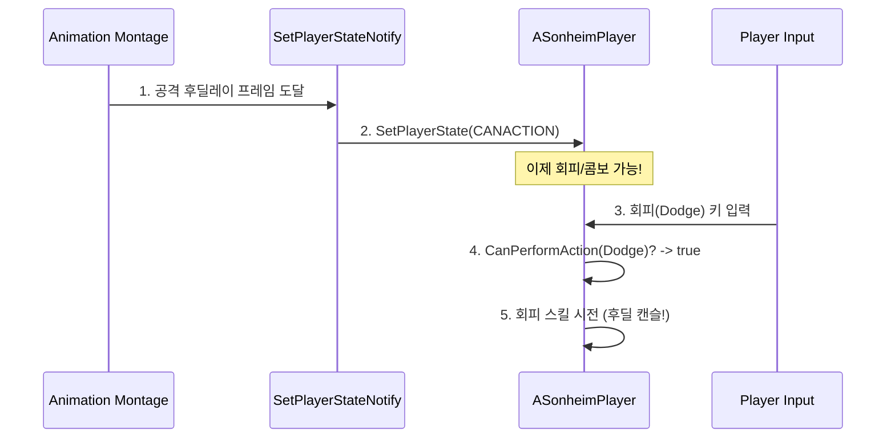

# 4.1. 플레이어 캐릭터 컨트롤: '손맛'을 만드는 기술

> ### TPS 게임에서 부드럽게 어깨를 조준(Shoulder-View)하고, 공격의 후딜레이를 회피로 캔슬하는 등, 플레이어의 손끝에 착 감기는 '손맛'은 어떻게 만들어질까요? Sonheim은 보간법(Interpolation)을 활용한 카메라/회전 제어와 애니메이션 주도 상태 머신을 통해, 반응성이 뛰어나면서도 안정적인 캐릭터 컨트롤 시스템을 직접 구현했습니다.
> 
> *   **보간법을 활용한 부드러운 조준:** `RInterpTo`와 `FInterpTo`를 사용하여, 딱딱하게 전환되는 조준 모드가 아닌, 사용자의 시점과 캐릭터의 움직임이 부드럽게 이어지는 전문 TPS 게임 수준의 카메라 워크와 캐릭터 회전을 구현했습니다.
> *   **애니메이션 주도 행동 제어:** `TMap` 기반의 간단한 상태 머신을 `AnimNotify`와 결합하여, 공격 중 이동 제한, 후딜레이 캔슬 등 ARPG 특유의 정교한 액션 연계 시스템을 애니메이터가 직접 타이밍을 디자인할 수 있도록 설계했습니다.
> *   **안정적인 기반 위에 확장:** 기본 이동 동기화는 언리얼 엔진의 검증된 `UCharacterMovementComponent`를 최대한 활용하여 안정성을 확보하고, 그 위에 조준, 글라이딩, 스프린트 등 Sonheim만의 커스텀 상태를 `ReplicatedUsing`으로 안정적으로 확장했습니다.

---

## 4.1.1. 구현 기능 목록 (Feature List)

이 시스템을 통해 플레이어는 다음과 같은 핵심 액션을 수행할 수 있습니다.

*   **기본 이동 및 카메라**
    *   **이동 및 점프:** 3인칭 시점에서 전후좌우 이동, 점프가 가능하며, 모든 움직임은 언리얼의 표준 `CharacterMovementComponent`를 통해 안정적으로 네트워크에 동기화됩니다.
    *   **카메라 제어:** 마우스를 통해 자유롭게 카메라를 회전하여 주변을 둘러볼 수 있습니다.

*   **정교한 조준 및 전투 연계**
    *   **부드러운 조준 (Aiming):** 마우스 우클릭 시, 카메라가 부드럽게 줌인되고 플레이어가 카메라 방향을 매끄럽게 따라 회전하여 정밀한 조준이 가능합니다.
    *   **액션 캔슬:** 공격 애니메이션의 후딜레이를 회피나 다음 콤보 공격으로 캔슬하여, 빠르고 유연한 전투를 경험할 수 있습니다. (상세: [[3.4 애니메이션 시스템|3.4_Animation_System]])
    *   **공격 및 회피:** 마우스 클릭과 특정 키를 통해, [[3.3 스킬 시스템|3.3_Skill_Architecture]]과 연동된 공격 및 회피 스킬을 사용합니다.

*   **특수 이동 및 상태**
    *   **스프린트 (Sprint):** Shift 키를 누르고 있는 동안 [[스태미나|3.2_Attribute_System]]를 소모하여 빠르게 달립니다. 클라이언트 예측 기법이 적용되어 키를 누르는 즉시 반응합니다.
    *   **글라이딩 (Gliding):** 글라이더 아이템을 소지하고 있을 경우, 공중에서 점프 키를 눌러 글라이더를 펼쳐 천천히 활강할 수 있습니다.
    *   **커스텀 상태 동기화:** 위 모든 커스텀 상태(`bIsSprinting`, `bIsGliding` 등)는 `ReplicatedUsing`(RepNotify)을 사용하여, 중간에 접속한 플레이어에게도 누락 없이 정확하게 동기화됩니다.

---

## 4.1.2. 핵심 구현 1: 보간법을 활용한 부드러운 조준 시스템

좋은 TPS의 조준 시스템은 단순한 기능이 아니라 '느낌(Game Feel)'의 영역입니다. Sonheim은 이 '손맛'을 구현하기 위해, 언리얼 엔진의 보간(Interpolation) 함수를 적극적으로 활용하여 카메라와 캐릭터의 움직임을 직접 제어합니다.

### 1. 부드러운 캐릭터 회전: `bUseControllerRotationYaw`
조준 모드에서 캐릭터는 항상 카메라가 바라보는 방향을 향해야 합니다. 하지만 평상시에는 이동 방향을 향해 자유롭게 회전해야 합니다. Sonheim은 이 두 상태를 전환하기 위해 언리얼 엔진의 표준 기능인 `UCharacterMovementComponent`의 `bUseControllerRotationYaw` 플래그를 활용합니다.

조준 상태(`bIsLockOn`)가 변경되면, `OnRep_IsLockOn` 함수가 모든 클라이언트에서 호출되어 `bUseControllerRotationYaw` 값을 동기화합니다. 이 플래그가 `true`가 되면, 캐릭터는 컨트롤러의 Yaw 회전값을 자동으로 따라 부드럽게 회전하게 되어, 별도의 보간 로직 없이도 자연스러운 조준 회전을 구현할 수 있습니다.

> [View on GitHub](https://github.com/chungheonLee0325/Sonheim/blob/main/Sonheim/Source/Sonheim/AreaObject/Player/SonheimPlayer.cpp#L968)
```cpp
// Source/Sonheim/AreaObject/Player/SonheimPlayer.cpp
void ASonheimPlayer::OnRep_IsLockOn()
{
	// 회전/애님만 동기화
	bUseControllerRotationYaw = bIsLockOn;
	GetCharacterMovement()->bOrientRotationToMovement = !bIsLockOn;

	if (S_PlayerAnimInstance)
		S_PlayerAnimInstance->bIsLockOn = bIsLockOn;
}
```

### 2. 부드러운 카메라 줌: `FInterpTo`
조준 시 카메라가 갑자기 줌인되면 플레이어는 어색함을 느낍니다. `ASonheimPlayer`의 `AdjustCameraForLockOn` 함수에서는 `FMath::FInterpTo`를 사용하여, 카메라를 담고 있는 `SpringArmComponent`의 `TargetArmLength` 값을 목표 값까지 매끄럽게 보간합니다. 이를 통해 조준 시에는 부드럽게 줌인되고, 조준을 풀면 다시 부드럽게 줌아웃되는 카메라 워크를 구현했습니다.

> [View on GitHub](https://github.com/chungheonLee0325/Sonheim/blob/main/Sonheim/Source/Sonheim/AreaObject/Player/SonheimPlayer.cpp#L900)
```cpp
// Source/Sonheim/AreaObject/Player/SonheimPlayer.cpp
void ASonheimPlayer::AdjustCameraForLockOn(bool IsLockOn)
{
    if (IsLockOn)
    {
        // ...
        // 로컬 플레이어만 수행하는 카메라 처리 (줌인)
        GetWorld()->GetTimerManager().SetTimer(LockOnCameraTimerHandle, [weakThis]
        {
            // ...
            float alpha = FMath::FInterpTo(strongThis->CameraBoom->TargetArmLength,
                                         strongThis->RClickCameraBoomAramLength,
                                         0.01f, 5.f);
            strongThis->CameraBoom->TargetArmLength = alpha;
            // ...
        }, 0.01f, true);
    }
    // ...
}
```

### 3. 캐릭터 방향 제어: `bUseControllerRotationYaw`
평상시에는 캐릭터의 이동 방향과 바라보는 방향이 자유로워야 하지만, 조준 중에는 반드시 카메라(컨트롤러)의 방향을 따라야 합니다. 이 상태 전환은 `CharacterMovementComponent`의 `bUseControllerRotationYaw` 플래그를 통해 제어합니다. 조준 상태가 변경될 때마다 이 플래그를 `ReplicatedUsing`(RepNotify)으로 동기화하여, 모든 클라이언트에서 캐릭터의 회전 방식이 일관되게 동작하도록 보장합니다.

---

## 4.1.3. 핵심 구현 2: 애니메이션 주도 행동 제어 머신

Sonheim은 `EPlayerState` 열거형과 `TMap`을 이용한 간단한 상태 머신을, **애니메이션 노티파이와 결합**하여, 복잡한 ARPG의 컨트롤을 애니메이터가 직접 디자인할 수 있는 매우 유연하고 강력한 시스템을 구축했습니다.



1.  **규칙 정의:** `InitializeStateRestrictions` 함수에서, `EPlayerState`를 키로, 각 상태에서 어떤 행동(`Move`, `Action` 등)이 가능한지를 정의한 `FActionRestrictions` 구조체를 값으로 하는 `TMap`을 초기화합니다.
2.  **애니메이션 주도 상태 변경:** `SetPlayerStateNotify`라는 커스텀 `AnimNotify`를 통해, 애니메이터는 애니메이션 타임라인의 **정확한 프레임**에 `SetPlayerState()` 함수를 호출하여 캐릭터의 상태를 변경할 수 있습니다.
3.  **서버 권위 검증:** `Move`나 `LeftMouse_Triggered` 같은 모든 핵심 행동 함수는, 실제 로직을 실행하기 전에 `CanPerformAction()` 함수를 호출하여 현재 상태에서 해당 행동이 허용되는지 서버 권위 하에 검증합니다.

이 세 가지 요소의 조합은 **"공격 후딜레이를 회피로 캔슬"** 하는 것과 같은 정교한 컨트롤을 가능하게 합니다. 애니메이터가 공격 애니메이션의 특정 프레임에 `SetPlayerState(EPlayerState::CANACTION)` 노티파이를 배치하면, 플레이어는 그 정확한 타이밍부터 다음 스킬(회피, 콤보)을 사용하여 후딜레이를 캔슬하고 즉시 다음 행동으로 연계할 수 있습니다. 이는 프로그래머의 개입 없이, 애니메이터가 직접 게임의 '손맛'을 디자인하는 매우 강력한 워크플로우입니다.

> [View on GitHub](https://github.com/chungheonLee0325/Sonheim/blob/main/Sonheim/Source/Sonheim/Animation/Player/SetPlayerStateNotify.cpp)
> [View on GitHub](https://github.com/chungheonLee0325/Sonheim/blob/main/Sonheim/Source/Sonheim/AreaObject/Player/SonheimPlayer.cpp#L737)
```cpp
// SetPlayerStateNotify.cpp - 애니메이션에서 직접 플레이어 상태를 변경
void USetPlayerStateNotify::Notify(USkeletalMeshComponent* MeshComp, UAnimSequenceBase* Animation)
{
    if (MeshComp && MeshComp->GetOwner())
    {
        ASonheimPlayer* owner = Cast<ASonheimPlayer>(MeshComp->GetOwner());
        if (owner != nullptr)
        {
            owner->SetPlayerState(PlayerState);
        }
    }
}

// SonheimPlayer.cpp - 행동 전, 상태에 따른 가능 여부 검증
void ASonheimPlayer::Move(const FVector2D MovementVector)
{
    if (Controller != nullptr)
    {
        // 행동 가능 여부를 서버 권위로 검증
        if (CanPerformAction(CurrentPlayerState, "Move"))
        {
            // ... 이동 로직 ...
        }
    }
}
```

## 4.1.4. 핵심 구현 3: RepNotify를 활용한 커스텀 상태 동기화

Sonheim의 모든 커스텀 상태(`bIsSprinting`, `bIsGliding`, `bIsDead` 등)는 `ReplicatedUsing`(RepNotify)을 사용하여, 중간에 접속한 플레이어에게도 누락 없이 정확하게 동기화됩니다. 특히 `Sprint` 기능에는 **가벼운 클라이언트 예측(Lightweight Client-Side Prediction)** 기법을 적용하여 반응성을 극대화했습니다.

1.  **[클라이언트]** 사용자가 `Shift` 키를 누르면, `Sprint_Pressed` 함수는 서버에 RPC를 보내기 **전에**, 먼저 로컬 클라이언트의 `ApplySprinting(true)` 함수를 호출하여 캐릭터의 이동 속도를 즉시 높입니다.
2.  **[클라이언트 -> 서버]** 그 직후, `Server_SetSprinting(true)` RPC를 호출하여 서버에 실제 상태 변경을 요청합니다.
3.  **[서버]** 서버는 요청을 받아 유효성을 검증하고, 실제 `bIsSprinting` 변수를 `true`로 변경합니다. 이 변수는 `ReplicatedUsing=OnRep_IsSprinting`으로 지정되어 있어, 모든 클라이언트에게 최종적인 상태를 보장합니다.

이 "선적용, 후요청" 방식을 통해, 플레이어는 키를 누르는 즉시 캐릭터가 빨라지는 즉각적인 피드백을 경험하게 되어, 네트워크 지연을 전혀 체감할 수 없습니다.

> [View on GitHub](https://github.com/chungheonLee0325/Sonheim/blob/main/Sonheim/Source/Sonheim/AreaObject/Player/SonheimPlayer.cpp#L935)
```cpp
// Source/Sonheim/AreaObject/Player/SonheimPlayer.cpp
void ASonheimPlayer::Sprint_Pressed()
{
    // 1. 클라이언트에서 먼저 적용하여 즉각적인 반응성을 제공
    if (IsLocallyControlled()) ApplySprinting(true);

    // 2. 서버에 실제 상태 변경을 요청
    Server_SetSprinting(true);
}

void ASonheimPlayer::Server_SetSprinting_Implementation(bool bNew)
{
    // 3. 서버에서 권위있게 상태를 변경하고, Replication을 통해 전파
    bIsSprinting = bNew;
    OnRep_IsSprinting(); // 서버 자신에게도 RepNotify 즉시 적용
}

void ASonheimPlayer::OnRep_IsSprinting()
{
    ApplySprinting(bIsSprinting);
}
```

---

## 4.1.5. 설계 결정 및 회고

*   **설계 결정: 왜 조준 시스템을 직접 구현했는가?**
    단순히 기능을 구현하는 것을 넘어, **'손맛'의 미세한 영역을 완벽하게 통제**하기 위함이었습니다. `RInterpTo`와 같은 저수준의 수학 함수를 이용하여 조준 시스템을 직접 구현함으로써, 캐릭터 회전 속도, 카메라 줌 속도 등 모든 변수를 자유롭게 조절하고 테스트하며, Sonheim만의 가장 만족스러운 조준 감각을 찾아낼 수 있었습니다.

*   **아쉬운 점: 클라이언트 예측의 비일관성**
    솔직하게, `Sprint` 기능에서 사용된 "선적용, 후요청" 방식의 클라이언트 예측 패턴이 모든 액션에 일관되게 적용되지는 못했습니다. 예를 들어, 스킬 시스템은 서버의 응답을 받은 후에야 애니메이션이 재생되는 순수 서버 권위 방식으로 구현되어 있어, 네트워크 환경에 따라 미세한 입력 지연이 느껴질 수 있습니다. 이는 프로젝트 초기에 스킬의 **데이터 무결성과 서버 권위 보장**이라는 안정성을 최우선으로 확보하는 데 집중했기 때문입니다.

*   **개선 방안: `GameplayTag` 도입 및 클라이언트 예측 확장**
    향후 개선한다면, `EPlayerState` 열거형을 **`GameplayTag`**로 대체하여 계층적 상태 관리를 도입하고, 스킬 시전 시에도 먼저 클라이언트에서 애니메이션을 재생하고 서버에 RPC를 보내는 방식으로 리팩토링하여, 모든 액션에서 일관되고 즉각적인 반응성을 제공할 수 있을 것입니다.

---

## 4.1.6. 관련 시스템

*   [[2.1 서버 권위 원칙|2.1_Server_Authority_Architecture]]
*   [[2.4 플레이어 클래스 아키텍처|2.4_Player_Class_Architecture]]
*   [[3.3 스킬 시스템|3.3_Skill_Architecture]]
*   [[3.4 애니메이션 시스템|3.4_Animation_System]]
