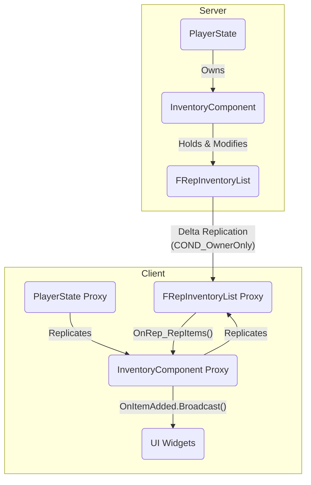

# 4.2. 인벤토리 시스템 (UInventoryComponent)

> ### FastArray와 클라이언트 예측으로 구현한 반응형 온라인 인벤토리
>
> *   **`FastArraySerializer` (델타 복제)**를 통해, 수십 개의 슬롯이 변경되어도 최소한의 네트워크 패킷만 전송하여 서버 부하를 최적화했습니다.
> *   **`PlayerState`**에 컴포넌트를 소유시켜, 플레이어가 사망하거나 재접속해도 모든 아이템이 안전하게 보존되는 **데이터 영속성**을 확보했습니다.
> *   **클라이언트 예측(Client-Side Prediction)**을 지원하는 API 설계를 통해, 네트워크 지연이 있는 환경에서도 아이템을 즉시 옮기는 듯한 반응성 높은 UX를 제공합니다.

---

> [!VIDEO]
> **[인벤토리 시스템 시연 영상]**
> (영상이나 GIF를 여기에 삽입하세요. 드래그 앤 드롭으로 아이템을 옮기거나, 장비를 착용했을 때 스탯이 즉시 변하는 모습을 보여주는 것이 좋습니다.)

---

## 4.2.1. 구현 기능 목록 (Feature List)

이 시스템을 통해 플레이어는 다음과 같은 인벤토리 기능을 경험하게 됩니다.

*   **아이템 관리**
    *   **획득 및 보관:** 아이템을 획득하여 슬롯 기반 인벤토리에 저장하고, 아이템 종류에 따라 자동으로 스택을 쌓습니다.
    *   **맥락에 맞는 UI 피드백:** 아이템이 추가될 때, 이것이 \'새로운 획득\'인지 \'슬롯 이동\'인지를 시스템이 구분하여, 새로운 아이템을 얻었을 때만 획득 UI가 표시되도록 하는 섬세한 UX를 제공합니다.
    *   **아이템 이동:** 드래그 앤 드롭으로 인벤토리 내에서 아이템의 위치를 자유롭게 교체합니다.
    *   **아이템 버리기:** 소지한 아이템을 월드에 드롭하거나, 영구적으로 파기할 수 있습니다.

*   **장비 시스템**
    *   **장착 및 해제:** 인벤토리의 장비 아이템을 캐릭터의 전용 장비 슬롯(방어구 등)에 장착하거나 해제합니다.
    *   **스탯 실시간 연동:** 장비를 장착하거나 해제하는 즉시, [[4.3 스탯 시스템|4.3_Stat_System]]이 실시간으로 변경됩니다.
    *   **자동 장착:** 아이템 획득 시, 비어있는 장비 슬롯이 있다면 자동으로 해당 아이템을 장착하는 편의 기능을 제공합니다.

*   **무기 슬롯 시스템**
    *   플레이어는 **4개의 무기 슬롯**을 가지며, 단축키를 통해 이 슬롯들을 순환하며 장착된 무기를 실시간으로 교체할 수 있습니다.

*   **네트워크 및 데이터**
    *   **클라이언트 예측:** 모든 아이템 조작(이동, 장착 등)이 서버의 응답을 기다리지 않고 UI에 즉시 반영되어, 쾌적한 플레이 경험을 제공합니다.
    *   **서버 권위:** 모든 아이템 관련 로직은 최종적으로 서버의 검증을 거치므로, 아이템 복제나 유실과 같은 문제를 원천적으로 방지합니다.
    *   **데이터 영속성:** 플레이어가 게임을 종료하거나, 전투 중 사망하여 부활해도 모든 인벤토리 및 장비 정보는 안전하게 유지됩니다.

---

## 4.2.2. 기술 상세 (Technical Deep Dive)

### 4.2.2.1. 설계 목표

인벤토리 시스템은 플레이어의 성장과 직결되는 핵심 시스템입니다. 이 시스템의 핵심 기능을 담당하는 `UInventoryComponent`는 다음과 같은 목표를 달성하기 위해 설계되었습니다.

1.  **데이터 영속성 (Data Persistence):** 플레이어가 죽거나 재접속하더라도 모든 아이템 정보가 안전하게 유지되어야 합니다. 이를 위해 컴포넌트는 폰(Pawn)이 아닌, 세션 내내 유지되는 [[2.4 플레이어 클래스 아키텍처|2.4_Player_Class_Architecture]]에 소속됩니다.
2.  **서버 권위 및 데이터 무결성:** 모든 아이템의 추가, 삭제, 이동은 반드시 서버의 검증을 거쳐야 하며, 클라이언트의 조작이나 네트워크 오류로 인해 아이템이 복제되거나 유실되어서는 안 됩니다.
3.  **네트워크 효율성 (Network Efficiency):** 수십 개의 슬롯을 가진 인벤토리 데이터가 변경될 때, 전체 목록이 아닌 변경된 슬롯의 정보만 클라이언트에 전송하여 네트워크 부하를 최소화해야 합니다.
4.  **반응성 높은 UX 지원:** 네트워크 지연 속에서도 사용자가 아이템을 옮기거나 사용할 때 즉각적인 피드백을 느낄 수 있도록, 클라이언트 예측(Client-Side Prediction)을 지원하는 유연한 구조를 가져야 합니다.

### 4.2.2.2. 아키텍처: Fast Array와 조건부 복제

`UInventoryComponent`의 핵심 아키텍처는 언리얼 엔진의 고급 복제 기술을 적극적으로 활용하여, 안정성과 효율성이라는 두 마리 토끼를 모두 잡는 것입니다.



*   **`FRepInventoryList` (Fast Array Serializer):** 아이템 목록을 일반 `TArray`가 아닌 `FFastArraySerializer` 기반의 커스텀 구조체로 관리합니다. 이는 배열 전체가 아닌, **변경된 아이템 슬롯만** 클라이언트에 전송하는 **델타 복제(Delta Replication)**를 가능하게 하여 네트워크 효율을 극대화합니다. 각 항목은 아래와 같은 간단한 구조체로 이루어져 있습니다.

```cpp
// Source/Sonheim/AreaObject/Player/Utility/InventoryComponent.h
USTRUCT(BlueprintType)
struct FRepInventoryEntry : public FFastArraySerializerItem
{
	GENERATED_BODY()

	UPROPERTY()
	int32 SlotIndex = 0;

	UPROPERTY()
	int32 ItemID = 0;

	UPROPERTY()
	int32 Count = 0;
};
```

*   **`COND_OwnerOnly` (조건부 복제):** 인벤토리 데이터는 `DOREPLIFETIME_CONDITION` 매크로를 통해 `COND_OwnerOnly` 조건으로 복제됩니다. 이는 각 플레이어가 오직 **자기 자신의 인벤토리 데이터만** 수신하도록 하여, 불필요한 정보 전송을 막고 보안을 강화합니다.

### 4.2.2.3. 핵심 구현

#### 4.2.2.3.1. \'새로운 획득\'과 \'슬롯 이동\'을 구분하는 방법

> **어떻게 UI가 \'새로운 획득\'에만 반응하게 만들었는가?**

이 시스템의 섬세한 UX를 보여주는 좋은 예시는, 아이템이 추가될 때 \'새로운 획득\'과 \'인벤토리 내 이동\'을 구분하여 각기 다른 피드백을 주는 것입니다. 이 로직의 핵심은 `AddItem` 함수의 `bool IsDirectAcquisition` 파라미터와, 여러 종류의 델리게이트에 있습니다.

*   **`OnInventoryChanged`:** 인벤토리 슬롯의 내용이 변경될 때마다 항상 호출되는 가장 일반적인 델리게이트입니다. UI는 이 이벤트를 받아 슬롯의 아이콘과 개수를 다시 그립니다.
*   **`OnItemAdded`:** **오직 \'새로운 아이템\'을 획득했을 때만** 호출되는 특별한 델리게이트입니다. UI는 이 이벤트를 받아, 화면 좌측에 아이템의 아이콘, 이름, 획득 개수를 표시하고 레어리티에 따라 테두리 색상이 변하는 알림 위젯을 띄웁니다.

이 둘을 구분하는 로직은 `AddItem` 함수 내부에 있습니다.

> [View on GitHub](https://github.com/chungheonLee0325/Sonheim/blob/main/Sonheim/Source/Sonheim/AreaObject/Player/Utility/InventoryComponent.cpp#L288)
```cpp
// Source/Sonheim/AreaObject/Player/Utility/InventoryComponent.cpp
bool UInventoryComponent::AddItem(int ItemID, int ItemCount, bool IsDirectAcquisition)
{
    if (GetOwnerRole() == ROLE_Authority)
    {
        // ... (아이템 추가 로직) ...

        // IsDirectAcquisition이 true일 때만 OnItemAdded를 호출!
        if (IsDirectAcquisition && AddedToInventory > 0)
        {
            OnItemAdded.Broadcast(ItemID, AddedToInventory);
        }
        // OnInventoryChanged는 항상 호출
        BroadcastInventoryChanged();
        return true;
    }
    // ...
}
```

`SwapItems`와 같이 인벤토리 내부에서 아이템의 위치만 변경하는 함수는, 내부적으로 `AddItem`을 호출할 때 `IsDirectAcquisition` 파라미터를 `false`로 전달합니다. 덕분에 `OnItemAdded` 델리게이트는 호출되지 않아 불필요한 알림이 뜨지 않고, `OnInventoryChanged`만 호출되어 슬롯 UI만 깔끔하게 갱신됩니다.

#### 4.2.2.3.2. 클라이언트 예측 API의 쌍 구조

반응성 높은 UX를 위해, 인벤토리의 모든 핵심 기능은 **`공개 API` - `클라이언트 예측 함수` - `서버 RPC`** 라는 세 가지 함수의 쌍으로 구성됩니다. `SwapItems` 함수가 그 대표적인 예시입니다.

> [View on GitHub](https://github.com/chungheonLee0325/Sonheim/blob/main/Sonheim/Source/Sonheim/AreaObject/Player/Utility/InventoryComponent.cpp#L789)
```cpp
// Source/Sonheim/AreaObject/Player/Utility/InventoryComponent.cpp
bool UInventoryComponent::SwapItems(int32 FromIndex, int32 ToIndex)
{
    // ... (유효성 검사) ...

	// 서버에서 실행
	if (GetOwnerRole() == ROLE_Authority)
	{
        // 실제 데이터 변경 로직
		InventoryItems.Swap(FromIndex, ToIndex);
		UpdateRepEntryAtIndex(FromIndex);
		UpdateRepEntryAtIndex(ToIndex);
		BroadcastInventoryChanged();
		return true;
	}
	// 클라이언트에서 실행
	else
	{
		// 1. 예측
		if (bEnableClientPrediction)
		{
			PerformClientPrediction_SwapItems(FromIndex, ToIndex);
		}

		// 2. 서버 요청
		ServerSwapItems(FromIndex, ToIndex);
		return true;
	}
}
```
이러한 구조를 통해, 플레이어는 네트워크 지연이 있는 환경에서도 마치 싱글플레이 게임처럼 쾌적하게 인벤토리를 조작할 수 있습니다.

### 4.2.2.4. 회고 및 개선점

*   **문제:** 프로젝트 초기, 인벤토리 데이터를 `TMap<int32, FInventoryItem>`으로 구현하려 했습니다. `TMap`은 키를 통한 빠른 접근(O(1))이 가능하지만, 언리얼 엔진에서 `TMap` 자체는 네트워크 리플리케이션을 직접 지원하지 않아 데이터 동기화에 큰 어려움이 있었습니다.
*   **해결 과정:** 대안으로 `TArray<FInventoryItem>`을 사용했지만, 아이템 하나만 변경되어도 배열 전체를 복제하는 비효율 문제가 발생했습니다. 이 문제를 해결하기 위해 언리얼 엔진의 `Fast Array Serialization`을 학습하고 도입했습니다. 아이템 목록을 `FFastArraySerializer` 기반의 구조체로 리팩토링하여, 변경된 항목만 선택적으로 동기화하는 델타 복제 기능을 구현했습니다.
*   **교훈:** 언리얼 엔진의 네트워크 아키텍처를 깊이 이해하고, 상황에 맞는 최적의 동기화 메커니즘을 선택하는 것이 멀티플레이어 게임의 성능과 안정성에 얼마나 중요한지 깨달았습니다. 특히 `FastArraySerializer`와 같은 엔진의 고급 기능을 적극적으로 활용하면, 직접 구현하기 어려운 복잡한 네트워크 최적화를 매우 효율적으로 달성할 수 있다는 것을 배웠습니다.

### 4.2.2.5. 관련 시스템

*   [[2.1 서버 권위 원칙|2.1_Server_Authority_Architecture]]
*   [[2.4 플레이어 클래스 아키텍처|2.4_Player_Class_Architecture]]
*   [[4.3 스탯 시스템|4.3_Stat_System]]
*   [[6.2 아이템 시스템|6.2_Item_System]]
*   [[7.5 인벤토리 UI 심층 분석|7.5_Building_a_Reusable_Inventory_UI]]
*   [[8.4 반응형 인벤토리 UX|8.4_Case_Study_Inventory_Interaction]]
