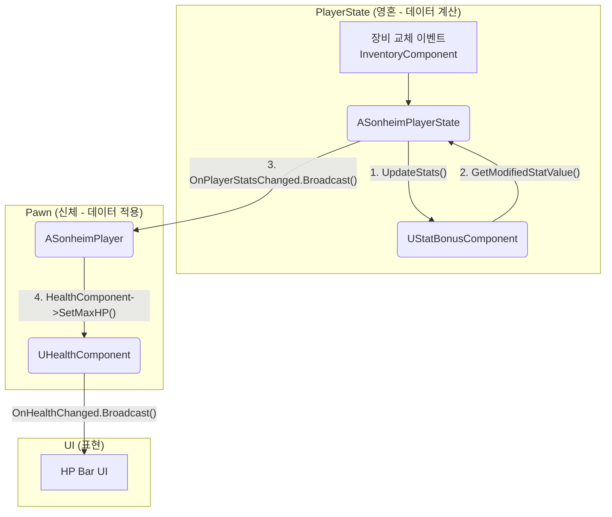

# 4.3. 스탯 시스템: 동적인 능력치 계산

> ### PlayerState에 StatBonusComponent를 중앙화하여, 여러 장비와 버프에 흩어진 스탯 보너스를 안전하게 집계/계산하고, 그 결과를 Pawn의 각종 기능 컴포넌트(체력, 이동속도)에 전파하는 동적 스탯 파이프라인을 구축했습니다.
> 
> *   **중앙화된 스탯 보너스 집계:** `StatBonusComponent`가 `TMap`을 사용하여 여러 장비와 버프에서 오는 모든 스탯 보너스를 중앙에서 집계하고, 아이템 ID를 키로 보너스를 추적하여 장비 해제 시 관련 보너스만 정확히 제거합니다.
> *   **가산/곱연산/덮어쓰기 지원:** 단순 합산(Additive) 보너스뿐만 아니라, 곱연산(Multiplicative)과 덮어쓰기(Override) 타입의 보너스까지 지원하여, 복잡하고 다양한 종류의 버프와 아이템 효과를 구현할 수 있는 확장성 높은 계산 로직을 갖추었습니다.
> *   **델리게이트 기반의 비동기 적용:** `PlayerState`에서 계산된 최종 스탯은 `OnPlayerStatsChanged` 델리게이트를 통해 `Pawn`에 전파됩니다. `Pawn`은 이 신호를 받아, 스탯의 종류에 따라 `HealthComponent`의 최대 체력을 변경하거나 `CharacterMovementComponent`의 이동 속도를 변경하는 등, 실제 게임플레이에 능력치를 적용하는 역할을 수행합니다.

---

> [!VIDEO]
> **[스탯 시스템 시연 영상]**
> (영상이나 GIF를 여기에 삽입하세요. 플레이어가 장비를 장착하거나 해제할 때, 캐릭터 정보창의 공격력, 방어력 등 최종 스탯이 실시간으로 변하는 모습을 보여주는 것이 좋습니다.)

---

## 4.3.1. 구현 기능 목록 (Feature List)

이 시스템을 통해 플레이어는 다음과 같은 성장 경험을 하게 됩니다.

*   **실시간 동적 스탯:**
    *   플레이어의 최종 능력치는 레벨에 따른 기본 스탯, 모든 장비가 제공하는 스탯 보너스, 그리고 일시적인 버프/디버프 효과가 모두 합산되어 실시간으로 결정됩니다.
*   **자동화된 UI 연동:**
    *   장비를 교체하거나 버프를 받으면, 캐릭터 정보창(스탯 위젯)과 HUD의 HP 바 등이 별도의 로직 없이 자동으로 최신 값으로 갱신됩니다.
*   **완벽한 데이터 영속성:**
    *   플레이어가 전투 중 사망하여 부활하더라도, 레벨과 장비로 인한 모든 스탯 보너스는 그대로 유지됩니다.

---

## 4.3.2. 기술 상세 (Technical Deep Dive)

### 4.3.2.1. 설계 목표

[[어트리뷰트 시스템|3.2_Attribute_System]]이 모든 캐릭터의 기본적인 속성 관리 기반을 제공한다면, 이 **플레이어 스탯 시스템**은 그 기반 위에서, 오직 플레이어에게만 필요한 더 복잡하고 동적인 요구사항을 해결하는 것을 목표로 합니다.

1.  **상태 지속성 (State Persistence):** 플레이어가 죽었다 부활하더라도 레벨, 장비로 인한 스탯 보너스 등은 유지되어야 합니다. 이를 위해 언리얼 엔진의 철학에 따라, **Pawn**과 **PlayerState**의 역할을 명확히 구분하여 컴포넌트를 배치합니다.
2.  **동적인 스탯 변화:** 플레이어의 행동(장비 교체, 버프/디버프)에 따라 모든 관련 스탯이 실시간으로 재계산되고, 게임플레이에 즉시 반영되어야 합니다.
3.  **이벤트 기반 반응형 구조:** 스탯에 변화가 생겼을 때, 다른 시스템이 해당 스탯을 직접 참조하지 않고도 `델리게이트`를 통해 변경 사실을 통지받아 \'반응\'하는 유연한 구조를 지향합니다.
4.  **서버 권위 및 효율적인 복제:** 모든 스탯 계산과 판정은 서버에서만 이루어지며, 그 결과는 클라이언트에 효율적으로 복제되어야 합니다.

### 4.3.2.2. 아키텍처: PlayerState 중심의 동적 스탯 계산

플레이어의 스탯이 영속성을 가지면서도 동적으로 변하기 위해서는, 언리얼 엔진의 `Pawn`과 `PlayerState`의 역할을 명확히 구분해야 합니다.

*   **Pawn (`ASonheimPlayer`):** 게임 월드에 실제 존재하는 물리적 아바타입니다. 따라서 캐릭터의 죽음과 함께 소멸되는 **일시적인 상태** (현재 HP, 현재 스태미나)를 관리하는 컴포넌트([[`HealthComponent`, `StaminaComponent`|3.2_Attribute_System]])가 여기에 위치합니다.
*   **PlayerState (`ASonheimPlayerState`):** 플레이어의 연결 세션 동안 유지되는 추상적인 상태 정보입니다. 캐릭터가 죽어도 초기화되지 않아야 하는 **영구적인 상태** (레벨, 장비로 인한 스탯 보너스)를 관리하는 컴포넌트([[`InventoryComponent`|4.2_Inventory_System]], `StatBonusComponent`)가 여기에 위치합니다.

이러한 역할 분리에 따라, 플레이어의 스탯은 `PlayerState`를 중재자로 하여 다음과 같은 흐름으로 계산되고 적용됩니다.



### 4.3.2.3. 핵심 구현

#### 1. 플레이어의 동적 스탯 계산 (PlayerState 중심)

플레이어의 스탯은 `ASonheimPlayerState`를 중재자로 하여 동적으로 계산됩니다. 장비 교체와 같이 모든 스탯에 영향을 주는 이벤트가 발생하면 `UpdateStats` 함수가, 버프/디버프처럼 특정 스탯만 변경될 때는 `UpdateStat` 함수가 호출되어 효율적으로 처리합니다.

> [View on GitHub (Stat Calculation)](https://github.com/chungheonLee0325/Sonheim/blob/main/Sonheim/Source/Sonheim/AreaObject/Player/SonheimPlayerState.cpp#L120)
```cpp
// Source/Sonheim/AreaObject/Player/SonheimPlayerState.cpp
void ASonheimPlayerState::UpdateStats()
{
	if (!HasAuthority())
		return;

	// 모든 기본 스탯에 대해 수정된 값을 계산
	for (const auto& StatPair : BaseStat)
	{
        // StatBonusComponent를 통해 최종 스탯 값을 가져온다.
		float ModifiedValue = m_StatBonusComponent->GetModifiedStatValue(StatPair.Key, StatPair.Value);
		ModifiedStat.Add(StatPair.Key, ModifiedValue);
        // 스탯 변경을 전파한다.
		OnPlayerStatsChanged.Broadcast(StatPair.Key, ModifiedValue);
	}
	// ...
}
```

#### 2. 스탯 변경 전파 및 적용 (Pawn의 역할)

`HealthComponent`와 같은 컴포넌트는 `PlayerState`의 델리게이트를 직접 구독하지 않습니다. 대신, **Pawn**(`ASonheimPlayer`)이 `PossessedBy` 함수에서 `PlayerState`가 유효해지는 시점에 `OnPlayerStatsChanged` 델리게이트를 구독하여 중재자 역할을 합니다.

> [View on GitHub (Delegate Binding)](https://github.com/chungheonLee0325/Sonheim/blob/main/Sonheim/Source/Sonheim/AreaObject/Player/SonheimPlayer.cpp#L274)
```cpp
// Source/Sonheim/AreaObject/Player/SonheimPlayer.cpp
void ASonheimPlayer::BindDelegates()
{
    // ...
	if (S_PlayerState)
	{
		S_PlayerState->OnPlayerStatsChanged.RemoveDynamic(this, &ASonheimPlayer::StatChanged);
		S_PlayerState->OnPlayerStatsChanged.AddDynamic(this, &ASonheimPlayer::StatChanged);
	}
}
```

`PlayerState`에서 스탯 변경 이벤트가 브로드캐스트되면, `ASonheimPlayer`에 바인딩된 `StatChanged` 함수가 호출됩니다. 이 함수는 스탯 종류를 확인하여 자신이 소유한 `HealthComponent`의 `SetMaxHP`를 호출하는 등 실제 액터를 변경하는 역할을 수행합니다.

> [View on GitHub (Stat Handling)](https://github.com/chungheonLee0325/Sonheim/blob/main/Sonheim/Source/Sonheim/AreaObject/Player/SonheimPlayer.cpp#L501)
```cpp
// Source/Sonheim/AreaObject/Player/SonheimPlayer.cpp
void ASonheimPlayer::StatChanged(EAreaObjectStatType StatType, float StatValue)
{
	if (!HasAuthority()) return;

	switch (StatType)
	{
	case EAreaObjectStatType::HP:
		if (m_HealthComponent)
		{
			m_HealthComponent->SetMaxHP(StatValue);
		}
		break;
    // ...
	}
}
```

### 4.3.2.4. 회고 및 개선점

*   **설계 결정:** 초기 기획 단계에서, `HealthComponent`가 `InventoryComponent`의 델리게이트를 직접 구독하여 장비 변경에 반응하는 설계를 고려했습니다. 하지만 이 방식은 `HealthComponent`가 `InventoryComponent`의 존재를 알아야 하는 강한 결합을 만들어, 재사용성을 해치고 시스템의 복잡도를 높이는 문제가 있었습니다.

*   **해결 과정:** 최종적으로, 언리얼의 `Pawn`/`PlayerState` 아키텍처를 올바르게 활용하여, **데이터의 계산(`PlayerState`)**과 **데이터의 적용(`Pawn`)**을 명확히 분리했습니다. `PlayerState`는 모든 스탯 보너스를 종합하여 최종 스탯을 계산하고, `Pawn`은 이 최종 스탯을 받아 자신의 컴포넌트(체력, 이동속도 등)에 적용하는 역할만 수행합니다. 이 둘 사이의 통신은 오직 `OnPlayerStatsChanged` 델리게이트를 통해 이루어지므로, 각자의 역할에만 집중하는 매우 유연하고 안정적인 구조가 완성되었습니다.

*   **교훈:** 이 설계를 통해, 언리얼 엔진의 아키텍처를 깊이 이해하고 따르는 것이 얼마나 중요한지 깨달았습니다. `Pawn`과 `PlayerState`의 역할을 명확히 분리함으로써, 복잡한 동적 스탯 시스템을 매우 직관적이고 확장 가능한 구조로 구현할 수 있었습니다.

---

## 4.3.3. 관련 시스템

*   [[3.2 어트리뷰트 시스템|3.2_Attribute_System]]
*   [[4.2 인벤토리 시스템|4.2_Inventory_System]]
*   [[2.4 플레이어 클래스 아키텍처|2.4_Player_Class_Architecture]]
*   [[7.1 이벤트 기반 UI 아키텍처|7.1_Event-Driven_UI_Architecture]]
