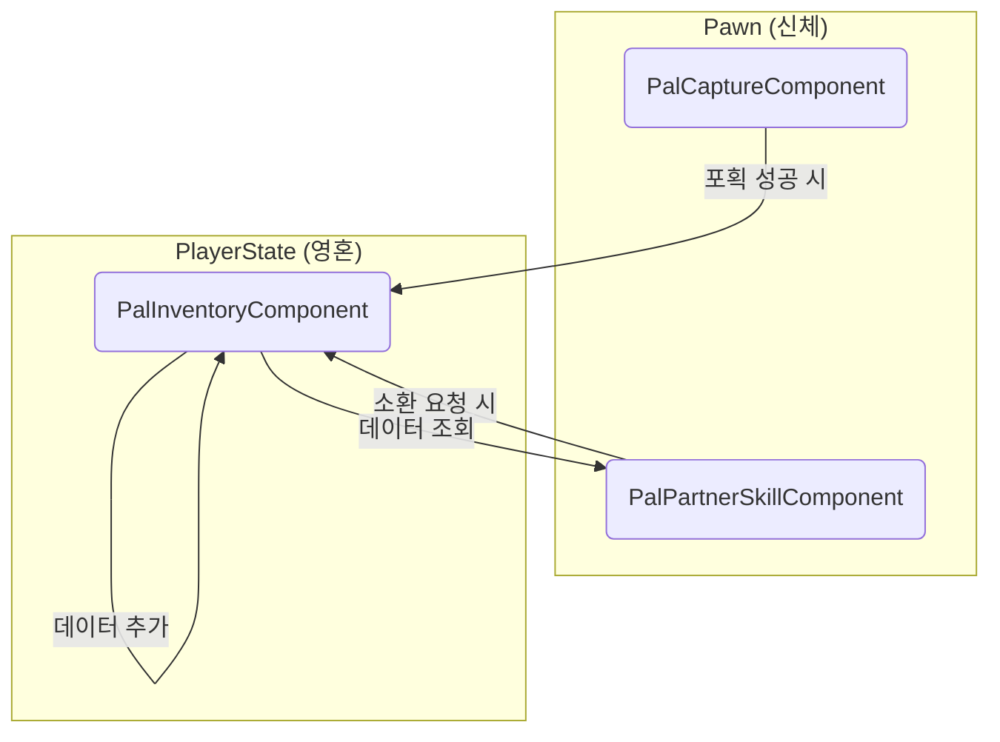

# 4.4. 팰 관리 시스템: 포획에서 전투까지, 완전한 생명주기

> ### 어떻게 야생의 몬스터가 플레이어의 충직한 동료 '팰'로 다시 태어날까요? Sonheim은 '포획', '보관', '소환'으로 이어지는 팰의 완전한 생명주기를, 각자의 책임이 명확한 3개의 독립적인 컴포넌트가 유기적으로 협력하여 관리하도록 설계했습니다.
> 
> *   **컴포넌트 기반 생명주기 관리:** 팰의 전체 생명주기를 **포획 시도(`PalCaptureComponent`)**, **영속적 데이터 보관(`PalInventoryComponent`)**, **월드 소환 및 전투(`PalPartnerSkillComponent`)** 라는 3개의 독립적인 컴포넌트로 분리하여, 각 기능의 책임과 역할을 명확히 하고 유지보수성을 극대화했습니다.
> *   **일관된 사용자 경험을 위한 '지연된 서버 권위':** 포획과 소환 과정에서, 실제 데이터 변경(팰 추가/생성)을 화려한 연출이 끝나는 시간만큼 정확히 지연시킵니다. 이를 통해 모든 플레이어가 동일한 연출을 본 후 동일한 결과를 경험하는, 매우 높은 수준의 시각적 일관성을 보장합니다.
> *   **생동감 있는 확률적 연출:** 포획에 실패하더라도 매번 똑같은 연출이 반복되지 않습니다. 같은 확률이라도, 포획 시퀀스의 **어느 단계에서 실패할지가 서버에서 확률적으로 결정**되어, 마치 팰이 스피어 안에서 정말로 저항하는 듯한 생동감과 긴장감을 제공합니다.
> *   **의도적인 기술 선택과 최적화:** 팰 인벤토리는 아이템 인벤토리와 달리, 데이터의 양과 사용 빈도를 고려하여 `FastArraySerializer` 대신 일반 `TArray` 복제를 사용하는 **의도적인 기술적 절충**을 선택하고, 대신 `OnRep` 함수에 커스텀 Diffing 로직을 구현하여 효율적인 UI 업데이트를 달성했습니다.

> [!NOTE]
> 이 문서는 팰 시스템을 구성하는 **3개 컴포넌트의 역할과 책임(What & Why)**에 집중합니다. 이 컴포넌트들이 협력하여 팰을 포획하는 전체 데이터 흐름에 대한 더 자세한 분석은 **[[8.1 사례 연구: 팰 포획 시퀀스|8.1_Case_Study_Pal_Capture_Sequence]]** 문서에서 확인하실 수 있습니다.

---

## 4.4.1. 구현 기능 목록 (Feature List)

이 시스템을 통해 플레이어는 다음과 같은, 팰과의 다채로운 상호작용을 경험하게 됩니다.

*   **팰 포획 (Capture)**
    *   **서버 권위 포획 판정:** 팰 스피어 명중 시, 대상의 **[[3.2 어트리뷰트 시스템|남은 체력]]과 데이터 테이블에 정의된 고유 저항값 등을 기반**으로 계산된 **포획 확률** 에 따라 **서버가 포획 성공 여부를 최종 판정**합니다. 클라이언트는 조준 시 이 확률을 미리 볼 수 있습니다.
    *   **생동감 있는 확률적 연출:** 포획에 실패하더라도 매번 똑같은 연출이 반복되지 않습니다. 같은 확률이라도, 포획 시퀀스의 **어느 단계에서 실패할지가 서버에서 확률적으로 결정**되어, 마치 팰이 스피어 안에서 정말로 저항하는 듯한 생동감과 긴장감을 제공합니다.
    *   **스킬 시스템 연동:** 팰 스피어를 던지는 행위는 [[3.3 스킬 시스템|스킬 시스템]]을 재사용하여, 일관된 방식으로 처리됩니다.
    *   **결과의 지연 반영 (연출 우선):** 포획 성공/실패 여부는 서버에서 즉시 결정되지만, 그 결과는 바로 적용되지 않습니다. 플레이어에게 긴장감 넘치는 연출을 온전히 보여주기 위해, **애니메이션이 모두 끝난 후에야** 팰이 인벤토리에 추가되거나 다시 월드에 나타나는 등, 실제 게임 결과가 반영됩니다.

*   **팰 보관 및 관리 (Storage & Management)**
    *   **데이터 영속성:** 포획에 성공한 팰은 플레이어의 팰 인벤토리에 영구적으로 저장되며, 플레이어가 죽거나 재접속해도 데이터가 안전하게 유지됩니다. (관련: [[2.4 플레이어 클래스 아키텍처|2.4]])
    *   **클라이언트 예측 기반 슬롯 교체:** 키보드 단축키로 소환할 팰을 교체할 때, 네트워크 지연 없이 즉시 UI가 반응합니다.

*   **팰 소환 및 전투 (Summon & Combat)**
    *   **애니메이션 연동 소환:** 플레이어의 소환 모션이 끝나는 시점에 정확히 맞춰 팰이 등장하는, 모든 플레이어에게 동기화된 시각적으로 완성도 높은 소환/해제 연출을 제공합니다.
    *   **자동 전투 AI:** 소환된 팰은 주인을 따라다닐 뿐만 아니라, 주기적으로 주변의 적을 탐색하여 자동으로 공격 대상을 설정하는 능동적인 동료로 행동합니다.
    *   **파트너 스킬:** 소환된 팰에게 탭/홀드 방식의 고유 파트너 스킬 사용을 명령하여 전투를 돕게 할 수 있습니다.
---
### 4.4.2. 아키텍처: 세 컴포넌트의 협력

이 시스템은 각기 다른 책임을 가진 세 개의 컴포넌트가 `PlayerController`와 `PlayerState`를 중심으로 유기적으로 협력하는 구조로 설계되었습니다.

*   **`UPalCaptureComponent` (포획 담당):** 플레이어(`Pawn`)에 부착됩니다. 팰 스피어 투척, 포획률 계산, 포획 시퀀스 연출 등 월드에서 일어나는 물리적인 포획 과정을 담당합니다.
*   **`UPalInventoryComponent` (보관 담당):** `PlayerState`에 부착됩니다. 포획된 팰의 목록을 영구적으로 저장하고 관리하는 데이터베이스 역할을 합니다.
*   **`UPalPartnerSkillComponent` (활용 담당):** 플레이어(`Pawn`)에 부착됩니다. `PalInventoryComponent`의 데이터를 참조하여 팰을 월드에 소환하고, 파트너 스킬 사용을 제어합니다.



---

## 4.4.3. 핵심 구현: 팰의 생명주기 심층 분석

### 단계 1: 포획 - 데이터, 연출, 그리고 결과의 동기화

`PalCaptureComponent`는 포획의 **'확률 계산'**, **'연출'**, 그리고 **'결과 적용'** 이라는 세 가지 과정을 정교하게 분리하여, 일관된 사용자 경험을 제공합니다.

#### 1. 데이터 기반 포획 확률 계산: 전략적 재미의 기반

이 시스템의 가장 큰 특징은, 포획 확률 계산 로직이 **두 가지 다른 상황에서 재사용**되며, 그 모든 과정이 **데이터 테이블에 의해 제어**된다는 점입니다.

1.  **사전 정보 제공 (조준 시):** 플레이어가 몬스터를 조준하면, `InteractionComponent`는 `CalculateCaptureRate` 함수를 미리 호출하여 그 결과를 UI에 보여줍니다. 이를 통해 플레이어는 "이 몬스터는 체력을 더 빼야겠구나" 와 같은 **전략적인 판단**을 내릴 수 있습니다.
2.  **최종 판정 (명중 시):** 팰 스피어가 실제로 명중하면, 서버는 동일한 `CalculateCaptureRate` 함수를 다시 호출하여 **최종 성공 여부를 판정**합니다.

이 함수의 핵심은, 모든 계산이 `dt_AreaObject` 데이터 테이블에 정의된 몬스터 고유의 속성들을 조합하는, 완벽한 **[[2.2_Data_Driven_Design|데이터 주도 방식]]**이라는 점입니다.

> [View on GitHub](https://github.com/chungheonLee0325/Sonheim/blob/main/Sonheim/Source/Sonheim/AreaObject/Player/Utility/PalCaptureComponent.cpp#L164)
```cpp
// Source/Sonheim/AreaObject/Player/Utility/PalCaptureComponent.cpp
float UPalCaptureComponent::CalculateCaptureRate(ABaseMonster* TargetPal) const
{
    const FAreaObjectData& Data = TargetPal->GetAreaObjectData(); // 데이터 테이블 로드
    const float hpRatio = TargetPal->GetHP() / TargetPal->GetMaxHP();

    // HP 비율에 따라, 데이터 테이블의 CaptureBase와 CaptureLowHPThreshold 값을 사용해 확률을 선형 보간
    float rate = FMath::Lerp( ... ); 

    // 데이터 테이블의 고유 저항값(CaptureResist) 적용
    rate *= (1.f - Data.CaptureResist);

    return FMath::Clamp(rate, 0.f, 1.f);
}
```

**이 설계가 제공하는 가치:**

이 데이터 주도 설계 덕분에, 기획자는 코드 수정 없이 데이터 테이블의 수치(`CaptureBase`, `CaptureResist` 등)만 조정하여 매우 다채로운 포획 경험을 만들어낼 수 있습니다.

*   **시나리오 1: 초보자용 몬스터:** `CaptureBase` 값을 높게 설정하여, 체력이 가득 차 있어도 높은 포획 확률을 제공합니다.
*   **시나리오 2: 고집 센 몬스터:** `CaptureLowHPThreshold` 값을 매우 낮게 설정하여, 체력을 거의 다 깎아야만 포획 확률이 기하급수적으로 오르도록 설계할 수 있습니다.
*   **시나리오 3: 희귀 몬스터:** `CaptureResist` 값을 높게 설정하여, 기본적인 포획 성공률 자체를 매우 낮게 만드는 등, 몬스터의 개성과 등급에 맞는 다양한 포획 난이도를 자유롭게 밸런싱할 수 있습니다.


#### 2. 지연된 서버 권위 (Delayed Authority)
`Server_AttemptCapture` 함수는 포획 성공 여부를 즉시 판정하지만, 그 결과를 바로 적용하지 않습니다. 대신, 모든 클라이언트에게 포획 연출을 시작하라고 `Multicast_BeginCaptureReveal` RPC로 명령하고, **`FTimerManager::SetTimer`**를 사용해 연출이 끝나는 정확한 시간 후에야 실제 결과를 적용하는 `Server_ApplyCaptureOutcome` 함수를 호출합니다.

> [View on GitHub](https://github.com/chungheonLee0325/Sonheim/blob/main/Sonheim/Source/Sonheim/AreaObject/Player/Utility/PalCaptureComponent.cpp#L194)
```cpp
// Source/Sonheim/AreaObject/Player/Utility/PalCaptureComponent.cpp
void UPalCaptureComponent::Server_AttemptCapture_Implementation(...)
{
	// 1. 서버에서 포획 성공 여부를 즉시 판정
	bool bCaptureSuccess = (FMath::RandRange(1, 100) <= capturePercent);

	// 2. 모든 클라이언트에게 연출 시작을 명령 (Multicast RPC)
	Multicast_BeginCaptureReveal(TargetPal, Params, SourceSphere);

	// 3. 연출이 끝나는 시간만큼 지연시킨 후, 실제 결과를 적용하는 함수를 예약
	FTimerHandle ApplyHandle;
	GetWorld()->GetTimerManager().SetTimer(
		ApplyHandle,
		FTimerDelegate::CreateUObject(this, &UPalCaptureComponent::Server_ApplyCaptureOutcome, ...),
		RevealTotal, false);
}

void UPalCaptureComponent::Server_ApplyCaptureOutcome_Implementation(...)
{
    // 4. [연출 종료 후] 성공 시 인벤토리에 추가, 실패 시 몬스터 재활성화
	if (bSuccess) PalInventory->AddPal(TargetPal);
    else TargetPal->ActivateMonster();
}
```
이 **'지연된 서버 권위'** 설계는, 모든 플레이어가 동일한 연출을 본 후 동일한 결과를 경험하는 매우 높은 수준의 시각적 일관성을 보장하는 핵심적인 기술입니다.

#### 3. 생동감 있는 확률적 연출
포획 실패 시, 연출이 항상 똑같이 끝나면 지루함을 유발합니다. `Server_AttemptCapture` 함수는 실패가 결정되었을 때, `PickFailStage` 함수를 호출하여 **몇 번째 흔들림에서 실패할지**를 확률적으로 다시 계산합니다. 이 `FailStageOverride` 값이 `FPalCaptureRevealParams` 구조체에 담겨 모든 클라이언트에 전달되므로, 같은 확률이라도 매번 다른 저항 연출을 보여주어 생동감과 긴장감을 극대화합니다.

> [View on GitHub](https://github.com/chungheonLee0325/Sonheim/blob/main/Sonheim/Source/Sonheim/AreaObject/Player/Utility/PalCaptureComponent.cpp#L210)
```cpp
// Source/Sonheim/AreaObject/Player/Utility/PalCaptureComponent.cpp
void UPalCaptureComponent::Server_AttemptCapture_Implementation(...)
{
    // ...
	int32 FailStageOverride = -1;
	if (!bCaptureSuccess)
		FailStageOverride = PickFailStage(Guess, Segments);

    FPalCaptureRevealParams Params;
    Params.FailStageOverride = FailStageOverride; // 실패 단계를 파라미터에 포함
    // ...
	Multicast_BeginCaptureReveal(TargetPal, Params, SourceSphere);
    // ...
}
```

### 단계 2: 보관 - 소유권 이전과 상태 관리의 기술

`PalInventoryComponent`는 포획된 팰의 데이터를 영속적으로 관리하지만, '보관'이라는 과정은 단순히 목록에 팰을 추가하는 것 이상의 의미를 가집니다. 이는 `PalCaptureComponent`와의 긴밀한 협력을 통해 달성됩니다.

#### 1. 보관의 기술적 의미: 소유권 이전과 상태 격리

'팰을 인벤토리에 보관한다'는 것은 기술적으로 어떤 의미일까요? 포획이 성공하면, `PalCaptureComponent`는 `PalInventoryComponent`의 `AddPal` 함수를 호출하기 전후로 다음과 같은 핵심적인 '소유권 이전' 절차를 수행합니다.

1.  **소유권 설정:** `PalInventoryComponent`에 팰을 추가하기 직전, `TargetPal->SetPartnerOwner(Player)`를 호출하여 몬스터의 주인이 플레이어임을 명시합니다. 이 순간부터 몬스터는 `CanAttack` 로직 등에서 주인을 알아보는 '파트너'가 됩니다.
2.  **데이터 추가:** `PalInventoryComponent->AddPal(TargetPal)`을 호출합니다. 이 컴포넌트의 `AddPal` 함수 자체는 순수하게 `OwnedPals` 배열에 팰을 추가하고, 이 변경사항을 클라이언트에 복제하는 역할에만 집중합니다.
3.  **상태 격리:** 데이터 추가가 완료되면, 즉시 `TargetPal->DeactivateMonster()`를 호출합니다. 이는 방금 전까지 월드를 배회하던 몬스터를, **3단계에서 설명한 '비활성' 상태로 전환하여 완벽히 격리**하는 과정입니다.

> [View on GitHub](https://github.com/chungheonLee0325/Sonheim/blob/main/Sonheim/Source/Sonheim/AreaObject/Player/Utility/PalCaptureComponent.cpp#L183)
```cpp
// Source/Sonheim/AreaObject/Player/Utility/PalCaptureComponent.cpp
void UPalCaptureComponent::Server_ApplyCaptureOutcome_Implementation(...)
{
    if (bSuccess && PalInventory)
    {
        // 1. 소유권 설정
        TargetPal->SetPartnerOwner(Cast<ASonheimPlayer>(GetOwner()));
        // 2. 데이터 추가
        PalInventory->AddPal(TargetPal);
        // 3. 상태 격리
        TargetPal->DeactivateMonster();
    }
    // ...
}
```

**이 설계가 제공하는 가치:** 이 방식은 각 컴포넌트의 역할을 명확하게 분리합니다. `PalCaptureComponent`는 **'오케스트레이터'** 로서 포획 성공 시의 전체 흐름(소유권 설정, 데이터 추가, 상태 격리)을 책임지고, `PalInventoryComponent`는 **'데이터 저장소'** 로서 팰 목록을 관리하고 복제하는 자신의 역할에만 충실합니다. 이러한 역할 분리는 시스템의 예측 가능성과 유지보수성을 크게 향상시킵니다.

#### 2. 클라이언트 예측 기반의 빠른 슬롯 교체

플레이어가 소환할 팰을 단축키로 교체할 때, `SwitchPalSlot` 함수는 서버의 응답을 기다리지 않고 먼저 클라이언트의 UI를 즉시 업데이트합니다. 그 직후, `ServerRPC_SwitchPalSlot` RPC를 호출하여 서버에 실제 데이터 변경을 요청합니다. 이 **"선적용, 후요청(Apply-First, Request-Later)"** 방식 덕분에, 플레이어는 네트워크 지연 없이 즉각적인 피드백을 경험할 수 있습니다.

> [View on GitHub](https://github.com/chungheonLee0325/Sonheim/blob/main/Sonheim/Source/Sonheim/AreaObject/Player/Utility/PalInventoryComponent.cpp#L93)
```cpp
// Source/Sonheim/AreaObject/Player/Utility/PalInventoryComponent.cpp
void UPalInventoryComponent::SwitchPalSlot(int32 Direction)
{
    // ... (팰이 없는 경우 등 예외 처리)

    // 클라이언트에서 호출된 경우
    if (GetOwnerRole() != ROLE_Authority)
    {
        // 1. 서버 결과를 기다리지 않고, 즉시 UI를 업데이트하도록 델리게이트 호출
        int32 Predicted = (CurrentPalIndex + Direction) % OwnedPals.Num();
        // ... (인덱스 순환 로직)
        OnSelectedPalChanged.Broadcast(Predicted);

        // 2. 서버에 실제 변경을 요청
        ServerRPC_SwitchPalSlot(Direction);
        return;
    }

    // ... (서버에서 실행되는 실제 로직)
}
```

#### 3. 상태 기반 `OnRep`을 이용한 효율적인 UI 업데이트

팰 목록은 아이템 인벤토리와 달리, `FastArraySerializer`가 아닌 일반 `TArray`로 복제됩니다. 이는 팰의 최대 소지 개수가 적어, 복잡한 최적화보다는 단순한 구현이 더 효율적이라는 판단 때문입니다.

대신, 저희는 `OnRep_OwnedPals` 함수 내부에 **상태를 가지는(Stateful) 변경 감지(Diffing) 로직**을 직접 구현하여 UI 업데이트를 최적화했습니다.

1.  **변경 감지:** 클라이언트에서 `OnRep_OwnedPals`가 호출되면, 함수는 **미리 저장해 둔 이전 목록(`PrevOwnedPals`)** 과 새로 복제된 현재 목록(`OwnedPals`)을 순회하며 비교합니다.
2.  **정확한 이벤트 호출:** 비교를 통해, 특정 인덱스의 팰이 `nullptr`가 되었으면 `OnPalRemoved` 델리게이트를, 새로운 팰이 할당되었으면 `OnPalAdded` 델리게이트를 호출하여, UI가 정확히 필요한 부분만 업데이트하도록 합니다.
3.  **상태 갱신:** 모든 비교가 끝나면, `PrevOwnedPals = OwnedPals;`를 실행하여 다음 `OnRep` 호출을 위해 현재 목록을 '이전 목록'으로 저장합니다.

> [View on GitHub](https://github.com/chungheonLee0325/Sonheim/blob/main/Sonheim/Source/Sonheim/AreaObject/Player/Utility/PalInventoryComponent.cpp#L138)
```cpp
// Source/Sonheim/AreaObject/Player/Utility/PalInventoryComponent.cpp
void UPalInventoryComponent::OnRep_OwnedPals()
{
    // ... (초기 동기화 로직) ...

	// 1. 이전 목록과 현재 목록을 비교하여 변경분만 감지
	for (int32 i = 0; i < MaxNum; ++i)
	{
		ABaseMonster* OldPal = (i < OldNum) ? PrevOwnedPals[i].Get() : nullptr;
		ABaseMonster* NewPal = (i < NewNum) ? OwnedPals[i] : nullptr;

		if (OldPal == NewPal) continue;

        // 2. 변경된 슬롯에 대해 정확한 델리게이트 호출
		if (OldPal) OnPalRemoved.Broadcast(i);
		if (NewPal) OnPalAdded.Broadcast(NewPal, i);
	}
    
    // 3. 다음 비교를 위해 현재 상태를 이전 상태로 저장
    PrevOwnedPals = OwnedPals;
}
```

**이 설계가 제공하는 가치:** 이 '의도된 기술적 절충'은 `FastArraySerializer`의 복잡성을 피하면서도, **"무엇이 변했는가?"를 `OnRep` 함수 스스로가 알게 함**으로써, 불필요한 UI 전체 리프레시를 막고 매우 효율적인 클라이언트 업데이트를 달성합니다.

### 단계 3: 소환과 생명주기 제어

저장된 팰 데이터가 어떻게 다시 월드에 존재하는 '살아있는 실체'가 되고, 그 생명은 어떻게 효율적으로 관리될까요? `PalPartnerSkillComponent`는 애니메이션과 서버 로직을 동기화하여 시각적 완성도를 높이고, `BaseMonster`는 FSM 제어를 통해 팰의 생명주기를 직접 관리하여 서버 부하까지 고려합니다.

#### 1. 애니메이션 주도 지연된 권위: 완벽한 연출 동기화

팰을 소환하거나 해제할 때, 모든 플레이어에게 동일한 연출을 보장하는 것은 매우 중요합니다. 만약 서버가 팰을 생성한 뒤 클라이언트에게 "이제 각자 애니메이션을 재생해" 라고 통보한다면, 네트워크 지연(Latency) 때문에 어떤 플레이어는 애니메이션 중간에 팰이 뿅 하고 나타나는 어색한 장면을 보게 될 것입니다.

저희는 이 문제를 **'애니메이션 주도 지연된 권위(Animation-Driven Delayed Authority)'** 방식으로 해결했습니다.

1.  **연출 우선 지시 (Multicast):** 플레이어가 소환 키를 누르면, 서버는 실제 팰을 생성하기 전에 먼저 `MultiCast_PlaySummonAnimation` RPC를 호출하여 모든 클라이언트(서버 자신 포함)에게 "지금부터 소환 애니메이션을 재생하라"고 명령합니다.
2.  **애니메이션 종료 시점 감지:** 각 클라이언트에서는 애니메이션 몽타주가 재생되고, 그와 동시에 애니메이션이 끝났을 때(`FOnMontageEnded`) 특정 함수를 호출하도록 약속(Delegate)해 둡니다.
3.  **권위있는 결과 적용 (Server-Only):** 마침내 애니메이션이 끝나면, 약속된 람다 함수가 실행됩니다. 이때, 오직 **서버에서만(`GetOwnerRole() == ROLE_Authority`)** `ProcessPendingSummon` 함수를 호출하여 실제 팰을 월드에 소환하거나 해제하는 로직을 수행합니다.

> [View on GitHub](https://github.com/chungheonLee0325/Sonheim/blob/main/Sonheim/Source/Sonheim/AreaObject/Player/Utility/PalPartnerSkillComponent.cpp#L101)
```cpp
// Source/Sonheim/AreaObject/Player/Utility/PalPartnerSkillComponent.cpp
void UPalPartnerSkillComponent::MultiCast_PlaySummonAnimation_Implementation()
{
    // ... (연출에 필요한 무기 숨김 등의 코드)
    OwnerPlayer->PlayAnimMontage(SummonPalMontage);
    
    FOnMontageEnded EndDelegate;
    EndDelegate.BindLambda([this](UAnimMontage* Montage, bool bInterrupted)
    {
        // 애니메이션이 정상적으로 끝났고, 이 코드를 실행하는 주체가 서버라면
        if (GetOwnerRole() == ROLE_Authority && !bInterrupted)
        {
            // 실제 소환/해제 로직을 처리한다.
            ProcessPendingSummon();
        }
    });
    AnimInstance->Montage_SetEndDelegate(EndDelegate, SummonPalMontage);
}
```

**이 설계가 제공하는 가치:** 이 방식은 로직의 실행 시점을 '서버의 즉각적인 판단'이 아닌 **'모든 클라이언트가 공유하는 애니메이션의 종료 시점'** 에 맞춥니다. 결과적으로 모든 플레이어는 소환 애니메이션이 끝나는 정확한 타이밍에 팰이 나타나는, 마치 잘 연출된 영화의 한 장면 같은 완벽한 동기화를 경험하게 됩니다.

#### 2. 실제적인 생명주기 제어: Activate / Deactivate

팰을 소환 해제(회수)했을 때, 액터를 매번 파괴(Destroy)하고 다시 생성(Spawn)하는 것은 서버에 큰 부담을 줍니다. 저희는 액터를 재사용하여, 팰을 게임 월드에서 논리적으로, 그리고 시각적으로 완벽하게 '비활성' 상태로 전환하는 것을 목표로 했습니다.

`ActivateMonster`와 `DeactivateMonster` 함수는 이 생명주기를 관리하는 핵심 인터페이스입니다.

*   **`DeactivateMonster` (비활성화):** 이 함수는 팰을 '게임에 존재하지 않는 상태'로 만듭니다.
    1.  **AI 정지:** `m_AiFSM->StopFSM()`을 호출하여 불필요한 CPU 연산을 중단시킵니다.
    2.  **기본 비활성화:** `SetActorHiddenInGame(true)`과 `SetActorEnableCollision(false)`를 호출하여 팰을 시각적으로 숨기고 물리적 충돌을 막습니다.
    3.  **논리적 격리:** 하지만 위 함수만으로는 저희가 직접 구현한 `CanAttack`과 같은 커스텀 로직까지 막을 수는 없습니다. 이를 위해, 저희는 `AddCondition(EConditionBitsType::Hidden)`을 호출하여 팰에게 명시적인 **'Hidden' 상태**를 부여합니다. 다른 게임 시스템들은 이 [[3.2_Attribute_System|상태 시스템]]을 확인하여, 비활성화된 팰을 타겟팅하거나 상호작용하려는 시도를 원천적으로 무시합니다.

*   **`ActivateMonster` (활성화):** `DeactivateMonster`의 모든 과정을 정확히 역순으로 수행하여, 팰을 다시 '살아있는' 상태로 되돌립니다.

> [View on GitHub](https://github.com/chungheonLee0325/Sonheim/blob/main/Sonheim/Source/Sonheim/AreaObject/Monster/BaseMonster.cpp#L601)
```cpp
// Source/Sonheim/AreaObject/Monster/BaseMonster.cpp
void ABaseMonster::DeactivateMonster()
{
    m_AiFSM->StopFSM();
    SetActorHiddenInGame(true);
    SetActorEnableCollision(false);

    // 커스텀 게임 로직(CanAttack 등)에서 이 팰을 무시하도록 상태 부여
    AddCondition(EConditionBitsType::Hidden);
}

void ABaseMonster::ActivateMonster()
{
    RemoveCondition(EConditionBitsType::Hidden);

    m_AiFSM->ChangeState(EAiStateType::SelectMode);
    SetActorHiddenInGame(false);
    SetActorEnableCollision(true);
}
```

**이 설계가 제공하는 가치:**

이 방식은 **표준 엔진 기능과 커스텀 상태 시스템의 역할을 명확히 분리**하여, 성능과 안정성을 모두 확보합니다.

1.  **성능 최적화:** 액터를 파괴하고 생성하는 비싼 비용을 '활성/비활성' 전환이라는 저비용 작업으로 대체하여 서버 부하를 크게 줄입니다.
2.  **논리적 안정성:** `IsHidden()`과 같은 렌더링 상태에 게임 로직이 의존할 때 발생하는 잠재적 버그를 방지합니다. 명시적인 `HasCondition(Hidden)` 체크는 "이 팰이 게임플레이에 참여하는가?"라는 질문에 대해 훨씬 더 예측 가능하고 안정적인 답변을 제공하여, 게임의 논리적 무결성을 보장합니다.

---

### 4.4.4. 핵심 구현 4: 살아있는 동료 만들기 (AI와 피아식별)

소환된 팰은 단순한 소환수가 아니라, 스스로 판단하고 주인을 위해 싸우는 '살아있는 동료'입니다. 이는 주기적으로 적을 탐색하는 자동 타겟팅 로직과, 복잡한 게임 규칙을 우아하게 풀어낸 계층적 피아식별 시스템을 통해 구현되었습니다.

#### 1. 자동 타겟팅 로직: 주인을 지키는 능동적인 동료

소환된 팰은 주인이 명령할 때만 움직이는 수동적인 존재가 아닙니다. `PalPartnerSkillComponent`의 `UpdateNearestEnemy` 함수는 주기적으로 호출되며, 팰이 스스로 주변의 위협을 탐색하고 대응하도록 만듭니다.

이 함수는 언리얼 엔진의 `OverlapMultiByProfile`을 사용하여 팰 주변 일정 반경 내의 모든 '몬스터'를 탐지합니다. 그 후, 탐지된 몬스터 목록을 순회하며 `CanAttack` 함수를 통해 공격 가능한 '적'만을 필터링하고, 그중 가장 가까운 대상을 찾아 자신의 AI에게 새로운 공격 목표(`AggroTarget`)로 설정해 줍니다.

**이 설계가 제공하는 가치:** 이 간단하지만 효과적인 로직 덕분에, 플레이어는 전투 중에 자신의 전투에 집중하면서도 팰이 스스로 주변의 적을 처리하며 자신을 보호해 줄 것이라는 강한 신뢰감을 갖게 됩니다. 이는 팰을 단순한 '펫'이 아닌 든든한 '파트너'로 인식하게 만드는 핵심적인 장치입니다.

#### 2. 정교한 피아식별(IFF): 계층적인 CanAttack 검증

"누구를 공격할 수 있는가?"라는 질문은 게임에서 가장 복잡한 규칙 중 하나입니다. 예를 들어,
*   내 파트너 팰은 나를 공격할 수 없습니다.
*   내 파트너 팰은 내 다른 파트너 팰을 공격할 수 없습니다.
*   내 파트너 팰은 다른 플레이어의 파트너 팰을 공격할 수 있습니다.
*   야생 몬스터는 플레이어와 그의 모든 팰을 공격할 수 있습니다.

이러한 복잡한 규칙들을 `if-else` 문으로 가득 채우는 것은 코드를 유지보수하기 어려운 스파게티 코드로 만드는 지름길입니다. 저희는 상속(Inheritance)과 컴포지션(Composition)을 활용한 **계층적 검증(Hierarchical Verification)** 방식으로 이 문제를 우아하게 해결했습니다.

`ABaseMonster`에 오버라이드된 `CanAttack` 함수는 다음과 같은 단계로 피아식별을 수행합니다.

1.  **1단계: [[3.1_AreaObject_Framework|부모 클래스의 기본 규칙]] 검사:** 먼저 `Super::CanAttack(TargetActor)`를 호출하여, `AAreaObjectBase`에 정의된 가장 기본적인 규칙(예: 자기 자신을 공격할 수 없음, 이미 죽은 대상을 공격할 수 없음)을 검사합니다. 이 검사를 통과하지 못하면 즉시 `false`를 반환합니다.
2.  **2단계: 파트너 관계 검사 (컴포지션):** 만약 몬스터가 누군가의 '파트너'라면, 공격 대상이 자신의 주인이거나, 혹은 같은 주인을 섬기는 다른 파트너인지 확인합니다. 이 경우, 공격할 수 없는 아군으로 판단합니다.
3.  **3단계: 몬스터 간 관계 검사:** 위 모든 검사를 통과했다면, 비로소 야생 몬스터 간의 관계나, 서로 다른 플레이어의 팰들 간의 관계 등 나머지 규칙들을 검사합니다.

> [View on GitHub](https://github.com/chungheonLee0325/Sonheim/blob/main/Sonheim/Source/Sonheim/AreaObject/Monster/BaseMonster.cpp#L634)
```cpp
// Source/Sonheim/AreaObject/Monster/BaseMonster.cpp
bool ABaseMonster::CanAttack(AActor* TargetActor)
{
	bool result = Super::CanAttack(TargetActor);
	if (!result)
		return false;

	// ... (중략) ...

	// 플레이어 처리
	ASonheimPlayer* targetPlayer = Cast<ASonheimPlayer>(TargetActor);
	if (targetPlayer)
	{
		// 내가 주인이 있다면 (나는 파트너 팰이라면) 공격 불가
		if (PartnerOwner != nullptr)
			return false;
		else // 나는 야생 몬스터라면 공격 가능
			return true;
	}

	return false;
}
```

**이 설계가 제공하는 가치:** 이 계층적 설계는 **관심사의 분리(Separation of Concerns)** 원칙을 훌륭하게 따릅니다. `AAreaObjectBase`는 가장 보편적인 규칙만 책임지고, `ABaseMonster`는 몬스터 세계의 규칙만 책임집니다. 만약 미래에 "모든 나는 오브젝트는 지상 유닛을 공격할 수 없다"는 새로운 보편 규칙이 생긴다면, 개발자는 `ABaseMonster` 코드를 건드릴 필요 없이 `AAreaObjectBase::CanAttack` 함수에만 해당 로직을 추가하면 됩니다. 이처럼 **확장에는 열려 있고, 수정에는 닫혀 있는(Open/Closed Principle)** 구조는 복잡한 게임 규칙을 매우 안전하고 확장성 있게 관리할 수 있도록 만들어 줍니다.

---

## 4.4.5. 회고 및 개선점

*   **한계점:** 현재 `PalInventoryComponent`가 단순 배열 복제를 사용하는데, 만약 기획이 변경되어 수백 마리의 팰을 소유하게 되면 이 방식이 네트워크 병목의 원인이 될 수 있습니다.
*   **개선 방안:** 미래에는 아이템 인벤토리처럼 `FFastArraySerializer`를 도입하여 델타 복제를 구현하거나, 혹은 자주 사용하는 팰만 실시간으로 동기화하는 **"액티브/스토리지" 시스템**으로 확장하여, 대규모 데이터에 대응할 수 있는 아키텍처로 발전시킬 수 있을 것입니다.

---

## 4.4.6. 관련 시스템

*   [[2.3 컴포넌트 기반 설계|2.3_Component_Based_Design]]
*   [[2.4 플레이어 클래스 아키텍처|2.4_Player_Class_Architecture]]
*   [[3.3 스킬 시스템|3.3_Skill_Architecture]]
*   [[8.1 사례 연구: 팰 포획 시퀀스|8.1_Case_Study_Pal_Capture_Sequence]]
