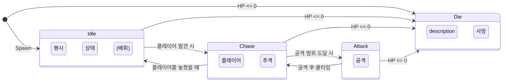

# 5.1. FSM과 상태 패턴을 이용한 AI 설계

## 5.1.1. 설계 목표: 왜 직접 FSM을 구현했는가?

Sonheim의 몬스터 AI는 단순히 플레이어를 공격하는 것을 넘어, 평화롭게 자신의 영역을 배회하고, 위협을 느끼면 도망가거나, 동료를 부르는 등 다양한 상태에 따라 입체적으로 행동해야 합니다. 만약 이 모든 로직을 거대한 `switch`문이나 `if-else`문으로 관리한다면, 새로운 행동을 추가하거나 수정할 때마다 코드는 걷잡을 수 없이 복잡해지고 버그의 온상이 될 것입니다.

언리얼 엔진의 표준 AI 시스템인 비헤이비어 트리(BT)는 복잡한 행동 조합에 강력하지만, 상태의 흐름이 명확하게 구분되는 Sonheim의 기획에는 FSM(Finite State Machine, 유한 상태 머신)이 더 적합하다고 판단했습니다. 특히, 각 상태의 로직을 별도의 클래스로 캡슐화하는 **상태 패턴(State Pattern)**을 적용하여, 다음과 같은 목표를 달성하고자 했습니다.

1.  **명확한 책임 분리:** `Idle`, `Chase`, `Attack` 등 AI의 모든 상태를 독립된 클래스로 분리하여, 각 상태가 자신의 행동 로직에만 집중하도록 합니다.
2.  **유연한 확장성:** "도망"과 같은 새로운 행동을 추가할 때, 기존 코드를 수정하는 대신 `UState_Flee`라는 새로운 상태 클래스를 추가하기만 하면 되도록 설계합니다.
3.  **재사용성:** `UState_Chase`와 같은 범용적인 상태 클래스는, 세부 파라미터만 다르게 설정하여 여러 종류의 몬스터가 재사용할 수 있도록 합니다.

---

## 5.1.2. 아키텍처: 상태 패턴 기반의 FSM 프레임워크

AI 시스템은 `ABaseMonster`에 부착되는 `UBaseAiFSM` 컴포넌트와, 이 FSM이 관리하는 여러 `UBaseAiState` UObject들로 구성됩니다. `UBaseAiFSM`은 현재 상태를 관리하고 상태를 전환하는 **컨텍스트(Context)** 역할을, 각 `UBaseAiState` 클래스는 개별 상태의 구체적인 행동을 캡슐화하는 **상태(State)** 역할을 수행합니다.



*   `ABaseMonster`: 모든 몬스터의 부모 클래스입니다.
*   `UBaseAiFSM`: FSM의 상태 전환을 관리하는 핵심 컴포넌트입니다.
*   `UBaseAiState`: 모든 상태 클래스의 부모가 되는 추상 클래스입니다.

---

## 5.1.3. 핵심 구현

#### 1. 상태 클래스의 정의 (`UBaseAiState`)

모든 상태 클래스의 부모인 `UBaseAiState`는 모든 상태가 가져야 할 공통 인터페이스(`Enter`, `Execute`, `Exit`)를 가상 함수로 정의합니다.

> [View on GitHub](https://github.com/chungheonLee0325/Sonheim/blob/main/Sonheim/Source/Sonheim/AreaObject/Monster/AI/Base/BaseAiState.h#L16)
```cpp
// Source/Sonheim/AreaObject/Monster/AI/Base/BaseAiState.h
UCLASS(Abstract)
class SONHEIM_API UBaseAiState : public UObject
{
	GENERATED_BODY()

public:
    // 상태에 진입할 때 1회 호출
	virtual void Enter() {};
    // 상태가 활성화된 동안 매 틱 호출
	virtual void Execute(float DeltaTime) {};
    // 상태를 떠날 때 1회 호출
	virtual void Exit() {};

    // ... (헬퍼 함수들)
};
```

#### 2. 상태별 행동 구현 (예: `UCommonAttack`)

각각의 구체적인 상태 클래스는 `UBaseAiState`를 상속받아, 자신만의 행동 로직을 구현합니다. 예를 들어, 공격 상태를 담당하는 `UCommonAttack`은 `Enter` 시점에 공격 스킬을 사용하고, 스킬이 끝날 때까지 대기한 뒤, 다음 상태로 전환을 요청합니다.

> [View on GitHub](https://github.com/chungheonLee0325/Sonheim/blob/main/Sonheim/Source/Sonheim/AreaObject/Monster/AI/Derived/CommonState/CommonAttack.cpp#L17)
```cpp
// Source/Sonheim/AreaObject/Monster/AI/Derived/CommonState/CommonAttack.cpp
void UCommonAttack::Enter()
{
	bHasFailed = false;

	UBaseSkill* skill = m_Owner->NextSkill;

    // 1. 스킬을 시전할 수 있는지 확인한다.
	if (m_Owner->CanCastSkill(skill, m_Owner->GetAggroTarget()))
	{
        // 2. 스킬이 완료/취소되면, 다음 상태로 전환하도록 델리게이트를 바인딩한다.
		skill->OnSkillComplete.BindUObject(this, &UCommonAttack::OnSkillCompleted);
		skill->OnSkillCancel.BindUObject(this, &UCommonAttack::OnSkillCanceled);
		m_Owner->CastSkill(skill, m_Owner->GetAggroTarget());
	}
	else
	{
		bHasFailed = true;
	}
}

void UCommonAttack::Execute(float dt)
{
    // Enter에서 스킬 시전에 실패했다면, 즉시 실패 상태로 전환한다.
	if (bHasFailed)
	{
		ChangeState(m_FailState);
	}
}

void UCommonAttack::OnSkillCompleted()
{
    // 3. FSM에 다음 상태(m_SuccessState)로 전환하도록 요청한다.
	ChangeState(m_SuccessState);
}
```

#### 3. 상태 전환 관리 (`UBaseAiFSM`)

`UBaseAiFSM` 컴포넌트는 현재 상태를 포인터로 저장하고, 상태 전환을 책임집니다. `ChangeState` 함수가 호출되면, 이전 상태의 `Exit` 함수를 호출하여 뒷정리를 하고, 새로운 상태의 `Enter` 함수를 호출하여 상태를 시작시킵니다. 모든 상태 전환은 서버에서만 권위있게 실행됩니다.

> [View on GitHub](https://github.com/chungheonLee0325/Sonheim/blob/main/Sonheim/Source/Sonheim/AreaObject/Monster/AI/Base/BaseAiFSM.cpp#L46)
```cpp
// Source/Sonheim/AreaObject/Monster/AI/Base/BaseAiFSM.cpp
void UBaseAiFSM::ChangeState(EAiStateType StateType)
{
	// 서버에서만 State를 변경할 수 있다.
	if (GetOwner()->GetLocalRole() != ROLE_Authority)
	{
		return;
	}
	
    // ... (유효성 검사) ...

    // 1. 이전 상태의 Exit 로직 실행
    if (m_CurrentState) m_CurrentState->Exit();

    // 2. 새로운 상태로 교체
    m_CurrentState = m_AiStates.FindRef(StateType);

    // 3. 새 상태의 Enter 로직 실행
    if (m_CurrentState) m_CurrentState->Enter();

    // 복제를 위해 현재 상태 타입을 업데이트
	CurrentStateType = StateType;
}
```

---

## 5.1.4. 설계의 이점

*   **높은 응집도, 낮은 결합도:** 각 상태 클래스는 자신의 행동 로직에 대한 모든 것을 알고 있지만, 다른 상태에 대해서는 전혀 알지 못합니다. 이는 코드의 응집도를 높이고, 상태 간의 결합도를 낮춰 유지보수를 용이하게 합니다.
*   **유연한 확장성 (Open-Closed Principle):** "도망"과 같은 새로운 행동을 추가하고 싶을 때, 기존의 `CommonAttack`이나 `ChaseTarget` 상태 코드를 수정할 필요 없이, `UState_Flee`라는 새로운 클래스를 추가하기만 하면 됩니다. 이는 시스템이 확장에는 열려있고, 수정에는 닫혀있는 OCP 원칙을 만족하는 설계입니다.
*   **디버깅의 용이성:** "몬스터가 공격을 멈추지 않는 버그"가 발생했다면, 우리는 복잡한 `AIController` 전체를 뒤지는 대신, `UCommonAttack` 클래스의 `Exit` 조건이나 `OnSkillCompleted` 로직에 문제가 있는지 명확한 범위 내에서 디버깅을 시작할 수 있습니다.

---

## 5.1.5. 관련 시스템

*   [[2.3 컴포넌트 기반 설계|2.3_Component_Based_Design]]
*   [[3.1 AAreaObject 프레임워크|3.1_AreaObject_Framework]]
*   [[3.2 어트리뷰트 시스템|3.2_Attribute_System]]
*   [[3.3 스킬 시스템|3.3_Skill_Architecture]]
*   [[5.2 파트너 AI|5.2_Partner_AI]]
