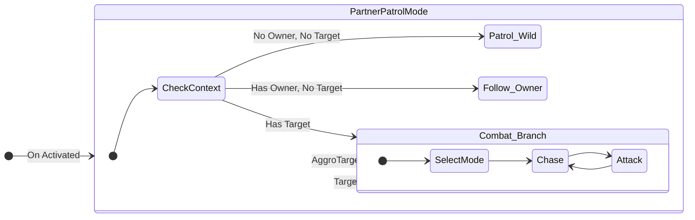

# 5.2. 파트너 AI: 상태 분기를 이용한 동적 행동 전환

## 5.2.1. 설계 목표: 야생 몬스터에서 충직한 동료로

플레이어가 포획한 몬스터는 더 이상 무작위로 배회하고 플레이어를 공격하는 야생의 존재가 아닙니다. 주인을 따라다니고, 주인이 공격하는 대상을 함께 공격하며, 주인의 명령에 따라 특수 스킬을 사용하는 등, 완전히 다른 행동 패턴을 가져야 합니다.

만약 이 모든 행동 로직을 하나의 거대한 클래스 안에서 `if (IsPartner) ... else ...` 와 같이 분기 처리한다면, 코드는 극도로 복잡해지고 유지보수가 불가능해질 것입니다. 따라서 파트너 AI 시스템은 다음과 같은 목표를 가지고 설계되었습니다.

1.  **행동 로직의 완벽한 분리:** 몬스터가 야생 상태일 때의 행동 로직과 플레이어의 파트너일 때의 행동 로직을, FSM(유한 상태 머신) 내의 서로 다른 \'상태 분기(State Branch)\'로 완벽하게 분리하여, 서로에게 영향을 주지 않도록 설계합니다.
2.  **동적인 행동 모드 전환:** 몬스터가 월드에 소환되는 순간, 자신의 소유권(`PartnerOwner`) 상태에 따라 적절한 행동 모드(야생 또는 파트너)로 스스로 전환할 수 있어야 합니다.
3.  **재사용성과 확장성:** \'주인을 따라다니는\' 행동이나 \'주인의 타겟을 공격하는\' 행동은, 어떤 종류의 몬스터든 재사용할 수 있는 범용적인 상태 클래스로 구현되어야 합니다.

---

## 5.2.2. 아키텍처: 단일 상태 클래스를 이용한 동적 라우팅

이러한 문제를 해결하기 위해, Sonheim은 FSM의 시작점이자 기본 상태인 **`UPartnerPatrolMode`** 클래스가 **상황에 따라 자신의 행동을 바꾸는 라우터(Router)** 역할을 하도록 설계했습니다.

`UPartnerPatrolMode` 상태는 매 틱마다 몬스터의 소유권(`PartnerOwner`)과 공격 대상(`AggroTarget`)을 확인하여, 다음에 수행할 행동을 동적으로 결정합니다.



*   **`UPartnerPatrolMode` (라우터 상태):** FSM의 기본 상태입니다. `Execute` 함수 내에서 `PartnerOwner`의 유무를 확인하여 **야생 배회**와 **주인 따라다니기** 행동을 분기합니다. 만약 `AggroTarget`이 감지되면, 즉시 **전투 상태 분기(`SelectMode`)**로 전환합니다.
*   **전투 상태 분기:** `SelectMode`, `Chase`, `Attack` 등 실제 전투를 수행하는 상태들의 집합입니다.

---

## 5.2.3. 핵심 구현

#### 1. FSM의 시작점을 라우터 상태로 설정

각 몬스터의 FSM 컴포넌트(예: `ULambBallFSM`)는 `InitStatePool` 함수에서, 야생과 파트너 행동을 모두 처리할 수 있는 `UPartnerPatrolMode`를 **FSM의 시작 상태**로 지정합니다.

> [View on GitHub](https://github.com/chungheonLee0325/Sonheim/blob/main/Sonheim/Source/Sonheim/AreaObject/Monster/AI/Derived/AiMonster/PalFSM/LambBallFSM.cpp#L41)
```cpp
// Source/Sonheim/AreaObject/Monster/AI/Derived/AiMonster/PalFSM/LambBallFSM.cpp
void ULambBallFSM::InitStatePool()
{
    // 1. 파트너/야생 모드를 모두 처리하는 라우터 상태를 생성
    auto PartnerPatrolMode = CreateState<UPartnerPatrolMode>(this, m_Owner,EAiStateType::PartnerSkillMode, EAiStateType::SelectMode);
    AddState(EAiStateType::PartnerPatrolMode, PartnerPatrolMode);

    // 2. 전투에 필요한 다른 모든 상태들도 등록
    auto SelectMode = CreateState<USelectMode>(...);
    AddState(EAiStateType::SelectMode, SelectMode);
    auto AttackMode = CreateState<UAttackMode>(...);
    AddState(EAiStateType::AttackMode, AttackMode);
    // ... (Chase, UseSkill 등 다른 상태 등록) ...

    // 3. FSM의 시작 상태를 라우터인 PartnerPatrolMode로 지정
    ChangeState(EAiStateType::PartnerPatrolMode);
}
```

#### 2. 라우터 상태의 동적 행동 분기 (`UPartnerPatrolMode`)

`UPartnerPatrolMode`의 `ServerExecute` 함수는 이 아키텍처의 핵심입니다. 이 함수는 매 틱마다 몬스터의 상황을 확인하여 행동을 결정합니다.

> [View on GitHub](https://github.com/chungheonLee0325/Sonheim/blob/main/Sonheim/Source/Sonheim/AreaObject/Monster/AI/Derived/AiMonster/BasePartnerAiState/PartnerPatrolMode.cpp#L30)
```cpp
// Source/Sonheim/AreaObject/Monster/AI/Derived/AiMonster/BasePartnerAiState/PartnerPatrolMode.cpp
void UPartnerPatrolMode::ServerExecute(float dt)
{
    // ...

    // 1. 공격할 대상이 생겼는가? -> 전투 상태로 즉시 전환
	if (m_Owner->GetAggroTarget())
	{
		ChangeState(m_SuccessState); // (SuccessState는 SelectMode로 지정됨)
		return;	
	}

    // 2. 주인이 없는가? -> 야생 몬스터처럼 배회
	if (!m_Owner->PartnerOwner)
	{
		if (FlowTime > PatrolTime)
		{
			PatrolWild();
		}
		return;
	}

    // 3. 주인이 있는가? -> 주인과의 거리에 따라 따라가거나 텔레포트
	float Dist = FVector::Distance(m_Owner->GetActorLocation(), m_Owner->PartnerOwner->GetActorLocation());

	if (Dist > 2000.f) // 너무 멀면
	{
		TeleportToPlayer();
	}
	else if (Dist > 1000.f) // 적당히 멀면
	{
		PatrolToPlayer();
	}
    // ...
}
```

이처럼 단일 상태 클래스 내에서 분기 처리를 함으로써, FSM의 구조를 복잡하게 만들지 않고도 다양한 상황에 맞는 행동을 유연하게 구현할 수 있습니다.

---

## 5.2.4. 설계의 이점

*   **단순하고 명확한 구조:** FSM의 전체적인 구조는 `Patrol <-> Combat` 이라는 단순한 흐름을 유지합니다. 파트너/야생 모드 전환이라는 복잡한 로직은 `UPartnerPatrolMode`라는 단일 클래스 내에 캡슐화되어 있어, 전체 아키텍처를 이해하기 쉽습니다.
*   **높은 응집도:** 파트너 AI와 관련된 모든 로직(주인 따라다니기, 텔레포트 등)은 `UPartnerPatrolMode` 클래스에 모여 있어, 관련 코드를 찾고 수정하기가 매우 용이합니다.
*   **동적이고 유연한 전환:** 몬스터의 상태(`PartnerOwner`, `AggroTarget`)가 변하면, `UPartnerPatrolMode`는 다음 틱에 즉시 다른 행동을 수행하거나 다른 상태로 전환합니다. 이는 별도의 상태 전환 요청 없이도 매우 동적이고 반응적인 AI를 가능하게 합니다.

---

## 5.2.5. 관련 시스템

*   [[5.1 FSM 기반 AI 프레임워크|5.1_FSM_based_AI]]
*   [[3.3 스킬 시스템|3.3_Skill_Architecture]]
*   [[4.4 팰 관리 시스템|4.4_Pal_Management_System]]
*   [[8.1 팰 포획 시퀀스|8.1_Case_Study_Pal_Capture_Sequence]]
