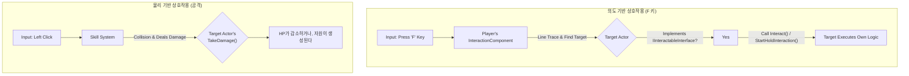

# 6.1. 통합 상호작용 원칙: 의도와 결과의 분리

> ### `인터페이스`와 `다형성`을 활용하여, 성격이 다른 두 종류의 상호작용(의도/물리)을 각기 다른 시스템으로 분리하고, 플레이어에게는 직관적인 단일 조작 경험으로 통합했습니다. 이 문서는 특히 **`F`키를 통한 \'의도 기반 상호작용\'**이 `IInteractableInterface`를 통해 **탐지, UI 피드백, 실행**으로 이어지는 전체 파이프라인을 심층적으로 분석합니다.

---

> [!VIDEO]
> **[통합 상호작용 시스템 시연 영상]**
> (영상이나 GIF를 여기에 삽입하세요. F키로 제작대 UI를 열고, 공격 키로 나무를 쳐서 아이템을 얻는 모습을 보여주는 것이 좋습니다.)

---

## 6.1.1. 구현 기능 목록 (Feature List)

이 시스템을 통해 플레이어는 다음과 같은 방식으로 월드와 상호작용하게 됩니다.

*   **의도 기반 상호작용 (`IInteractableInterface` 파이프라인)**
    *   **탐지 및 피드백:** 상호작용 가능한 대상을 바라보면 외곽선이 표시되고, `GetInteractionName()`을 통해 "아이템 줍기" 등 컨텍스트에 맞는 텍스트가 화면에 표시됩니다.
    *   **두 종류의 실행 방식:** 대상이 `IInteractableInterface`의 `GetHoldDuration()`을 어떻게 정의했는지에 따라 두 가지 방식으로 상호작용합니다.
        *   **즉시 실행 (Instant):** `F`키를 누르는 즉시 `Interact()`가 실행됩니다. (예: `ABaseItem`, `ABaseContainer`)
        *   **홀드 실행 (Hold):** `F`키를 일정 시간 누르고 있어야 `Interact()`가 실행되며, `UpdateHoldProgressUI`를 통해 UI에 진행률이 표시됩니다. (예: `ACraftingStation` 제작 돕기)
    *   **홀드 취소:** `CanHoldCancel()`을 구현한 객체는 `F`키가 아닌 다른 키(예: `C`키)를 길게 눌러 진행 중인 작업을 취소할 수 있습니다.

*   **물리 기반 상호작용 (공격)**
    *   공격 액션은 `TakeDamage` 가상 함수를 재정의한 대상에 따라 \'HP 감소\'(`AAreaObject`) 또는 \'자원 생성\'(`ABaseResourceObject`)이라는 다른 결과를 낳습니다.
    *   *상세한 데미지 처리 과정과 다형성 구현은 [[3.5 전투 및 피드백 시스템|3.5_Combat_and_Feedback_System]]과 [[6.3 자원 시스템|6.3_Resource_System]] 문서에서 다룹니다.*

---

## 6.1.2. 기술 상세 (Technical Deep Dive)

### 6.1.2.1. 설계 목표

게임 세계에서 "상호작용"은 다양한 형태로 나타납니다. `F`키를 눌러 문을 여는 행동과, 도끼로 나무를 내리쳐 목재를 얻는 행동은 사용자에게는 모두 "상호작용"으로 느껴지지만, 그 내부 구현 방식은 완전히 달라야 합니다.

Sonheim의 통합 상호작용 시스템은 이처럼 다른 성격의 상호작용들을, 각 목적에 맞는 별개의 시스템으로 명확히 분리하여 처리하는 것을 목표로 합니다.

1.  **의도 기반 상호작용 (Intent-Based):** 플레이어가 명확한 **의도**를 가지고 `F`키를 누르는 행동은 **인터페이스(`IInteractableInterface`)**를 통해 처리합니다.
2.  **물리 기반 상호작용 (Physics-Based):** **물리적인 충돌**의 결과로 발생하는 상호작용은 **데미지 시스템(`TakeDamage`)**을 통해 처리합니다.
3.  **명확한 역할 분리:** 이 두 시스템을 분리함으로써, 각 시스템은 자신의 책임에만 집중하여 코드의 복잡성을 낮추고, 새로운 종류의 상호작용을 추가할 때 어떤 시스템을 확장해야 할지 명확하게 만듭니다.

### 6.1.2.2. 아키텍처: 두 개의 독립적인 파이프라인

플레이어의 입력은 그 종류에 따라 완전히 다른 두 개의 파이프라인을 통해 처리됩니다.



### 6.1.2.3. 핵심 구현 1: \'의도 기반 상호작용\'의 전체 파이프라인

\'의도 기반 상호작용\'은 플레이어의 `UInteractionComponent`가 중심이 되어 **탐지 → UI 피드백 → 실행**의 명확한 파이프라인을 따릅니다.

#### 6.1.2.3.1. 탐지 (`InteractionComponent::PerformDetection`)
`InteractionComponent`는 주기적으로 `PerformDetection` 함수를 호출하여 플레이어의 시야 정면으로 라인 트레이스를 발사합니다. 트레이스에 맞은 모든 액터들 중, `IInteractableInterface`를 구현하고 `CanInteract()`가 `true`를 반환하는 가장 가까운 액터를 최종 상호작용 대상(`BestInteractable`)으로 선정합니다.

#### 6.1.2.3.2. UI 피드백 (`UpdateInteractable` & `OnDetected`)
탐지된 대상(`CurrentInteractable`)이 변경되면, `UpdateInteractable` 함수가 호출됩니다. 이 함수는 이전 대상에게는 `OnDetected(false)`를, 새로운 대상에게는 `OnDetected(true)`를 인터페이스를 통해 호출합니다. `DetectWidget`과 같은 UI 요소는 이 이벤트를 수신하여, 대상의 외곽선을 그리거나 `GetInteractionName()`으로 얻어온 텍스트를 화면에 표시하는 등 컨텍스트에 맞는 UI를 갱신합니다.

#### 6.1.2.3.3. 실행 (`StartHoldInteraction`)
플레이어가 `F`키를 누르면 `StartHoldInteraction` 함수가 호출됩니다. 이 함수는 인터페이스의 `GetHoldDuration()`을 호출하여 상호작용 방식을 결정하는 핵심 분기 로직을 포함합니다.

> [View on GitHub](https://github.com/chungheonLee0325/Sonheim/blob/main/Sonheim/Source/Sonheim/AreaObject/Player/Utility/InteractionComponent.cpp#L288)
```cpp
// Source/Sonheim/AreaObject/Player/Utility/InteractionComponent.cpp
void UInteractionComponent::StartHoldInteraction(EHoldPurpose Purpose)
{
    // ... (유효성 검사) ...

    // 1. 인터페이스를 통해 대상의 Hold 시간 정보를 가져온다.
	const float HoldDuration = IInteractableInterface::Execute_GetHoldDuration(CurrentInteractable);

    // 2. HoldDuration 값에 따라 로직 분기
	if (HoldDuration <= 0.f)
	{
		// 즉시 실행 (Instant Interaction)
		TryInteract(); // 내부적으로 서버에 Interact() 호출 요청
		return;
	}

    // 3. 타이머를 이용한 홀드 진행 (Hold Interaction)
	GetWorld()->GetTimerManager().SetTimer(HoldTimerHandle, [this, HoldDuration, Purpose]()
	{
        // 진행률(HoldProgress) 계산 및 UI 업데이트
		HoldProgress = FMath::Min(HoldProgress + (0.01f / HoldDuration), 1.0f);
		IInteractableInterface::Execute_UpdateHoldProgressUI(CurrentInteractable, HoldProgress, Purpose);

		if (HoldProgress >= 1.0f)
		{
            // 홀드 완료 시 상호작용 실행
			TryInteract();
		}
	}, 0.01f, true);
}
```

#### 6.1.2.3.4. 서버 호출 및 다형적 실행 (`Server_TryInteract` → `Interact_Implementation`)
클라이언트의 `TryInteract()`는 `Server_TryInteract` RPC를 호출하여 서버에 상호작용을 요청합니다. 서버는 이 요청을 받아 최종적으로 `IInteractableInterface::Execute_Interact`를 호출합니다. 그러면 인터페이스를 구현한 실제 액터의 `Interact_Implementation` 함수가 다형적으로 호출되어, 각 클래스에 정의된 고유한 로직이 실행됩니다.

*   **[[`ABaseItem`|6.2_Item_System]]:** `Interact_Implementation`에서 즉시 아이템을 획득합니다.
*   **[[`ACraftingStation`|6.5_Crafting_System]]:** `Interact_Implementation`에서 제작대의 내부 상태에 따라 \'아이템 수령\', \'제작 돕기\', \'UI 열기\' 중 하나의 행동을 선택합니다.
*   **[[`ABaseContainer`|6.4_Container_System]]:** `Interact_Implementation`에서 보관함 UI를 엽니다.

### 6.1.2.4. 핵심 구현 2: \'물리 기반 상호작용\' (요약 및 링크)

\'물리 기반 상호작용\'은 언리얼 엔진의 기본 데미지 시스템과 **다형성(Polymorphism)**을 통해 구현됩니다. 플레이어의 공격 스킬은 대상이 누구인지 전혀 알 필요 없이, 단지 `UGameplayStatics::ApplyDamage` 함수를 호출하여 피해를 입혔다는 사실만 알립니다.

실제 결과는 `AActor`의 가상 함수인 `TakeDamage`를 피격 대상이 어떻게 **재정의(Override)**했는지에 따라 달라집니다.

*   **`AAreaObject` (몬스터, 플레이어):** `TakeDamage`를 재정의하여 자신의 `HealthComponent`의 HP를 감소시키는, 전형적인 전투 로직을 수행합니다.
*   **`ABaseResourceObject` (나무, 광석):** `TakeDamage`를 완전히 다른 목적으로 재정의하여, 받은 피해량에 비례해 \'자원 아이템\'을 생성하는 \'수확\' 로직을 수행합니다.

이 설계를 통해, \'공격\'이라는 단일 액션이 \'전투\'와 \'채집\'이라는 전혀 다른 두 가지 게임플레이로 자연스럽게 이어집니다.

> 더 상세한 `TakeDamage`의 다형적 구현 방식은 아래 문서들을 참고하십시오.
> *   **전투:** [[3.5 전투 및 피드백 시스템|3.5_Combat_and_Feedback_System]]
> *   **자원 채집:** [[6.3 자원 시스템|6.3_Resource_System]]

### 6.1.2.5. 회고 및 개선점

*   **문제 인식:** 프로젝트 초기에는 모든 상호작용을 하나의 거대한 시스템으로 통합하려는 유혹이 있었습니다. 예를 들어, `F`키를 눌렀을 때 플레이어가 도끼를 들고 있으면 나무를 채집하고, 칼을 들고 있으면 공격하는 식의 복잡한 분기 처리를 고려했습니다.
*   **잘못된 설계의 문제점:** 이 방식은 플레이어의 `InteractionComponent`가 세상의 모든 오브젝트 타입과 모든 도구의 종류를 알아야 하는 거대한 `switch` 문을 필요로 합니다. 이는 단일 책임 원칙과 개방-폐쇄 원칙을 모두 위배하며, 새로운 아이템이나 오브젝트가 추가될 때마다 이 거대한 분기문을 수정해야 하는 \'유지보수 지옥\'을 만들게 됩니다.
*   **해결 과정:** 문제의 본질은 \'상호작용\'이라는 단어를 너무 광범위하게 해석한 데 있었습니다. 이를 **\'명시적 의도\'(`F`키)**와 **\'물리적 결과\'(충돌)**라는 두 가지 다른 맥락으로 분리하여 접근했습니다.
    *   \'명시적 의도\'가 필요한 상호작용은 `IInteractableInterface`를 통해 객체가 자신의 행동을 스스로 정의하도록 책임을 위임했습니다.
    *   \'물리적 결과\'가 중요한 상호작용은 `TakeDamage`라는 엔진의 기본 시스템을 활용하고, 다형성을 통해 객체가 피해에 대한 반응을 스스로 정의하도록 책임을 위임했습니다.
*   **교훈:** 이 설계를 통해, 상호작용을 하는 주체(플레이어)의 코드는 매우 단순하게 유지된 반면, 상호작용의 대상이 되는 객체들은 각자 자신의 컨텍스트에 맞는 풍부한 행동을 수행할 수 있게 되었습니다. 시스템을 설계할 때는 용어를 명확히 정의하고, 각 기능의 본질적인 \'책임\'이 무엇인지 파악하여, 그 책임을 가장 잘 수행할 수 있는 객체에게 로직을 위임하는 것이 얼마나 중요한지 깨달았습니다.

### 6.1.2.6. 관련 시스템

*   [[2.3 컴포넌트 기반 설계|2.3_Component_Based_Design]]
*   [[3.5 전투 및 피드백 시스템|3.5_Combat_and_Feedback_System]]
*   [[6.2 아이템 시스템|6.2_Item_System]]
*   [[6.3 자원 시스템|6.3_Resource_System]]
*   [[6.4 보관함 시스템|6.4_Container_System]]
*   [[6.5 제작 시스템|6.5_Crafting_System]]
*   [[7.1 이벤트 기반 아키텍처|7.1_Event-Driven_UI_Architecture]]
