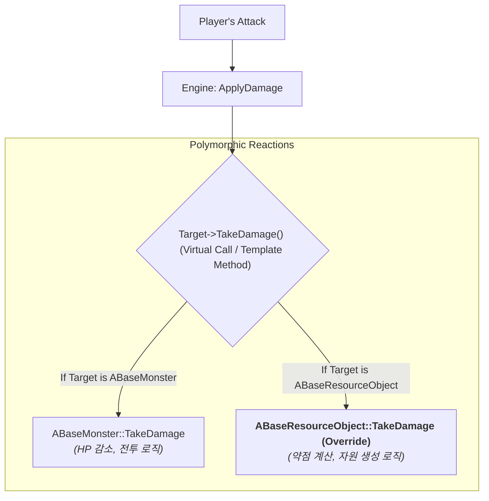

# 6.3. 자원 시스템 (ABaseResourceObject)

> ### 엔진의 기본 피해 처리 시스템을 재활용하여 타격감과 보상 경험을 극대화한 자원 시스템
> 
> *   **`AActor::TakeDamage` 함수 재정의(Override):** 언리얼 엔진의 기본 `TakeDamage` 가상 함수를 재정의하여, 공격자는 대상을 구별할 필요 없이(`ApplyDamage`) 동일한 코드로 몬스터와 자원을 공격할 수 있도록 설계했습니다.
> *   **단계적 자원 드랍 (Staged Drops):** 자원이 파괴될 때만 보상을 주는 것이 아니라, 누적 피해량이 일정 임계값을 넘을 때마다 즉시 자원의 일부를 드롭하여, 채집의 지루함을 없애고 즉각적인 보상 경험을 제공합니다.
> *   **약점 시스템 (Weakness System):** 자원마다 특정 공격 타입(예: 벌목 도끼, 곡괭이)에 더 큰 피해를 받도록 설정하여, 플레이어가 상황에 맞는 도구를 전략적으로 사용하도록 유도합니다.

---

> [!VIDEO]
> **[자원 시스템 시연 영상]**
> (영상이나 GIF를 여기에 삽입하세요. 바위를 곡괭이로 칠 때마다 작은 돌멩이가 튀어나오고, 마지막에 바위가 깨지며 많은 아이템이 쏟아지는 모습을 보여주는 것이 좋습니다.)

---

## 6.3.1. 구현 기능 목록 (Feature List)

이 시스템을 통해 플레이어는 다음과 같은 자원 채집 경험을 하게 됩니다.

*   **단계적 자원 획득**
    *   자원을 타격하여 누적된 피해량이 일정 임계값을 넘을 때마다, 즉시 자원의 일부가 주변에 드롭됩니다.
    *   자원의 체력이 0이 되어 파괴될 때는, 더 많은 최종 보상을 한 번에 획득할 수 있습니다.

*   **전략적인 약점 공략**
    *   나무는 \'도끼\' 타입의 공격에, 광석은 \'곡괭이\' 타입의 공격에 추가 피해를 입는 등, 자원의 종류에 맞는 도구를 사용하면 더 빠르게 채집할 수 있습니다.
    *   약점을 공격하면 더 높은 데미지 수치가 표시되어, 플레이어는 시각적으로 자신의 공격이 효과적임을 즉시 인지할 수 있습니다.

*   **확률 기반 아이템 드롭**
    *   드롭되는 아이템은 데이터 테이블에 정의된 확률에 따라 매번 독립적으로 결정됩니다.
    *   이 드롭 로직은 `SonheimUtility`에 공용 `static` 메서드로 구현되어, 몬스터의 전리품 드롭 등 다른 시스템에서도 동일하게 재사용됩니다.

*   **풍부한 시청각 피드백**
    *   자원을 타격할 때마다 타격 위치에 맞는 파티클 이펙트(VFX)와 사운드(SFX)가 재생되어, 채집 행위의 타격감을 극대화합니다.

---

## 6.3.2. 기술 상세 (Technical Deep Dive)

### 6.3.2.1. 서론

월드에 배치된 나무, 광석과 같은 자원 오브젝트는 몬스터와 근본적으로 다른 상호작용을 가집니다. 플레이어의 공격에 대해 이들은 피해를 입고 쓰러지는 것이 아니라, 정해진 자원(목재, 광물 등)을 생성하고 최종적으로는 파괴되어야 합니다.

이 문서는 Sonheim의 모든 자원 오브젝트의 기반이 되는 `ABaseResourceObject` 클래스가 어떻게 엔진의 기본 `TakeDamage` 함수를 **재정의(Override)**하여, 전투 로직을 **수확 로직**으로 완벽하게 전환하는지 그 객체 지향적 설계를 상세히 설명합니다.

### 6.3.2.2. 아키텍처: 피해 반응의 재정의 (Overriding Damage Response)

이 시스템의 핵심은, 모든 `AActor`가 가진 `TakeDamage`라는 가상 함수를 `ABaseResourceObject`가 자신만의 목적에 맞게 완전히 새로운 내용으로 재정의하는 것입니다. 이를 통해 공격을 하는 플레이어나 스킬 코드는 대상을 전혀 구분할 필요 없이 동일한 `ApplyDamage` 함수를 호출하지만, 그 결과는 대상의 실제 타입에 따라 다형적으로 결정됩니다.



### 6.3.2.3. 핵심 구현

#### 6.3.2.3.1. 데이터 기반 자원 정의

모든 자원 오브젝트의 속성은 `dt_ResourceObject`라는 `UDataTable`에 의해 결정됩니다. 이 데이터에는 자원의 최대 체력(`HPMax`), 약점 공격 타입과 그에 따른 데미지 배율(`WeaknessAttackMap`), 그리고 피해를 입을 때마다 자원을 생성하는 체력 임계값(`DamageThresholdPct`) 등이 정의되어 있어, 기획자가 코드를 수정하지 않고도 새로운 자원을 추가하거나 밸런스를 조정할 수 있습니다.

#### 6.3.2.3.2. TakeDamage 재정의: 전투에서 수확으로

`ABaseResourceObject`는 `AActor`의 `TakeDamage` 함수를 오버라이드하여, HP 감소와 사망이라는 전투의 맥락을 자원 생성과 파괴라는 수확의 맥락으로 재해석합니다.

> [View on GitHub](https://github.com/chungheonLee0325/Sonheim/blob/main/Sonheim/Source/Sonheim/GameObject/ResourceObject/BaseResourceObject.cpp#L158)
```cpp
// Source/Sonheim/GameObject/ResourceObject/BaseResourceObject.cpp
float ABaseResourceObject::TakeDamage(float Damage, const FDamageEvent& DamageEvent, ...)
{
    if (!HasAuthority() || !CanHarvest) return 0.0f;

    // 1. 공격 타입에 따른 약점 데미지 계산
    float damageCoefficient = GetWeaknessModifier(attackData.AttackType);
    ActualDamage = ActualDamage * damageCoefficient;

    float PreviousHP = HealthComponent->GetHP();
    HealthComponent->ModifyHP(-ActualDamage); // HP 감소
    float CurrentHP = HealthComponent->GetHP();

    // 2. 체력 감소량에 따른 \'단계적 자원 드랍\' 로직 호출
    float ThresholdHP = HealthComponent->GetMaxHP() * dt_ResourceObject->DamageThresholdPct;
    int32 PreviousHPSegment = FMath::FloorToInt(PreviousHP / ThresholdHP);
    int32 CurrentHPSegment = FMath::FloorToInt(CurrentHP / ThresholdHP);
    if (CurrentHPSegment < PreviousHPSegment)
    {
        SpawnPartialResources(PreviousHPSegment - CurrentHPSegment);
    }

    // 3. HP가 0이 되면 파괴 처리
    if (FMath::IsNearlyZero(CurrentHP))
    {
        OnDestroy();
    }

    return ActualDamage;
}
```
**단계적 자원 드랍의 동작 원리:**
위 코드의 `Segment` 계산 로직은 플레이어에게 즉각적인 보상 경험을 제공하는 핵심입니다. 예를 들어, 최대 체력이 100이고 `DamageThresholdPct`가 0.1(10%)인 자원이 있다고 가정해봅시다. 플레이어의 공격으로 체력이 95에서 75로 20 감소하면, `PreviousHPSegment`는 `Floor(9.5) = 9`가 되고, `CurrentHPSegment`는 `Floor(7.5) = 7`이 됩니다. 이때 `SegmentsLost`는 `9 - 7 = 2`가 되어, 체력 10% 구간을 2번 지났으므로 `SpawnPartialResources(2)`가 호출되어 2회분의 보상을 드랍하게 됩니다. 이 방식은 플레이어가 큰 피해를 주었을 때 한 번에 더 많은 자원을 획득하는, 만족스러운 보상 경험을 제공합니다.


### 6.3.2.4. 회고 및 개선점

*   **설계 결정:** 초기 기획 단계에서, \'채집\'을 위한 별도의 상호작용 시스템(예: `IHarvestable` 인터페이스와 `Harvest` 함수)을 만드는 것을 고려했습니다. 하지만 이 방식은 공격 로직과 채집 로직을 분리시켜, 플레이어의 스킬 코드가 공격 대상이 몬스터인지 자원인지 직접 확인하고 다른 함수를 호출해야 하는 복잡성을 야기했습니다. 또 다른 대안으로, `HealthComponent`가 데미지를 받은 후 델리게이트를 브로드캐스트하고 각 액터가 이를 구독하여 자신만의 로직을 처리하는 방식도 고려했습니다. 하지만 이 방식은 자원 오브젝트처럼 간단한 액터에게는 과도한 설계가 될 수 있었습니다.

*   **해결 과정:** 최종적으로, 언리얼 엔진의 기본 `AActor`에 이미 구현된 `TakeDamage` 가상 함수를 재정의(Override)하는 가장 객체 지향적인 방법을 선택했습니다. 모든 공격 가능한 대상(몬스터, 자원 등)이 `AActor`를 상속받는다는 점을 활용하여, `ABaseMonster`는 이 함수를 순수 \'HP 감소\'로, `ABaseResourceObject`는 \'자원 생성\' 로직이 포함된 \'HP 감소\'로 재정의했습니다.

*   **교훈:** 이 설계를 통해, 공격을 가하는 액터는 상대가 누구인지 전혀 신경 쓸 필요 없이 엔진의 기본 `ApplyDamage`만 호출하면 됩니다. 어떻게 반응할지는 전적으로 피격 대상이 스스로 결정하므로, 시스템 간의 결합도가 극적으로 낮아지고 코드의 재사용성과 확장성이 크게 향상되었습니다. 잘 설계된 상속 구조와 가상 함수는, 복잡한 분기문 없이도 다양한 객체의 행동을 우아하게 처리할 수 있는 강력한 도구임을 다시 한번 확인했습니다.

## 6.3.3. 관련 시스템

*   [[2.2 데이터 주도 설계|2.2_Data_Driven_Design]]
*   [[3.1 AAreaObject 프레임워크|3.1_AreaObject_Framework]]
*   [[3.2 어트리뷰트 시스템|3.2_Attribute_System]]
*   [[3.5 전투 및 피드백 시스템|3.5_Combat_and_Feedback_System]]
*   [[6.2 아이템 시스템|6.2_Item_System]]
