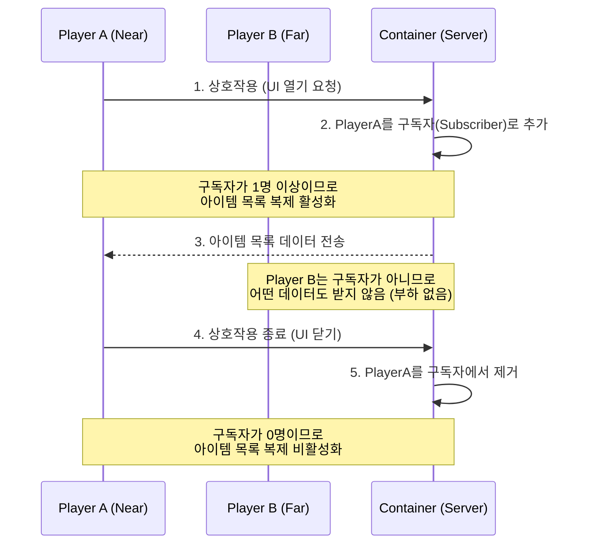

# 6.4. 보관함 시스템 (UContainerComponent)

> ### 구독 모델과 델타 복제로 구현한 대규모 월드용 고성능 공유 보관함
> 
> *   **구독 기반 복제(Subscription-based Replication):** 플레이어가 UI를 열어보고 있을 때만 아이템 목록을 네트워크로 전송하여, 월드에 수백 개의 보관함이 있어도 유휴 상태에서는 서버 부하를 0에 가깝게 유지합니다.
> *   **델타 복제(Fast Array Serializer):** 보관함의 내용물이 변경될 때, 전체 목록이 아닌 변경된 슬롯의 정보만 전송하여 네트워크 패킷을 최소화합니다.
> *   **컴포넌트 기반 설계:** \'아이템 보관\' 기능을 독립적인 컴포넌트로 구현하여, 일반 상자는 물론 몬스터 시체나 움직이는 오브젝트 등 어떤 액터든 쉽게 보관함으로 만들 수 있는 높은 재사용성과 확장성을 확보했습니다.

---

> [!VIDEO]
> **[보관함 시스템 시연 영상]**
> (영상이나 GIF를 여기에 삽입하세요. 한 플레이어가 상자에 아이템을 넣고 UI를 닫은 후, 다른 플레이어가 상자를 열었을 때 해당 아이템이 그대로 들어있는 모습을 보여주는 것이 좋습니다.)

---

## 6.4.1. 구현 기능 목록 (Feature List)

이 시스템을 통해 플레이어와 개발자는 다음과 같은 기능을 경험하게 됩니다.

*   **엄청난 네트워크 성능**
    *   플레이어가 UI를 열어 상호작용하고 있는 보관함의 정보만 네트워크를 통해 전송됩니다.
    *   열어보지 않는 수많은 보관함들은 서버에 어떠한 네트워크 부하도 주지 않습니다.

*   **안전한 실시간 공유**
    *   한 번에 한 명의 플레이어만 보관함 UI와 상호작용할 수 있도록 하여, 여러 플레이어가 동시에 아이템을 조작할 때 발생할 수 있는 데이터 충돌 문제를 원천적으로 방지합니다.
    *   한 플레이어가 아이템을 넣거나 뺀 결과는, 나중에 보관함을 여는 다른 모든 플레이어에게도 완벽하게 동기화됩니다.

*   **맥락(Context)에 맞는 스마트 UX**
    *   보관함 UI가 열려있을 때는, 인벤토리 아이템의 우클릭 메뉴가 \'아이템 사용\'이나 \'장비 장착\'이 아닌, **\'보관함으로 보내기\'** 기능으로 변경됩니다.
    *   반대로, 보관함 아이템을 우클릭하면 **\'인벤토리로 보내기\'** 기능이 활성화되어, 양방향으로 빠르고 직관적인 아이템 정리를 돕습니다.

*   **높은 재사용성과 확장성**
    *   `UContainerComponent`를 액터 블루프린트에 추가하기만 하면, 어떤 오브젝트든 즉시 아이템 보관 기능을 가질 수 있습니다.
    *   보관함의 슬롯 수, 스택 가능 여부 등은 모두 데이터 테이블 기반으로 설정되어, 기획자가 쉽게 새로운 종류의 보관함을 만들 수 있습니다.

---

## 6.4.2. 기술 상세 (Technical Deep Dive)

### 6.4.2.1. 서론

월드에 배치된 보관함(상자, 창고 등)은 여러 플레이어가 공유하는 중요한 상호작용 객체입니다. 월드에 수백 개의 보관함이 존재할 수 있으므로, 이들의 아이템 정보를 모든 플레이어에게 항상 동기화하는 것은 엄청난 네트워크 부하를 유발합니다.

이 문서는 Sonheim의 모든 월드 보관함 기능을 책임지는 `UContainerComponent`가 어떻게 **컴포넌트 기반의 재사용성**을 확보하고, **구독 기반 복제(Subscription-based Replication)**라는 고급 네트워크 최적화 기법을 통해 서버 부하를 최소화했는지 그 핵심 설계를 설명합니다.

### 6.4.2.2. 아키텍처: 구독 기반의 효율적인 공유 보관함

이 시스템의 핵심은, 보관함의 아이템 목록을 무조건 모든 클라이언트에 복제하는 것이 아니라, 오직 해당 보관함의 UI를 열어보고 있는 플레이어(`Subscribers`)가 있을 때만 서버가 클라이언트로 데이터를 전송하는 **구독 기반 복제** 전략입니다. 이를 통해 월드에 수많은 보관함이 존재하더라도 네트워크 부하를 최소화합니다.



### 6.4.2.3. 회고 및 개선점

*   **문제 인식:** 만약 월드에 1,000개의 보관함이 있고, 각 보관함의 아이템 목록을 모든 플레이어에게 항상 복제한다면 어떻게 될까요? 플레이어가 한 번도 열어보지 않을 상자의 정보까지 모두 전송하는 것은 엄청난 네트워크 낭비이며, 이는 서버 성능에 직접적인 악영향을 미칩니다. 대규모 월드를 지향하는 게임에서는 결코 용납될 수 없는 설계입니다.

*   **해결 과정:** 이 문제를 해결하기 위해, 데이터가 **\'누구에게 필요한가\'** 라는 관점에서 접근했습니다. 보관함의 내용물은 오직 그것을 열어보고 있는 플레이어에게만 필요합니다. 이 아이디어를 바탕으로, 플레이어가 UI를 열 때 `ServerSubscribeViewer` RPC를 호출하여 서버의 `Subscribers` 목록에 자신을 등록하는 **구독 모델**을 구현했습니다. 그리고 언리얼 엔진의 `PreReplication` 함수를 오버라이드하여, 이 `Subscribers` 목록이 비어있을 때는 `DOREPLIFETIME_ACTIVE_OVERRIDE` 매크로를 통해 아이템 목록의 복제를 동적으로 비활성화시켰습니다.

*   **교훈:** 이 설계를 통해, 유휴 상태의 모든 보관함은 서버에 어떠한 네트워크 부하도 발생시키지 않게 되었습니다. 이는 단순히 기능을 구현하는 것을 넘어, \'어떻게 하면 시스템을 확장 가능하게 만들 것인가\'에 대한 고민의 중요성을 보여줍니다. 언리얼 엔진이 제공하는 저수준의 복제 제어 기능을 깊이 이해하고 활용하면, 대규모 멀티플레이어 환경의 성능을 극적으로 최적화할 수 있다는 귀중한 경험을 얻었습니다.

> [View on GitHub (Source)](https://github.com/chungheonLee0325/Sonheim/blob/main/Sonheim/Source/Sonheim/GameObject/Buildings/Utility/ContainerComponent.cpp#L26)
```cpp
// Source/Sonheim/GameObject/Buildings/Utility/ContainerComponent.cpp
void UContainerComponent::PreReplication(IRepChangedPropertyTracker& ChangedPropertyTracker)
{
	Super::PreReplication(ChangedPropertyTracker);

	// 구독자가 있을 때만 아이템 목록을 복제하도록 동적으로 설정
	const bool bActive = Subscribers.Num() > 0;
	DOREPLIFETIME_ACTIVE_OVERRIDE(UContainerComponent, RepContainerItems, bActive);
}
```

## 6.4.3. 관련 시스템

*   [[2.2 데이터 주도 설계|2.2_Data_Driven_Design]]
*   [[2.3 컴포넌트 기반 설계|2.3_Component_Based_Design]]
*   [[4.2 인벤토리 시스템|4.2_Inventory_System]]
*   [[6.1 통합 상호작용 원칙|6.1_Unified_Interaction_System]]
*   [[7.1 이벤트 기반 아키텍처|7.1_Event-Driven_UI_Architecture]]
