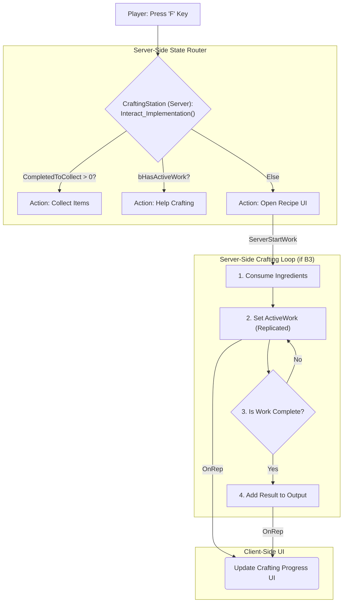

# 6.5. 제작 시스템 (Crafting System)

> ### 컨텍스트 기반 상호작용과 동시성 문제를 해결한 서버 권위 제작 시스템
> 
> *   **중앙 라우터(Router) 설계**를 통해, `F`키 하나만으로 아이템 수령, 제작 돕기, UI 열기 등 상황에 맞는 직관적인 UX를 제공합니다.
> *   **`UIOwner` 상태 잠금(State Locking)**으로, 여러 플레이어가 동시에 접근해도 데이터 무결성을 보장하고 동시성 문제를 해결했습니다.
> *   **데이터 테이블 기반 레시피**를 사용하여, 기획자가 코드를 수정하지 않고도 새로운 콘텐츠를 쉽게 추가할 수 있도록 확장성을 확보했습니다.

---

> [!VIDEO]
> **[제작 시스템 시연 영상]**
> (영상이나 GIF를 여기에 삽입하세요. F키 하나로 상황에 따라 아이템 수령, 제작 돕기, UI 열기 등 다른 행동으로 이어지는 모습을 보여주는 것이 좋습니다.)

---

## 6.5.1. 구현 기능 목록 (Feature List)

이 시스템을 통해 플레이어는 다음과 같은 제작 경험을 하게 됩니다.

*   **상황에 맞는 스마트 상호작용**
    *   플레이어는 제작대를 보고 `F`키를 누르는 단일 행동만으로, 제작대의 상태에 따라 다음 세 가지 행동이 자동으로 실행됩니다.
        *   **아이템 수령:** 완성된 아이템이 있으면 즉시 인벤토리로 가져옵니다.
        *   **제작:** 제작중인 아이템이 있을경우 상호작용하여 제작을 진행합니다. 다른 플레이어가 제작 진행 중일경우, 제작속도를 가속합니다.
        *   **레시피 확인:** 제작 가능한 아이템 목록 UI를 엽니다.

*   **실시간 공유 제작 과정**
    *   한 플레이어가 제작을 시작하면, 주변의 모든 플레이어는 해당 제작대의 UI를 통해 현재 어떤 아이템이 얼마나 진행되고 있는지 실시간으로 확인할 수 있습니다.

*   **안전한 멀티플레이 제작**
    *   여러 플레이어가 동시에 제작을 시작하여 재료가 두 번 소모되거나 아이템이 복제되는 문제 없이, 한 번에 한 명의 플레이어만 제작을 시작할 수 있도록 보장됩니다.

*   **데이터 기반 레시피**
    *   게임에 등장하는 모든 제작법(재료, 결과물, 제작 시간 등)은 데이터 테이블로 관리되어, 업데이트를 통해 새로운 제작 아이템을 쉽게 추가할 수 있습니다.

---

## 6.5.2. 기술 상세 (Technical Deep Dive)

### 6.5.2.1. 설계 목표

제작 시스템은 Sonheim의 핵심 게임 루프를 완성하는 필수 시스템입니다. 월드에 배치된 제작대(`ACraftingStation`)는 여러 플레이어가 동시에 상호작용할 수 있는 공유 객체이므로, 다음과 같은 복합적인 목표를 가지고 설계되었습니다.

1.  **서버 권위 파이프라인:** 재료 소모, 아이템 제작 등 모든 데이터 변경은 반드시 서버에서만 처리되도록 하여 멀티플레이어 환경에서의 데이터 정합성과 보안을 확보합니다.
2.  **컨텍스트 기반 상호작용:** 제작대의 현재 상태(대기 중, 제작 중, 완료)에 따라, 동일한 `F`키 입력이 각기 다른 행동(UI 열기, 작업 돕기, 아이템 수령)으로 이어져야 합니다.
3.  **데이터 기반 확장성:** 모든 제작법의 속성은 데이터 테이블에서 관리하여, 기획자가 코드를 수정하지 않고도 새로운 아이템을 쉽게 추가하거나 밸런스를 조정할 수 있도록 합니다.
4.  **실시간 상태 동기화:** 한 플레이어의 제작 활동이 제작대 주변의 모든 플레이어에게 실시간으로 공유되어야 합니다.

### 6.5.2.2. 아키텍처: 서버의 상태 라우터와 비동기 작업 루프

이 시스템의 핵심은, 모든 상호작용의 최종 해석과 실행 권한을 서버 소유의 액터인 `ACraftingStation`이 갖는다는 것입니다. `CraftingStation`의 `Interact_Implementation` 함수는 제작대의 현재 상태를 확인하여 다음에 실행할 로직을 결정하는 **중앙 라우터(Router)** 역할을 하며, 실제 제작 과정은 비동기 루프로 처리됩니다.



### 6.5.2.3. 핵심 구현

#### 6.5.2.3.1. 데이터 정의 (`FCraftingRecipe`)

모든 제작법은 데이터 테이블(`dt_CraftingRecipe`)에 정의됩니다. 이 구조체는 제작의 모든 규칙을 담고 있습니다.

*   **`ResultItemID`**: 제작 완료 시 생성될 아이템의 ID입니다.
*   **`RequiredIngredients`**: `TMap<ItemID, Count>` 형태로, 제작에 필요한 재료 아이템과 개수를 정의합니다.
*   **`WorkRequired`**: 제작에 필요한 총 작업량입니다. 이 값이 클수록 제작에 더 오랜 시간이 걸립니다.
*   **`RequiredStationID`**: 특정 제작대에서만 제작 가능하도록 제한하는 기능입니다.

#### 6.5.2.3.2. 컨텍스트 기반 상호작용 라우터 (`Interact_Implementation`)

플레이어가 `F`키를 누를 때 호출되는 `Interact_Implementation` 함수는, 제작대의 현재 상태 변수들을 정해진 우선순위에 따라 순차적으로 확인하며 단 하나의 행동을 결정하는 **중앙 라우터** 역할을 수행합니다.

> [View on GitHub](https://github.com/chungheonLee0325/Sonheim/blob/main/Sonheim/Source/Sonheim/GameObject/Buildings/Crafting/CraftingStation.cpp#L180)
```cpp
// Source/Sonheim/GameObject/Buildings/Crafting/CraftingStation.cpp
void ACraftingStation::Interact_Implementation(ASonheimPlayer* Player)
{
    if (!Player) return;

    // 1순위: 수령할 아이템이 있는가?
    if (CompletedToCollect > 0)
    {
        ServerCollectAll(Player);
        return;
    }
    // 2순위: 진행중인 작업이 있는가? (협력 플레이)
    else if (bHasActiveWork)
    {
        ServerAddWork(ResolvePlayerWorkSpeed_Internal(Player), Player);
        return;
    }
    // 3순위: 아무것도 없다면 UI를 연다.
    if (!bHasActiveWork) 
    {
        ServerRequestOpenUI(Player);
    }
}
```

#### 6.5.2.3.3. 서버 권위 제작 루프

라우터가 \'UI 열기\'를 결정하고 플레이어가 제작할 아이템을 선택하면, `ServerStartWork` RPC가 호출되어 실제 제작 과정이 시작됩니다.

*   **재료 검증 및 소모:** `ServerStartWork` 함수는 가장 먼저 플레이어의 인벤토리(`UInventoryComponent`)에 요청된 제작법에 맞는 재료가 있는지 확인하고, 있다면 해당 재료를 차감합니다.
*   **상태 잠금(Locking):** `UIOwner` 변수에 현재 제작을 요청한 플레이어를 저장하여, 다른 플레이어가 동시에 제작을 시작하는 **동시성 문제**를 원천적으로 차단합니다.
*   **작업 상태 복제 (`ActiveWork`):** 재료가 성공적으로 소모되면, 현재 진행 중인 작업 정보(제작법, 진행률 등)를 `ActiveWork`라는 구조체 변수에 기록합니다. 이 변수는 `ReplicatedUsing`으로 지정되어 있어, 내용이 변경될 때마다 모든 클라이언트에게 자동으로 전파되어 UI에 진행률이 표시됩니다.

### 6.5.2.4. 구현 경험: 동시성 문제 해결 (Mutex-like State Locking)

#### 6.5.2.4.1. 문제 정의: 공유 자원의 동시 접근

제작대는 여러 플레이어가 동시에 접근할 수 있는 공유 자원입니다. 만약 두 명의 플레이어(A, B)가 정확히 같은 타이밍에 제작 UI를 열려고 시도한다면 어떻게 될까요? 처리 순서에 따라 플레이어 A는 UI를 열고, B의 요청은 무시되어야 합니다. 만약 이 처리가 없다면, 두 플레이어 모두 UI를 열게 되어 재료 중복 소모, 데이터 꼬임 등 심각한 버그가 발생할 수 있습니다.

#### 6.5.2.4.2. 해결 방안: `UIOwner`를 이용한 상태 잠금 (State Locking)

이 문제를 해결하기 위해, `ACraftingStation`은 `UIOwner`라는 `ASonheimPlayer*` 타입의 리플리케이트 변수를 사용합니다. 이 변수는 현재 제작 UI와 상호작용할 독점적인 권한을 가진 플레이어를 가리키는, 일종의 **가벼운 뮤텍스(Mutex) 또는 세마포어(Semaphore)** 역할을 합니다.

*   **잠금 (Lock):** 플레이어가 UI 열기를 요청(`ServerRequestOpenUI`)하면, 서버는 가장 먼저 `UIOwner`가 `nullptr`인지 확인합니다. 비어있을 경우에만 요청한 플레이어를 `UIOwner`로 지정하여 \'잠금\'을 설정하고, 클라이언트에게 UI를 열도록 명령합니다. 이미 다른 플레이어가 `UIOwner`로 지정되어 있다면, 뒤늦게 도착한 요청은 모두 무시됩니다.

> [View on GitHub](https://github.com/chungheonLee0325/Sonheim/blob/main/Sonheim/Source/Sonheim/GameObject/Buildings/Crafting/CraftingStation.cpp#L438)
```cpp
// Source/Sonheim/GameObject/Buildings/Crafting/CraftingStation.cpp
void ACraftingStation::ServerRequestOpenUI_Implementation(ASonheimPlayer* Player)
{
    if (!HasAuthority() || !Player) return;
    // UIOwner가 이미 있거나, 내가 아니라면 요청을 무시한다.
    if (UIOwner && UIOwner != Player) return;
    
    // UIOwner를 나로 지정하여 다른 플레이어의 접근을 막는다.
    UIOwner = Player;
    
    if (auto* PC = Cast<ASonheimPlayerController>(Player->GetController()))
    {
        PC->Client_OpenCraftingUI(this);
    }
}
```

*   **잠금 해제 (Unlock):** 플레이어가 UI를 닫으면, 서버는 `UIOwner`가 요청한 플레이어와 일치하는지 다시 한번 확인한 후, 변수를 `nullptr`로 되돌려 \'잠금\'을 해제합니다. 이제 다른 플레이어들이 제작 UI를 열 수 있습니다.

> [View on GitHub](https://github.com/chungheonLee0325/Sonheim/blob/main/Sonheim/Source/Sonheim/GameObject/Buildings/Crafting/CraftingStation.cpp#L449)
```cpp
// Source/Sonheim/GameObject/Buildings/Crafting/CraftingStation.cpp
void ACraftingStation::ServerReleaseUI_Implementation(ASonheimPlayer* Player)
{
    if (!HasAuthority() || !Player) return;
    // 요청자가 현재 소유주가 아니면 무시한다.
    if (Player != UIOwner) return;

    // ... (UI 닫기 로직) ...
    
    // UIOwner를 비워서 다른 플레이어가 사용할 수 있도록 한다.
    UIOwner = nullptr;
}
```

#### 6.5.2.4.3. 설계 결정: 왜 이 방법을 선택했는가?

*   **의도적인 잠금 범위 최소화:** 이 잠금은 오직 \'레시피를 선택하는 행위\'에만 국한됩니다. `Interact_Implementation` 라우터를 보면 알 수 있듯이, 이미 제작이 진행 중일 때 다른 플레이어가 `F`키를 누르면 \'제작 돕기\'가 되고, 완료된 아이템이 있으면 \'아이템 수령\'이 됩니다. 이 두 가지 협력 행동은 `UIOwner` 잠금과 무관하게 언제나 가능합니다. 이는 **데이터 무결성을 해치는 경쟁 상태는 방지하되, 협동 플레이의 재미는 해치지 않도록** 잠금의 범위를 의도적으로 최소화한 설계입니다.
*   **단순함과 명확성:** 복잡한 뮤텍스 객체나 시스템을 도입하는 대신, 단순히 플레이어 포인터 하나를 상태 변수로 사용하는 것만으로 동시성 문제를 명확하고 간단하게 해결했습니다. 코드를 읽는 누구나 `UIOwner`의 의미를 직관적으로 파악할 수 있습니다.

## 6.5.3. 관련 시스템

*   [[2.2 데이터 주도 설계|2.2_Data_Driven_Design]]
*   [[2.3 컴포넌트 기반 설계|2.3_Component_Based_Design]]
*   [[2.4 플레이어 클래스 아키텍처|2.4_Player_Class_Architecture]]
*   [[4.2 인벤토리 시스템|4.2_Inventory_System]]
*   [[6.1 통합 상호작용 원칙|6.1_Unified_Interaction_System]]
*   [[7.6 제작 UI 심층 분석|7.6_Designing_a_Collaborative_Crafting_UI]]
