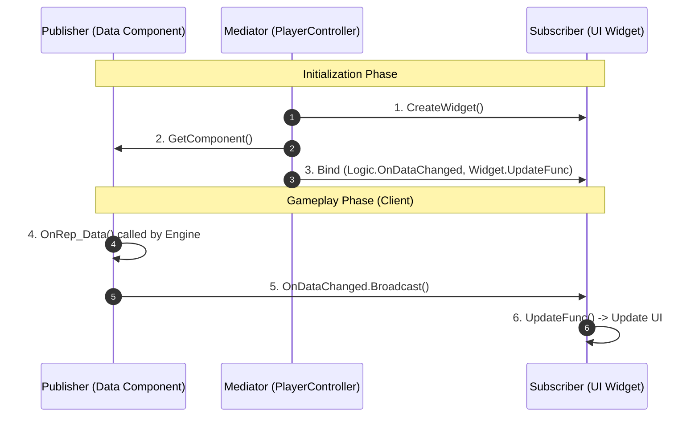

# 7.1. 이벤트 기반 UI 아키텍처 (Event-Driven UI Architecture)

> ### 데이터와 UI의 완벽한 분리: 델리게이트와 중재자 패턴을 활용한 이벤트 기반 UI 아키텍처
>
> *   **느슨한 결합 (Loosely Coupled):** 데이터(체력, 인벤토리 등)를 소유한 게임 로직과 이를 표현하는 UI 위젯이 서로의 존재를 전혀 알지 못하도록 완벽하게 분리했습니다. 데이터는 '자신이 변경되었다'는 사실만 방송(Publish)하고, UI는 이 방송을 구독(Subscribe)하여 스스로를 갱신합니다.
> *   **중재자 패턴 (Mediator Pattern):** `PlayerController`가 데이터 소유자와 UI 위젯 사이의 구독 관계를 설정해주는 '중재자' 역할을 전담합니다. 이를 통해 위젯 생성, 소멸, 이벤트 연결 로직을 중앙에서 관리하여 코드의 분산을 막고 유지보수성을 극대화했습니다.
> *   **경쟁 상태 해결 (Race-Condition Safe):** 멀티플레이 환경에서 컨트롤러와 데이터가 클라이언트에 도착하는 순서가 불확실해 발생하는 초기화 오류를, `PossessedBy`, `OnRep_Controller`, `OnRep_PlayerState` 등 액터의 생명주기 함수를 활용하여 원천적으로 해결했습니다.

---

> [!VIDEO]
> **[이벤트 기반 UI 아키텍처 시연 영상]**
> (영상 삽입 예정: 체력이 변할 때 체력 바가 업데이트되고, 아이템을 주웠을 때 획득 알림이 뜨는 모습)

---

## 7.1.1. 구현 기능 목록 (Feature List)

이 아키텍처를 통해 구현된, 플레이어에게 보여지는 핵심 기능 목록입니다.

*   **실시간 상태 연동:** 플레이어의 체력, 스태미나, 레벨, 경험치 등 모든 상태가 변경될 때, HUD의 해당 UI 요소가 즉시 반응하여 업데이트됩니다.
*   **즉각적인 인벤토리 갱신:** 인벤토리에 아이템이 추가되거나 제거, 혹은 장비가 변경되면 인벤토리 UI가 즉시 갱신됩니다.
*   **조건부 아이템 획득 알림:** 필드에서 직접 아이템을 획득하는 '특별한 경우'에만, 화면 우측에 아이템 획득 알림이 팝업으로 표시됩니다. (장비 해제 등으로 인벤토리에 아이템이 들어오는 일반적인 경우에는 표시되지 않습니다.)
*   **무기 및 탄약 정보 표시:** 현재 장착한 무기를 교체하면 HUD의 무기 정보가 즉시 변경되며, 해당 무기의 탄약 소지량을 실시간으로 표시합니다.
*   **팰(Pal) 정보 UI:** 새로운 팰을 포획하거나, 보유한 팰 목록에서 선택된 팰을 교체하면 HUD의 팰 슬롯 UI가 즉시 갱신됩니다.

---

## 7.1.2. 기술 상세 (Technical Deep Dive)

### 7.1.2.1. 설계 목표

UI 시스템은 게임의 상태를 플레이어에게 전달하는 가장 중요한 창구입니다. 복잡한 게임 로직과 UI가 뒤섞이지 않고, 각자의 역할에만 집중할 수 있는 깨끗하고 효율적인 구조를 만드는 것이 핵심 목표였습니다.

1.  **데이터와 표현의 완벽한 분리 (Decoupling):** 게임 로직(HP 감소, 아이템 획득 등)은 UI가 어떻게 생겼는지, 존재하는지조차 알 필요가 없어야 합니다. 반대로, UI는 데이터가 어떻게 변경되는지에 대한 내부 로직을 알 필요 없이, 오직 '변경되었다'는 사실만 통지받아 화면을 갱신해야 합니다.
2.  **이벤트 기반 업데이트 (Event-Driven Updates):** `Tick`을 돌며 매 프레임 데이터를 확인하는 비효율적인 방식을 지양하고, 데이터에 실제 변경이 발생했을 때만 UI가 반응하도록 하는 이벤트 기반 구조를 목표로 합니다.
3.  **중앙화된 UI 관리 (Centralized UI Management):** 인벤토리, 제작창 등 복잡한 UI 위젯의 생성과 소멸은 `ASonheimPlayerController`가 전담하도록 하여, UI의 생명주기 관리를 중앙화하고 코드의 분산을 막습니다.
4.  **단방향 데이터 흐름 (One-Way Data Flow):** UI는 게임 상태를 직접 변경할 수 없습니다. UI는 오직 서버로부터 복제된 데이터를 화면에 보여주는 '뷰(View)'의 역할만 수행하며, 상태 변경이 필요할 때는 반드시 서버 RPC를 통해 '요청'해야 합니다.

### 7.1.2.2. 아키텍처: 중재자를 통한 발행-구독 (Mediated Publish-Subscribe)

이러한 목표를 달성하기 위해, 언리얼 엔진의 **델리게이트(Delegate)** 시스템을 활용하되, `PlayerController`가 데이터 소유자와 UI 위젯 사이를 연결하는 **중재자(Mediator)** 역할을 하는 발행-구독 패턴을 사용합니다.



*   **발행자 (Publisher):** `UHealthComponent`, `UInventoryComponent` 등 실제 데이터를 소유하고 변경하는 컴포넌트입니다. 데이터가 변경될 때마다 `OnHealthChanged`와 같은 델리게이트를 '방송(Publish)'합니다.
*   **구독자 (Subscriber):** `UPlayerStatusWidget` 등 데이터를 시각적으로 표현하는 위젯입니다. 자신을 생성한 `PlayerController`에 의해 델리게이트가 '구독(Subscribe)'됩니다.
*   **중재자 (Mediator - `ASonheimPlayerController`):** 위젯을 생성하고, 데이터 소스(각종 컴포넌트)와 위젯의 이벤트 핸들러를 직접 연결(`AddDynamic`)해주는 중재자 역할을 수행합니다.

이 구조에서 발행자와 구독자는 서로의 존재를 전혀 알지 못하며, 오직 중재자만이 둘 사이의 관계를 알고 연결해줌으로써 시스템 간의 결합도를 극단적으로 낮춥니다.

### 7.1.2.3. 핵심 구현

#### 7.1.2.3.1. 기본 흐름: 이벤트 정의 및 구독 (HealthComponent 예시)

1.  **발행자 (Publisher):** `UHealthComponent`는 `m_HP` 변수가 `ReplicatedUsing=OnRep_HP`로 지정되어 있습니다. 서버에서 `m_HP`가 변경되면, 클라이언트에서 `OnRep_HP` 함수가 자동으로 호출되고, 이 함수 안에서 `OnHealthChanged` 델리게이트가 방송됩니다.

> [View on GitHub (Header)](https://github.com/chungheonLee0325/Sonheim/blob/main/Sonheim/Source/Sonheim/AreaObject/Attribute/HealthComponent.h#L7)
> [View on GitHub (Source)](https://github.com/chungheonLee0325/Sonheim/blob/main/Sonheim/Source/Sonheim/AreaObject/Attribute/HealthComponent.cpp#L81)
```cpp
// Source/Sonheim/AreaObject/Attribute/HealthComponent.h
DECLARE_DYNAMIC_MULTICAST_DELEGATE_ThreeParams(FOnHealthChangedDelegate, float, CurrentHP, float, Delta, float, MaxHP);

UPROPERTY(BlueprintAssignable)
FOnHealthChangedDelegate OnHealthChanged;

// Source/Sonheim/AreaObject/Attribute/HealthComponent.cpp
void UHealthComponent::OnRep_HP(float OldHP)
{
    float Delta = m_HP - OldHP;
    // "HP가 변경되었다"고 현재값, 변화량, 최대값을 모두 방송
    OnHealthChanged.Broadcast(m_HP, Delta, m_HPMax);
}
```

2.  **중재자 (Mediator):** `ASonheimPlayerController`는 `InitializeHUD` 함수에서 `PlayerStatusWidget`을 생성한 후, `HealthComponent`의 델리게이트에 `PlayerStatusWidget`의 함수를 직접 연결하여 구독 관계를 설정합니다.

> [View on GitHub](https://github.com/chungheonLee0325/Sonheim/blob/main/Sonheim/Source/Sonheim/AreaObject/Player/SonheimPlayerController.cpp#L215)
```cpp
// Source/Sonheim/AreaObject/Player/SonheimPlayerController.cpp
void ASonheimPlayerController::InitializeHUD_Implementation(ASonheimPlayer* NewPlayer)
{
    // ... (위젯 생성 로직)
    StatusWidget = CreateWidget<UPlayerStatusWidget>(this, StatusWidgetClass);
    if (StatusWidget)
    {
        StatusWidget->AddToViewport();
        if (NewPlayer->m_HealthComponent)
        {
            // Controller가 직접 HealthComponent의 델리게이트에 StatusWidget의 함수를 구독자로 등록
            NewPlayer->m_HealthComponent->OnHealthChanged.AddDynamic(StatusWidget, &UPlayerStatusWidget::UpdateHealth);
        }
    }
}
```

3.  **구독자 (Subscriber):** `UPlayerStatusWidget`은 `UpdateHealth` 함수가 호출되면, 전달받은 데이터(현재 HP, 최대 HP)를 사용하여 ProgressBar 위젯의 퍼센트를 갱신합니다.

```cpp
// Source/Sonheim/UI/Widget/Player/PlayerStatusWidget.h
UFUNCTION()
void UpdateHealth(float CurrentHP, float Delta, float MaxHP);

// Source/Sonheim/UI/Widget/Player/PlayerStatusWidget.cpp
void UPlayerStatusWidget::UpdateHealth(float CurrentHP, float Delta, float MaxHP)
{
    if (HPBar)
    {
        HPBar->SetPercent(CurrentHP / MaxHP);
    }
    // ... (HP 텍스트 업데이트 등)
}
```

#### 7.1.2.3.2. 심화 사례: 조건부 이벤트를 통한 다중 UI 업데이트

이 아키텍처는 더 나아가, 하나의 데이터 변경이 여러 UI에 각기 다른 방식으로 영향을 미치도록 확장될 수 있습니다. `InventoryComponent`는 아이템 획득 시, 상황에 따라 두 종류의 델리게이트를 발생시켜 이를 구현합니다.

*   **`OnInventoryChanged`:** 인벤토리 슬롯의 내용이 변경될 때마다 항상 호출되는 **일반적인 신호**입니다. `InventoryWidget`이 구독하여 슬롯 UI를 다시 그립니다.
*   **`OnItemAdded`:** 필드에서 직접 아이템을 줍는 경우처럼, **'새로운 아이템'을 획득했을 때만** 호출되는 **특별한 신호**입니다. `PlayerController`가 구독하여 HUD에 팝업 알림을 띄웁니다.

> [View on GitHub](https://github.com/chungheonLee0325/Sonheim/blob/main/Sonheim/Source/Sonheim/AreaObject/Player/Utility/InventoryComponent.cpp#L364)
```cpp
// Source/Sonheim/AreaObject/Player/Utility/InventoryComponent.cpp
bool UInventoryComponent::AddItem(int ItemID, int ItemCount, bool IsDirectAcquisition)
{
    // ... (아이템 추가 로직)

    // 특별한 조건(직접 획득)일 때만 OnItemAdded 호출
    if (IsDirectAcquisition && AddedToInventory > 0)
    {
        OnItemAdded.Broadcast(ItemID, AddedToInventory);
    }
    // 인벤토리 변경은 항상 호출
    BroadcastInventoryChanged();
    return true;
}
```
이처럼 두 UI(`InventoryWidget`, HUD 팝업)는 서로를 전혀 알지 못한 채, 각자 자신이 구독한 이벤트에만 독립적으로 반응하여, '인벤토리 슬롯 업데이트'와 '획득 팝업 표시'라는 다른 임무를 동시에 수행합니다.

### 7.1.2.4. 회고 및 개선점

#### 7.1.2.4.1. 초기화 시점의 경쟁 상태 해결 (리슨 서버 기준)

*   **문제:** 멀티플레이 환경에서 클라이언트의 UI 위젯을 생성할 때, 위젯이 참조해야 할 `PlayerController`와 `PlayerState`가 서버로부터 복제되어 유효해지는 시점의 순서를 보장할 수 없습니다. 이로 인해 잘못된 시점에 HUD를 초기화하려다 크래시가 발생할 수 있습니다.

*   **해결책:** `ASonheimPlayer`(Pawn)가 초기화 과정을 조율(Orchestration)하여, **호스트 클라이언트**와 **원격 클라이언트**의 각기 다른 초기화 경로를 모두 안전하게 처리합니다.

    *   **원격 클라이언트 (Remote Client):** 원격 클라이언트에서는 `PlayerController`와 `PlayerState`가 모두 네트워크를 통해 복제되어야 합니다. 이 두 객체의 복제 완료 시점은 각각 `OnRep_Controller`와 `OnRep_PlayerState` 함수를 통해 감지할 수 있습니다. `ASonheimPlayer`는 이 두 함수 모두에서 동일한 게이트 함수(예: `TryInitHUD_OnClient`)를 호출합니다. 이 게이트 함수는 `Controller`와 `PlayerState`가 모두 유효하고, 로컬 플레이어의 Pawn이 맞는지 확인한 후에야 비로소 `PlayerController::InitializeHUD()`를 호출합니다. 또한, 내부 플래그를 통해 초기화가 단 한 번만 실행되도록 보장합니다(Idempotent).

    *   **호스트 클라이언트 (Host Client):** 리슨 서버의 호스트는 서버와 클라이언트 역할을 겸합니다. 호스트의 `Pawn`이 컨트롤러에 의해 빙의될 때, **서버에서만** `ASonheimPlayer::PossessedBy`가 호출됩니다. 이 함수 안에서, 호스트의 `PlayerController`를 통해 `Client_InitHUD`와 같은 Client RPC를 호출하여, 호스트 자신에게 HUD 초기화를 명령합니다. 이로써 호스트 클라이언트의 초기화 경로를 명확하게 보장합니다.

*   **핵심 교훈:** `PossessedBy`는 서버 전용 함수이므로 클라이언트의 HUD 초기화를 직접 담당할 수 없다는 점을 명확히 인지해야 합니다. 안정적인 멀티플레이 초기화를 위해서는 **호스트는 `PossessedBy` -> `Client RPC` 경로**로, **원격 클라이언트는 `OnRep_Controller` / `OnRep_PlayerState`의 이중 게이트 방식**으로 처리 경로를 분리하고, 최종 실행 함수는 멱등성(Idempotency)을 갖도록 설계하는 것이 매우 중요합니다.

#### 7.1.2.4.2. 설계의 이점

*   **최적화된 성능:** UI는 매 프레임 데이터를 검사하는 대신(`Tick` 방식의 비효율성), 데이터가 실제로 변경되었을 때만 이벤트를 받아 필요한 부분만 업데이트하므로 불필요한 성능 낭비를 막습니다.
*   **높은 확장성 및 낮은 결합도:** 이 설계 덕분에, 나중에 '획득 아이템 로그' UI를 추가하고 싶을 때도, `OnItemAdded` 델리게이트를 구독하기만 하면 기존의 어떤 코드도 수정할 필요 없이 새로운 기능을 손쉽게 추가할 수 있습니다. 이는 시스템 간의 의존성을 최소화하는 이벤트 기반 아키텍처의 가장 큰 장점입니다.

---

## 7.1.3. 관련 시스템

*   [[2.4 플레이어 클래스 아키텍처|2.4_Player_Class_Architecture]]
*   [[3.2 어트리뷰트 시스템|3.2_Attribute_System]]
*   [[4.2 인벤토리 시스템|4.2_Inventory_System]]
*   [[7.3 UI 최적화: 오브젝트 풀링|7.3_Optimizing_UI_with_Object_Pooling]]
*   [[7.5 인벤토리 UI 심층 분석|7.5_Building_a_Reusable_Inventory_UI]]
