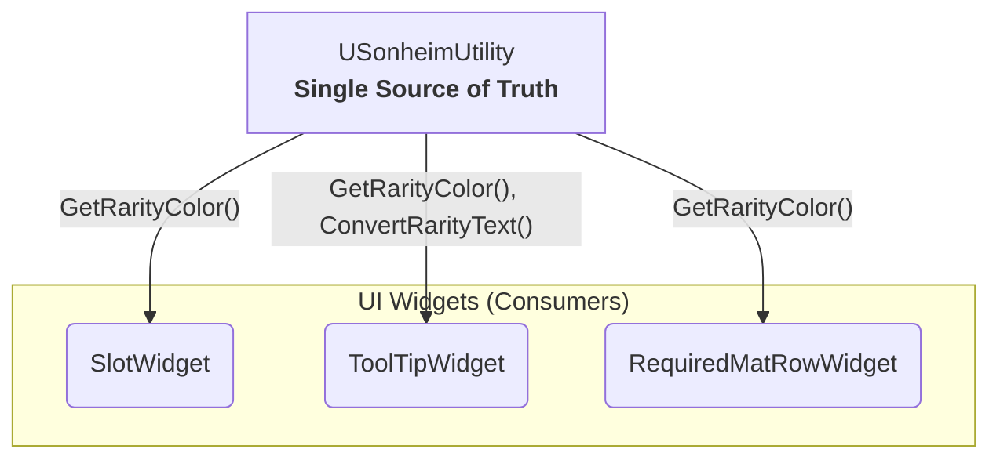

# 7.2. 단일 진실 공급원: 중앙화된 UI 디자인 시스템

> ### UI 혼돈을 막는 단 하나의 원칙: 중앙화된 UI 디자인 시스템
>
> *   **단일 진실 공급원 (Single Source of Truth):** UI의 외형(색상, 텍스트 등)에 대한 모든 규칙을 `USonheimUtility`라는 단 하나의 클래스에 `static` 함수로 중앙화했습니다. 이는 단순한 유틸리티 모음이 아니라, 프로젝트 전체의 시각적 일관성을 보장하고 유지보수 비용을 극적으로 낮추는 **중앙 디자인 시스템**의 핵심입니다.
> *   **설계자와 프로그래머의 완벽한 분업:** 이 구조 덕분에, 디자이너는 `USonheimUtility` 파일 하나만 관리하면 게임 전체의 UI 스타일을 변경할 수 있으며, 프로그래머는 세부적인 색상 값에 대해 전혀 신경 쓸 필요 없이 이 유틸리티 함수를 호출하기만 하면 됩니다.
> *   **증명된 일관성:** 인벤토리, 툴팁, 제작 UI 등 프로젝트의 모든 UI 위젯은 이 중앙 시스템을 통해 스타일을 적용받아, 일관된 사용자 경험을 제공합니다.

---

### 7.2.1. Why: 왜 중앙화된 디자인 시스템이 필요한가?

게임에 UI 위젯이 수십, 수백 개로 늘어날 때, 다음과 같은 문제는 필연적으로 발생합니다.

*   **\"전설 등급 색상을 약간 더 밝게 바꿔주세요.\"** 라는 디자이너의 간단한 요청 하나가, 수많은 위젯 블루프린트를 일일이 찾아 수정해야 하는 프로그래머의 거대한 작업으로 변합니다.
*   각 위젯에 색상 값이 하드코딩되어, 어떤 위젯은 `#FFD700`을 쓰고 어떤 위젯은 `#FFC300`을 쓰는 등 미세한 차이가 발생하여 **시각적 일관성**이 깨집니다.
*   새로운 프로그래머가 팀에 합류했을 때, 어떤 색상을 사용해야 하는지에 대한 명확한 가이드라인이 없어 혼란을 겪고 생산성이 저하됩니다.

이러한 **유지보수의 악몽**을 피하고, **프로젝트의 확장성과 시각적 완성도**를 보장하기 위해, 모든 스타일 관련 규칙을 한 곳에서 관리하는 **\"단일 진실 공급원(Single Source of Truth)\"** 원칙을 적용한 중앙 디자인 시스템을 구축했습니다.

---

### 7.2.2. How: `USonheimUtility`를 이용한 아키텍처

이 아키텍처의 핵심은 매우 간단합니다. UI 스타일링이 필요한 모든 위젯은 값을 하드코딩하는 대신, `USonheimUtility` 클래스의 `static` 함수를 호출하여 정해진 값을 받아 사용합니다.



---

### 7.2.3. Proof: 적용 사례 (Application Examples)

이 중앙 디자인 시스템이 어떻게 프로젝트 전반에 걸쳐 일관성을 부여하는지는 다음 사례들을 통해 명확히 증명됩니다.

#### 7.2.3.1. 사례 1: 인벤토리 UI ([[7.5 인벤토리 UI 심층 분석|7.5_Building_a_Reusable_Inventory_UI]])

`SlotWidget`과 `ToolTipWidget`은 아이템 등급(`EItemRarity`)에 따른 시각적 표현을 위해 `USonheimUtility`를 적극적으로 활용합니다.

*   **`SlotWidget`의 배경색:** `SetItemData` 함수 내에서, 아이템 등급에 맞는 배경색을 설정하기 위해 `GetRarityColor`를 호출합니다.
    ```cpp
    // In SlotWidget.cpp
    void USlotWidget::SetItemData(const FItemData* ItemData, int32 NewQuantity)
    {
        // ...
        if (IMG_BackGround)
        {
            IMG_BackGround->SetColorAndOpacity(USonheimUtility::GetRarityColor(ItemData->ItemRarity, 0.2f));
        }
        // ...
    }
    ```

*   **`ToolTipWidget`의 텍스트와 색상:** 툴팁 위젯은 아이템 등급 텍스트의 **내용**은 `ConvertRarityText`로, **색상**은 `GetRarityColor`로 설정하여 완벽한 일관성을 유지합니다.
    ```cpp
    // In ToolTipWidget.cpp (Conceptual)
    void UToolTipWidget::InitToolTip(const FItemData* ItemData)
    {
        // ...
        TXT_Rarity->SetText(USonheimUtility::ConvertRarityText(ItemData->ItemRarity));
        TXT_Rarity->SetColorAndOpacity(USonheimUtility::GetRarityColor(ItemData->ItemRarity));
        // ...
    }
    ```

#### 7.2.3.2. 사례 2: 제작 UI ([[7.6 제작 UI 심층 분석|7.6_Designing_a_Collaborative_Crafting_UI]])

제작 UI의 각 재료를 표시하는 `RequiredMatRowWidget` 역시, 재료 아이템의 등급을 시각적으로 표현하기 위해 동일한 중앙 시스템을 사용합니다.

*   **`RequiredMatRowWidget`의 배경색:** `SetMaterial` 함수 내에서, `GetRarityColor`를 호출하여 재료의 등급에 맞는 배경색을 설정합니다.
    ```cpp
    // In RequiredMatRowWidget.cpp
    void URequiredMatRowWidget::SetMaterial(int32 ItemID, int32 Required)
    {
        // ...
        const FItemData* ItemData = ...;
        if (ItemData && IMG_RarityBack)
        {
            IMG_RarityBack->SetColorAndOpacity(USonheimUtility::GetRarityColor(ItemData->ItemRarity, 0.2f));
        }
        // ...
    }
    ```
이처럼 인벤토리와 제작 시스템이라는 서로 다른 시스템의 UI가, 동일한 디자인 시스템을 공유함으로써 프로젝트 전체의 시각적 통일성이 확보됩니다.

---

### 7.2.4. 설계의 이점

*   **유지보수 비용 제로:** "전설" 등급의 색상을 수정해야 할 때, `GetRarityColor` 함수 단 하나만 수정하면 게임 내 모든 UI에 즉시 일관되게 반영됩니다.
*   **명확한 역할 분담:** 디자이너는 `USonheimUtility`만 관리하고, 프로그래머는 이 함수를 호출하기만 하면 되므로 협업이 매우 원활해집니다.
*   **보장된 일관성:** 모든 UI가 단일 출처의 규칙을 따르므로, 게임의 전체적인 시각적 완성도가 높아집니다.
