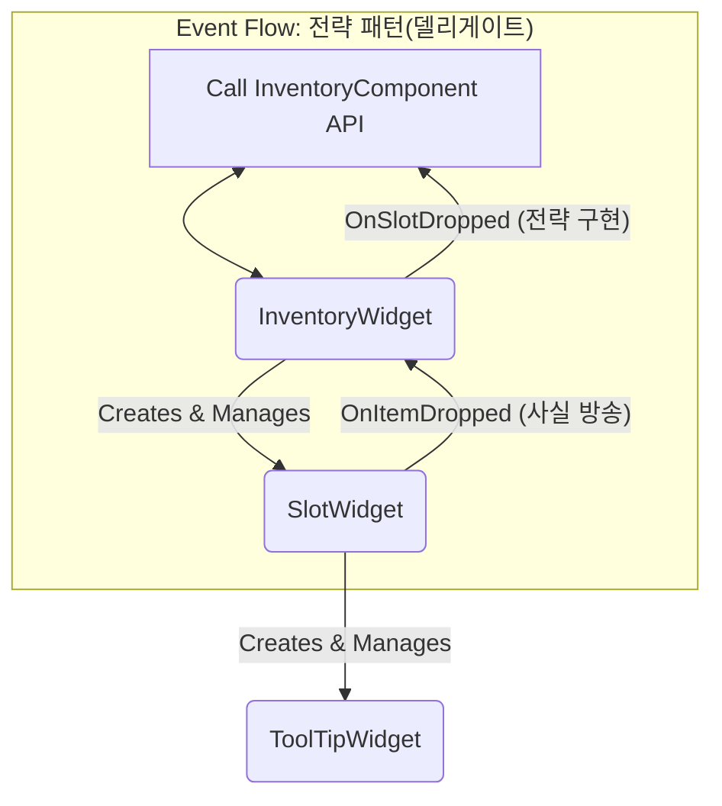

# 7.5. 재사용 가능한 인벤토리 UI 구축

> ### 전략 패턴으로 구현된 재사용 가능한 인벤토리 UI
> 
> *   **명확한 역할 분담 (SRP):** 인벤토리 전체를 지휘하는 `InventoryWidget`, UX 표현과 이벤트 전달을 담당하는 `SlotWidget`, 상세 정보만 표시하는 `ToolTipWidget`으로 역할을 완벽히 분리했습니다.
> *   **전략 패턴 (Strategy Pattern):** `SlotWidget`은 드래그 앤 드롭 같은 상호작용이 발생했다는 '사실'만 델리게이트로 방송하고, 상위 위젯(`InventoryWidget` 또는 `ContainerWidget`)이 그 이벤트를 구독하여 '어떻게 처리할지'에 대한 구체적인 전략을 구현합니다.
> *   **완벽한 재사용성:** 이 설계 덕분에 `SlotWidget`은 `InventoryComponent`의 존재를 알 필요가 없는 범용 부품이 되었고, 플레이어 인벤토리, 보관함 등 어떤 컨텍스트에서도 코드 수정 없이 재사용될 수 있습니다.

---

> [!VIDEO]
> **[인벤토리 UI 시스템 시연 영상]**
> (영상 삽입 예정: 드래그 앤 드롭으로 아이템을 옮기고, 우클릭으로 장착하며, 툴팁을 확인하는 모습)

---

## 7.5.1. 설계 목표

1.  **명확한 역할 분담 (SRP):** 인벤토리 전체를 관리하는 컨테이너 위젯, 개별 슬롯의 상호작용을 처리하는 슬롯 위젯, 상세 정보를 보여주는 툴팁 위젯으로 역할을 명확히 분리하여 각 위젯이 하나의 책임만 갖도록 합니다.
2.  **데이터와 표현의 완벽한 분리:** UI는 `UInventoryComponent`의 데이터를 화면에 보여주는 **뷰(View)**의 역할에만 집중하며, 백엔드 로직을 전혀 알 필요가 없습니다.
3.  **정교하고 즉각적인 UX:** 드래그 앤 드롭, 우클릭 등 사용자의 모든 상호작용에 대해, 명확하고 즉각적인 시각적 피드백을 제공하여 최상의 사용자 경험을 만듭니다.
4.  **일관된 UI 스타일:** 모든 관련 위젯은 [[7.2 중앙화된 디자인 시스템|7.2_Centralized_UI_Design_System]]에 정의된 중앙 유틸리티(`USonheimUtility::GetRarityColor`)를 사용하여, 아이템 등급에 따른 슬롯 배경색, 툴팁 색상 등이 게임 전체에 걸쳐 일관된 시각적 표현을 보장합니다.

---

## 7.5.2. 구현 기능 목록 (Feature List)

*   **풍부한 시각적 피드백:**
    *   마우스를 올린 슬롯은 살짝 커지는 애니메이션과 함께 테두리가 표시되어 현재 위치를 명확히 알려줍니다. (`NativeOnMouseEnter`)
    *   아이템을 드래그하면, 드롭이 **가능한** 슬롯 위에서는 **초록색**, **불가능한** 슬롯 위에서는 **빨간색** 테두리가 표시되어 직관적인 가이드를 제공합니다. (`NativeOnDragEnter`, `SetHighlighted`)
    *   드래그 중인 아이콘 자체도 드롭 불가능한 위치에서는 빨갛게 변색되어 추가적인 피드백을 줍니다. (`SetDragOperationVisual`)
*   **다양한 상호작용:**
    *   우클릭으로 아이템을 즉시 장착/해제합니다.
    *   슬롯 간 드래그 앤 드롭으로 아이템 위치를 교환합니다.
    *   장비 슬롯으로 드래그하여 아이템을 장착하거나, 장비 슬롯 간에 아이템을 스왑합니다.
*   **상세 정보 툴팁:** 아이템 슬롯에 마우스를 올리면, 해당 아이템의 이름, 등급, 스탯, 설명 등 상세 정보가 담긴 툴팁이 표시됩니다.
*   **아이템 삭제/버리기:** 인벤토리의 아이템을 휴지통 아이콘으로 드래그하면, 수량을 선택하여 아이템을 영구히 파괴하거나 월드에 드롭할 수 있습니다.

---

## 7.5.3. 기술 상세 (Technical Deep Dive)

### 7.5.3.1. 아키텍처: 전략 패턴으로 완성한 역할 분담과 재사용성

#### 7.5.3.1.1. 문제 정의: 재사용성과 확장성의 딜레마

`SlotWidget`은 인벤토리, 보관함, 퀵슬롯 등 다양한 곳에서 재사용되어야 합니다. 만약 `SlotWidget`이 드래그 앤 드롭의 결과(예: `InventoryComponent`의 아이템 스왑)를 직접 처리하도록 하드코딩했다면, 이 위젯은 오직 플레이어 인벤토리에서만 작동하는 반쪽짜리가 되었을 것입니다. 이는 단일 책임 원칙(SRP)을 위배하고 위젯을 점점 무겁고 복잡하게 만듭니다.

#### 7.5.3.1.2. 해결 방안: 전략 패턴을 통한 역할 분담의 완성

이 문제를 해결하기 위해, **전략 패턴**을 도입하여 각 위젯의 역할을 명확히 분리하고, 델리게이트(Delegate)를 통해 이들을 유기적으로 연결했습니다.

**1. 핵심 상호작용: 전략 패턴 (The Strategy Pattern)**

전략 패턴의 핵심은 상호작용이 발생했다는 **'사실'**과, 그 상호작용을 **'어떻게 처리할지(전략)'**를 분리하는 것입니다.



*   **`SlotWidget` (방송자):** `NativeOnDrop`에서 드롭이 발생하면, 직접 로직을 처리하는 대신 `OnItemDropped` 델리게이트를 호출하여 "From 슬롯에서 To 슬롯으로 드롭이 발생했다"는 **사실만 방송**합니다.

> [View on GitHub](https://github.com/chungheonLee0325/Sonheim/blob/main/Sonheim/Source/Sonheim/UI/Widget/Player/Inventory/SlotWidget.cpp#L281)
```cpp
// Source/Sonheim/UI/Widget/Player/Inventory/SlotWidget.cpp
bool USlotWidget::NativeOnDrop(...)
{
    // ... (유효성 검사) ...
    OnItemDropped.Broadcast(DragDropOp->DraggedSlotWidget, this);
    return true;
}
```

*   **`InventoryWidget` (구독자):** `SlotWidget`의 `OnItemDropped` 델리게이트를 **구독**하고 있다가, 이벤트가 방송되면 `OnSlotDropped` 함수를 실행합니다. 이 함수는 드롭된 슬롯의 종류에 따라 `InventoryComponent`의 어떤 API를 호출할지 결정하는 **구체적인 전략을 구현**합니다.

> [View on GitHub](https://github.com/chungheonLee0325/Sonheim/blob/main/Sonheim/Source/Sonheim/UI/Widget/Player/Inventory/InventoryWidget.cpp#L221)
```cpp
// Source/Sonheim/UI/Widget/Player/Inventory/InventoryWidget.cpp
void UInventoryWidget::OnSlotDropped(USlotWidget* FromSlot, USlotWidget* ToSlot)
{
    // 전략 1: 인벤토리 -> 인벤토리 = 아이템 스왑
    if (FromSlot->EquipmentSlotType == EEquipmentSlotType::None && ToSlot->EquipmentSlotType == EEquipmentSlotType::None)
    {
        InventoryComponent->SwapItems(FromSlot->SlotIndex, ToSlot->SlotIndex);
    }
    // ...
}
```

**2. 위젯별 역할 분담 (Single Responsibility Principle)**

이러한 전략 패턴 덕분에 각 위젯은 자신의 책임에만 집중할 수 있게 되었습니다.

*   **`SlotWidget`: UX 표현의 전문가**
    `SlotWidget`은 데이터 처리 로직 대신, 사용자에게 최상의 시각적 피드백을 제공하는 데 집중합니다. 특히, `NativeOnDragEnter`에서는 드롭 가능 여부에 따라 **타겟 슬롯의 테두리 색상**과 **드래그 중인 아이콘의 색상**을 동시에 변경하여, 사용자에게 매우 명확하고 직관적인 피드백을 제공합니다. 또한, `SetItemData` 함수가 호출되면, `USonheimUtility::GetRarityColor`를 호출하여 아이템 등급에 맞는 배경색을 스스로 설정하고, 자신의 툴팁 위젯을 직접 생성하고 관리하며 책임을 다합니다.

*   **`InventoryWidget`: 이벤트의 최종 해석자**
    `SlotWidget`이 "무슨 일이 일어났다"고 보고하면, `InventoryWidget`은 "그래서 어떻게 해야 한다"를 결정합니다. 우클릭은 장착/해제, 드롭은 아이템 스왑/장착 등, 현재 컨텍스트(플레이어 인벤토리)에 맞는 정책을 최종적으로 해석하고 실행하는 두뇌 역할을 합니다.

*   **`ToolTipWidget`: 데이터의 최종 시각화**
    `ToolTipWidget`은 `FItemData`를 전달받아 화면에 정보를 채워 넣는 가장 단순하고 명확한 책임만 수행합니다.

이 구조 덕분에 `SlotWidget`은 `InventoryComponent`의 존재를 전혀 알 필요 없는 완벽히 재사용 가능한 부품이 되었고, `InventoryWidget`은 인벤토리 컨텍스트에 맞는 정책을 자유롭게 정의할 수 있는 유연성을 확보했습니다.

### 7.5.3.2. 핵심 구현 2: 컨텍스트 기반의 지능적 유효성 검사

*   **문제 정의: 어떻게 즉각적인 시각적 피드백을 제공할 것인가?**
    드래그 앤 드롭의 최종 로직은 상위 위젯에 위임했지만, 플레이어에게 즉각적인 피드백(드롭 가능한 곳인지 알려주는 초록/빨강 테두리)을 주기 위해서는 `SlotWidget` 스스로가 드롭 가능 여부를 **미리** 알아야 합니다. 하지만 `SlotWidget`은 재사용성을 위해 `InventoryComponent`나 `ContainerComponent`의 존재를 알아서는 안됩니다.

*   **해결 방안: 컨텍스트를 스스로 판단하는 `IsDropValidFrom` 함수**
    이 딜레마를 해결하기 위해, `SlotWidget`은 `IsDropValidFrom`이라는 지능적인 유효성 검사 함수를 내부에 구현했습니다. 이 함수는 `GetTypedOuter<T>()`를 통해 자신의 부모가 누구인지 런타임에 질의합니다. 이 덕분에 `SlotWidget`은 컴파일 타임에는 `InventoryWidget`이나 `ContainerWidget`의 존재를 전혀 알 필요 없이, 어떤 부모 밑에 놓이더라도 능동적으로 자신의 컨텍스트를 파악하고 드롭 규칙을 스스로 판단할 수 있습니다.

> [View on GitHub](https://github.com/chungheonLee0325/Sonheim/blob/main/Sonheim/Source/Sonheim/UI/Widget/Player/Inventory/SlotWidget.cpp#L440)
```cpp
// Source/Sonheim/UI/Widget/Player/Inventory/SlotWidget.cpp
bool USlotWidget::IsDropValidFrom(USlotWidget* FromSlot) const
{
    // ...
    // 컨텍스트 판별 람다
	auto IsEquip = [](const USlotWidget* S) { return S && S->EquipmentSlotType != EEquipmentSlotType::None; };
	auto IsContainer = [](const USlotWidget* S) { return S && (S->GetTypedOuter<UContainerWidget>() != nullptr); };
	auto IsPlayerInv = [&](const USlotWidget* S) { return S && !IsEquip(S) && !IsContainer(S); };

	const bool FromInv = IsPlayerInv(FromSlot);
	const bool ToEquip = IsEquip(this);

    // 인벤토리 -> 장비 슬롯: 아이템-슬롯 적합성 검사
	if (FromInv && ToEquip)
	{
		return UInventoryRulesLibrary::IsItemCompatibleWithSlot(this, FromSlot->ItemID, EquipmentSlotType);
	}
    // ... 수많은 컨텍스트별 분기 처리 ...

	return false;
}
```
이 설계 덕분에, `NativeOnDragEnter`와 같은 UI 이벤트 함수는 `IsDropValidFrom`의 결과에 따라 테두리 색상을 바꾸기만 하면 되므로, UI 표현 로직과 게임 규칙 로직을 완벽하게 분리하면서도 즉각적인 피드백을 구현할 수 있었습니다.

특히, `IsItemCompatibleWithSlot`과 같은 실제 게임 규칙 검사는 `UInventoryRulesLibrary`라는 별도의 유틸리티 클래스로 분리했습니다. 이를 통해 `SlotWidget`은 '규칙을 검사해야 한다'는 사실만 알 뿐, '어떤 아이템이 어떤 슬롯에 맞는지'와 같은 구체적인 게임 규칙의 변경으로부터 완전히 독립될 수 있었습니다.

### 7.5.3.3. 회고: 완벽한 재사용성을 향한 여정

이 시스템의 핵심 목표는 `SlotWidget`을 어떤 상황에서도 수정 없이 가져다 쓸 수 있는 범용 부품으로 만드는 것이었습니다. 이를 위해 단일 책임 원칙(SRP)에 따라 각 위젯의 역할을 명확히 분리하고, 전략 패턴을 도입하여 상호작용의 '사실'과 '정책'을 분리했습니다. 그 결과, `SlotWidget`은 자신의 컨텍스트를 스스로 판단하고 UI 표현에만 집중하는 지능적인 컴포넌트가 되었고, `InventoryWidget`이나 `ContainerWidget`은 각자의 상황에 맞는 정책만 구현하면 되는 유연한 구조를 완성할 수 있었습니다. 이는 객체 지향 설계의 핵심 원칙들이 어떻게 실질적인 코드의 재사용성과 확장성으로 이어지는지를 보여주는 좋은 사례입니다.

---

## 7.5.4. 관련 시스템

*   [[2.3 컴포넌트 기반 설계|2.3_Component_Based_Design]]
*   [[4.2 인벤토리 시스템|4.2_Inventory_System]]
*   [[7.1 이벤트 기반 UI 아키텍처|7.1_Event-Driven_UI_Architecture]]
*   [[7.2 중앙화된 디자인 시스템|7.2_Centralized_UI_Design_System]]
*   [[8.4 반응형 인벤토리 UX|8.4_Case_Study_Inventory_Interaction]]
