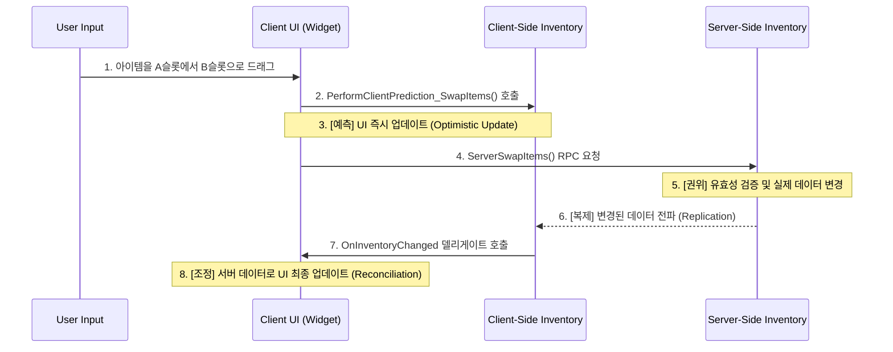

> ### 온라인 게임에서 아이템을 옮길 때의 랙(Lag)을 어떻게 감출 수 있을까? 서버의 권위를 유지하면서도, 플레이어에게는 싱글플레이 게임처럼 즉각적으로 반응하는 인벤토리 UX를 제공하는 방법은 무엇일까?
> 이 사례 연구는 Sonheim의 인벤토리 시스템이 어떻게 **클라이언트 예측(Client-Side Prediction)** 기법을 통해 사용자에게는 즉각적인 반응성을 제공하는 동시에, **서버 권위(Server Authority)** 아키텍처를 통해 데이터의 정합성을 100% 보장하는지, 그 정교한 상호작용의 전체 흐름을 추적합니다.
>
> *   **클라이언트 예측 (Client-Side Prediction):** 사용자가 아이템을 드래그 앤 드롭하면, 서버의 응답을 기다리지 않고 UI를 즉시 업데이트하여 네트워크 지연을 완벽하게 감춥니다.
> *   **역할 분기 API (Role-Splitting API):** `SwapItems`와 같은 공개 API는 내부적으로 호출자의 권한(서버/클라이언트)을 확인하여 역할을 분기합니다. 클라이언트는 예측 후 서버에 RPC를 보내고, 서버는 권위 있는 데이터 변경을 직접 수행합니다.
> *   **서버 권위와 조정 (Server Authority & Reconciliation):** 모든 예측은 서버의 최종 판결에 의해 조정됩니다. 서버로부터 복제된 최종 데이터는 클라이언트의 예측이 틀렸을 경우(Misprediction)에도 UI 상태를 올바르게 복구하여, 데이터 무결성을 100% 보장하는 안전장치 역할을 합니다.
> *   **효율적인 데이터 동기화 (`FastArraySerializer`):** 아이템 배열 전체가 아닌, 변경된 슬롯의 정보만 클라이언트에 전송하는 델타 복제를 통해, 반응성을 유지하면서도 네트워크 부하를 최소화합니다.

https://github.com/user-attachments/assets/c594e8a3-2840-456c-ae04-cabaaeb4d8ca

# 8.1. 사례 연구: 클라이언트 예측으로 구현하는 반응형 인벤토리 UX

## 8.1.1. 서론

인벤토리에서 아이템을 드래그 앤 드롭하는 것은 매우 직관적인 UX이지만, 멀티플레이어 환경에서 이를 구현하는 것은 간단하지 않습니다. 사용자의 모든 입력에 대해 서버의 응답을 기다린다면 끔찍한 지연(Lag)을 경험하게 될 것이고, 반대로 클라이언트에서만 처리한다면 데이터가 조작되거나 동기화가 깨지는 심각한 문제가 발생합니다.

이 문서는 Sonheim의 인벤토리 시스템이 어떻게 **[[2.1 서버 권위 원칙|클라이언트 예측(Client-Side Prediction)]]** 기법을 통해 사용자에게는 즉각적인 반응성을 제공하는 동시에, **[[2.1 서버 권위 원칙|서버 권위(Server Authority)]]** 아키텍처를 통해 데이터의 정합성을 100% 보장하는지, 그 정교한 상호작용의 전체 흐름을 추적하는 사례 연구입니다.

---

## 8.1.2. 아키텍처: 예측, 요청, 그리고 조정 (Prediction, Request, and Reconciliation)

이 시스템의 핵심은 **\"일단 먼저 보여주고, 서버에 확인받은 뒤, 틀렸으면 바로잡는다\"**는 세 단계의 순환 구조입니다. 클라이언트는 사용자의 입력에 즉시 반응하여 UI를 낙관적으로 업데이트(Optimistic Update)하고, 동시에 서버에 실제 처리를 요청합니다. 서버의 최종 결과가 도착하면, 클라이언트는 그 결과에 맞춰 자신의 상태를 조정(Reconcile)합니다.



---

## 8.1.3. 단계별 상세 분석

#### 1단계: 환상 - 즉각적인 반응의 구현 (클라이언트 예측)

*   **시작점:** 플레이어가 [[7.4 인벤토리 UI 시스템|`SlotWidget`]] A를 드래그하여 `SlotWidget` B에 드롭합니다.
*   **흐름:**
    1.  `InventoryWidget`은 `OnSlotDropped` 함수에서 이 요청을 받아, **클라이언트 예측 함수**와 **서버 요청 함수**를 모두 호출합니다.
    2.  먼저 호출된 `PerformClientPrediction_SwapItems` 함수는, 서버의 응답을 기다리지 않고 **로컬에 캐시된 인벤토리 배열의 아이템 위치를 즉시 바꾼 뒤**, `OnInventoryChanged` 델리게이트를 호출하여 UI를 바로 업데이트합니다. 사용자는 자신의 행동이 즉시 반영된 것처럼 느끼게 됩니다.

> [View on GitHub](https://github.com/chungheonLee0325/Sonheim/blob/main/Sonheim/Source/Sonheim/AreaObject/Player/Utility/InventoryComponent.cpp#L1201)
```cpp
// Source/Sonheim/AreaObject/Player/Utility/InventoryComponent.cpp
void UInventoryComponent::PerformClientPrediction_SwapItems(int32 FromIndex, int32 ToIndex)
{
    // 로컬에 캐시된 배열의 복사본을 만들어 스왑
    TArray<FInventoryItem> PredictedInventory = InventoryItems;
    PredictedInventory.Swap(FromIndex, ToIndex);
    
    // 예측된 상태로 UI가 즉시 업데이트되도록 델리게이트 호출
    OnInventoryChanged.Broadcast(PredictedInventory);
}
```

#### 2단계: 진실을 향한 요청 (서버 RPC)

*   `InventoryWidget`은 [[4.2 인벤토리 시스템|`InventoryComponent`]]의 `SwapItems` 함수를 호출하고, 이 함수는 내부적으로 `ServerSwapItems` RPC를 호출하여 서버에 실제 아이템 스왑을 요청합니다.

#### 3단계: 서버의 최종 판결 (서버 권위)

*   서버의 `InventoryComponent`가 `ServerSwapItems_Implementation` RPC를 수신하여, 모든 규칙을 다시 한번 검증한 후 **실제 데이터가 저장된** `InventoryItems` 배열의 아이템을 스왑하고, 변경사항을 클라이언트에 복제(Replicate)하도록 예약합니다.

#### 4단계: 조정 - 상태의 일치 (Replication & Reconciliation)

*   서버로부터 변경된 데이터가 클라이언트에 도착하면, `OnRep_RepItems` 함수가 자동으로 호출됩니다. 이 함수는 서버로부터 받은 최신 데이터로 로컬 캐시(`InventoryItems`)를 재구성하고, [[7.1 이벤트 기반 UI 아키텍처|`OnInventoryChanged` 델리게이트]]를 다시 한번 브로드캐스트합니다.
*   `InventoryWidget`은 이 델리게이트를 받아 UI를 다시 한번 그립니다. 만약 1단계의 예측이 정확했다면 사용자에게는 아무런 변화도 느껴지지 않을 것이고, 만약 예측이 틀렸다면, UI는 이 단계에서 서버의 최종 데이터에 맞춰 **상태를 올바르게 수정(조정)**하게 됩니다.

---

## 8.1.4. 설계 결정 및 트레이드오프

#### 예측 실패(Misprediction)는 버그가 아닌, 시스템의 일부

클라이언트 예측은 완벽하지 않습니다. 예를 들어, 심한 네트워크 지연(Lag)으로 인해 플레이어가 아이템을 A에서 B로 옮기는 요청이 서버에 도달하기 직전, 다른 이유(예: 자동 정렬)로 B 슬롯에 다른 아이템이 채워지는 **경쟁 상태(Race Condition)**가 발생할 수 있습니다.

*   **클라이언트 예측:** B 슬롯이 비어있다고 예측하고 A 아이템을 B로 옮긴 것처럼 보여줌.
*   **서버의 진실:** B 슬롯이 이미 차있으므로 스왑 요청을 거부함.
*   **조정 (Reconciliation):** 서버의 최종 데이터가 클라이언트에 도착하면, 클라이언트의 UI는 예측을 폐기하고 서버의 상태(A 아이템이 원래 자리에 그대로 있는 상태)로 되돌아갑니다.

이처럼 예측 실패는 버그가 아니라, **서버 권위 아키텍처가 올바르게 작동하고 있다는 증거**입니다. \'조정\' 단계는 예측이 틀렸을 경우를 대비한 필수적인 **안전장치**이며, 이 덕분에 사용자 경험의 반응성과 데이터의 무결성을 모두 확보할 수 있습니다.

#### 예측 로직의 단순성 vs. 성능

현재 `PerformClientPrediction_SwapItems` 함수는 예측을 수행할 때마다 `InventoryItems` 배열의 **복사본을 생성**합니다.

*   **장점:** 이 방식은 구현이 매우 간단하고 명확하며, 예측 로직이 원본 데이터를 오염시킬 위험이 없어 안전합니다.
*   **단점:** 만약 인벤토리 슬롯이 수천 개에 달하는 극단적인 상황이라면, 매번 배열을 복사하는 데 미세한 성능 비용이 발생할 수 있습니다.
*   **결론:** Sonheim 프로젝트의 인벤토리 규모(수십~수백 개)를 고려할 때, 배열 복사로 인한 성능 영향은 거의 없습니다. 따라서 여기서는 극단적인 상황에 대한 마이크로 최적화보다는, **코드의 명확성과 안정성을 우선**하는 것이 합리적인 설계적 트레이드오프라고 판단했습니다.

---

## 8.1.5. 설계의 이점

*   **최상의 사용자 경험:** 클라이언트 예측을 통해, 플레이어는 네트워크 지연과 관계없이 자신의 행동에 대한 즉각적인 시각적 피드백을 받습니다. 이는 게임의 반응성과 몰입감을 극대화합니다.
*   **완벽한 데이터 무결성:** 모든 최종적인 데이터 변경은 서버에서만 이루어지므로, 클라이언트의 조작이나 예측 실패로 인해 아이템이 복제되거나 유실될 위험이 원천적으로 차단됩니다.
*   **네트워크 효율성:** 아이템 배열 전체를 보내는 대신, [[4.2 인벤토리 시스템|`FastArraySerializer`]]를 사용하여 변경된 슬롯의 정보만 효율적으로 전송하여 네트워크 부하를 줄입니다.
*   **명확한 역할 분담:** UI는 사용자 경험과 예측에 집중하고, 서버 컴포넌트는 데이터의 유효성 검사와 권위 있는 상태 관리에만 집중하여 각자의 역할을 명확하게 분리했습니다.

---

## 8.1.6. 관련 시스템

*   [[2.1 서버 권위 원칙|2.1_Server_Authority_Architecture]]
*   [[4.2 인벤토리 시스템|4.2_Inventory_System]]
*   [[7.1 이벤트 기반 UI 아키텍처|7.1_Event-Driven_UI_Architecture]]
*   [[7.4 인벤토리 UI 시스템|7.4_Inventory_UI_System]]
