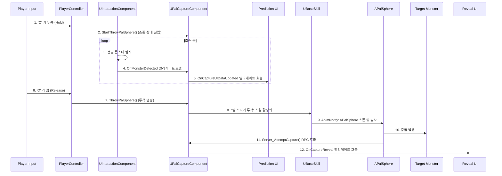
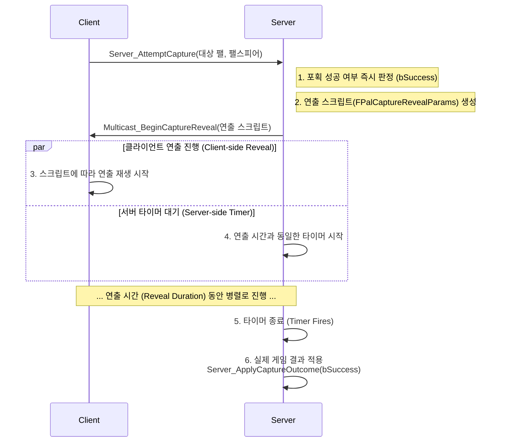

# 8.1. 사례 연구: 팰 포획 시퀀스

> ### 플레이어가 팰 스피어를 던지는 순간부터 포획에 성공하거나 실패하기까지, 클라이언트의 UI, 플레이어 캐릭터, 서버의 여러 컴포넌트, 그리고 몬스터 사이에서 어떤 데이터와 이벤트가 오고 가는지 그 전체 시퀀스를 심층 추적합니다.
> 이 문서는 [[4.4 팰 관리 시스템|4.4_Pal_Management_System]]을 구성하는 컴포넌트들이 어떻게 유기적으로 협력하여, **서버 권위 하에 일관된 사용자 경험**을 보장하고, **확률적 연출**을 통해 게임적 재미를 더하는지 실제 코드를 통해 증명하는 기술 심층 분석 문서입니다.

https://github.com/user-attachments/assets/57246d79-bd3b-473f-85fc-762670023729

## 8.1.1. 서론

이 문서는 Sonheim의 핵심 게임플레이 기능인 **팰 포획(Pal Capture)**이 어떻게 여러 모듈화된 시스템들의 유기적인 협력을 통해 구현되는지, 그 전체적인 데이터와 이벤트의 흐름을 추적하는 사례 연구입니다. 

이 문서의 핵심 목표는 다음과 같습니다.
1.  **시스템 간의 협력:** `Actor`, `Component`, `UI` 등 각기 다른 객체들이 어떻게 서로 직접 참조하지 않고, 오직 **델리게이트(Delegate)**를 통해 각자의 역할에만 집중하며 소통하는지 보여줍니다.
2.  **네트워크 아키텍처:** 서버 권위 아키텍처 하에서, 어떻게 **서버의 즉각적인 판정**과 **클라이언트의 지연된 연출**을 분리하여 기술적 안정성과 만족스러운 사용자 경험("결과의 지연 반영", "생동감 있는 확률적 연출")을 모두 달성하는지 상세히 설명합니다.

---

## 8.1.2. 전체 시스템 협력도

팰 포획 기능은 단순히 하나의 클래스가 아닌, 여러 시스템이 마치 톱니바퀴처럼 맞물려 동작하는 복잡한 시퀀스입니다. 아래 다이어그램은 이 기능에 관여하는 주요 액터와 컴포넌트들의 전체적인 상호작용 흐름을 보여줍니다.



이 모든 과정은 [[팰 관리 시스템|4.4_Pal_Management_System]]을 구성하는 `UPalCaptureComponent`, `UPalInventoryComponent`, `UPalPartnerSkillComponent`와, [[상호작용 시스템|6.1_Unified_Interaction_System]], [[스킬 시스템|3.3_Skill_Architecture]], [[애니메이션 시스템|3.4_Animation_System]], 그리고 [[UI 시스템|7.1_Event-Driven_UI_Architecture]]의 유기적인 협력으로 이루어집니다.

---

## 8.1.3. 핵심 네트워크 아키텍처

위의 전체 흐름 중, 네트워크 통신이 가장 중요하게 작용하는 11단계(충돌 이후)를 더 자세히 들여다보면 다음과 같은 **'즉시 판정 및 지연된 결과 적용'** 패턴을 사용합니다. 이는 서버 권위 모델을 사용자 경험(UX) 향상을 위해 응용한 구체적인 구현 기법입니다.



---

## 8.1.4. 단계별 상세 분석

#### 1단계: 조준 및 포획률 예측

*   **시작점:** 플레이어가 'Q' 키를 누르고 있는 동안(Hold) 발생합니다.
*   **흐름:**
    1.  `ASonheimPlayerController`가 키 입력을 감지하고, `UPalCaptureComponent`의 `StartThrowPalSphere()`를 호출하여 **조준 상태**로 진입시킵니다. 이 때 플레이어의 무기 메시는 숨겨지고, 손에는 팰스피어가 나타나는 등 시각적 변화가 일어납니다.
    2.  조준 상태에서, 플레이어의 `UInteractionComponent`는 전방에 조준된 몬스터가 있는지 계속 탐지합니다. (참고: [[6.1 통합 상호작용 원칙|6.1_Unified_Interaction_System]])
    3.  몬스터가 탐지되면, `UInteractionComponent`는 `OnMonsterDetected` 델리게이트를 브로드캐스트합니다. 이 컴포넌트는 포획에 대해 전혀 알지 못하며, 오직 "몬스터를 감지했다"는 자신의 역할에만 충실합니다.
    4.  `UPalCaptureComponent`는 이 델리게이트를 구독하고 있다가, 몬스터 정보를 받아 **예상 포획 확률을 계산**하고, `OnCaptureUIDataUpdated` 델리게이트를 다시 브로드캐스트합니다.
    5.  별도의 예측 UI 위젯이 이 델리게이트를 구독하여, 조준점 주변에 예상 포획 확률(%)을 표시합니다. 플레이어가 조준을 멈추거나 'Q' 키를 떼면, 이 UI는 자동으로 사라집니다.

> [View on GitHub](https://github.com/chungheonLee0325/Sonheim/blob/main/Sonheim/Source/Sonheim/AreaObject/Player/Utility/PalCaptureComponent.cpp#L41)
```cpp
// Source/Sonheim/AreaObject/Player/Utility/PalCaptureComponent.cpp
void UPalCaptureComponent::BeginPlay()
{
    // ...
    // InteractionComponent의 델리게이트에 자신의 함수를 바인딩(구독)
    InteractionComp->OnMonsterDetected.AddDynamic(this, &UPalCaptureComponent::OnMonsterDetected);
}

void UPalCaptureComponent::OnMonsterDetected(ABaseMonster* DetectedMonster)
{
    // ... 확률 계산 로직 ...
    UIData.CaptureRate = CalculateCaptureRate(DetectedMonster);

    // 자신의 델리게이트를 호출하여 UI에 데이터를 전파
    OnCaptureUIDataUpdated.Broadcast(UIData);
}
```

#### 2단계: 투척 및 서버 판정

*   **시작점:** 플레이어가 'Q' 키를 뗍니다(Release).
*   **흐름:**
    1.  `Controller`가 `UPalCaptureComponent`의 `ThrowPalSphere()`를 호출합니다. 이 때 플레이어의 팰스피어 보유 수량을 확인하고, 부족할 경우 피드백을 주며 시퀀스를 중단합니다.
    2.  `UPalCaptureComponent`는 '팰 스피어 투척' 스킬을 활성화합니다. (참고: [[3.3 스킬 시스템|3.3_Skill_Architecture]])
    3.  스킬은 애니메이션 몽타주를 재생하고, `AnimNotify`를 통해 `APalSphere` 액터를 월드에 스폰하여 발사합니다. (참고: [[3.4 애니메이션 시스템|3.4_Animation_System]])
    4.  `APalSphere`가 몬스터와 충돌하면, 서버에 `Server_AttemptCapture` RPC를 호출합니다.
    5.  **[서버]** `UPalCaptureComponent`는 대상 몬스터의 **상태를 잠궈** 다른 플레이어의 동시 접근을 막고, HP와 상태이상 등을 종합하여 **포획 성공 여부(`bSuccess`)를 즉시 판정**합니다.
    6.  **[서버]** 이 최종 결과를 포함한 모든 연출 정보를 `FPalCaptureRevealParams` 구조체(연출 스크립트)에 담아, `Multicast_BeginCaptureReveal` RPC로 모든 클라이언트에 전송하고, 연출 시간에 맞춰 **결과 적용을 위한 타이머를 시작**합니다.

> [View on GitHub](https://github.com/chungheonLee0325/Sonheim/blob/main/Sonheim/Source/Sonheim/AreaObject/Player/Utility/PalCaptureComponent.cpp#L281)
```cpp
// Source/Sonheim/AreaObject/Player/Utility/PalCaptureComponent.cpp
void UPalCaptureComponent::Server_AttemptCapture_Implementation(ABaseMonster* TargetPal, APalSphere* SourceSphere)
{
    // 1. 성공 여부 즉시 판정
    const float captureRate = CalculateCaptureRate(TargetPal);
    const bool bCaptureSuccess = FMath::RandRange(1, 100) <= (captureRate * 100.0f);

    // 2. 클라이언트에 보낼 '연출 스크립트' 생성
    FPalCaptureRevealParams Params;
    Params.bSuccess = bCaptureSuccess; // 최종 결과를 미리 담는다
    // ... (Segments, FailStageOverride 등 연출 정보 계산)

    // 3. 모든 클라이언트에 연출 시작을 알림
    Multicast_BeginCaptureReveal(TargetPal, Params, SourceSphere);

    // 4. 연출이 끝날 시간에 맞춰, 실제 결과를 적용할 함수를 타이머로 예약
    const float RevealTotal = ...; // 연출 총 시간 계산
    FTimerHandle ApplyHandle;
    GetWorld()->GetTimerManager().SetTimer(ApplyHandle,
        FTimerDelegate::CreateUObject(this, &UPalCaptureComponent::Server_ApplyCaptureOutcome, TargetPal, bCaptureSuccess),
        RevealTotal, false);
}
```

#### 3단계: 클라이언트 연출 지휘 및 결과 적용

*   **시작점:** 모든 클라이언트가 `Multicast_BeginCaptureReveal` RPC를 수신합니다.
*   **흐름:**
    1.  `UPalCaptureComponent`는 `OnCaptureReveal` 델리게이트를 호출하여, 자신을 구독하고 있던 `CaptureProgressWidget`(포획 진행 UI)에 '연출 스크립트'를 전달합니다.
    2.  **UI가 연출의 지휘자(Orchestrator)가 됩니다.** 위젯은 스크립트를 해석하여, MDI를 사용한 원형 프로그레스 바의 색상과 최종 목표치를 설정하고, 전체 연출을 몇 개의 구간(Segment)으로 나눌지 계산합니다.
    3.  UI는 블루프린트 타이머를 통해 각 세그먼트 연출을 순차적으로 재생합니다. 세그먼트가 한 칸 진행될 때마다, UI는 **자신만의 `OnSegmentTick` 델리게이트를 브로드캐스트**합니다.
    4.  `APalSphere` 액터는 이 UI의 `OnSegmentTick` 델리게이트를 구독하고 있다가, 이벤트가 발생할 때마다 스스로 **끄덕이는(Nod)** 애니메이션을 재생합니다.
    5.  UI 연출이 모두 끝나면, 성공/실패 여부에 따라 `OnRevealSuccess` 또는 `OnRevealFailed` 델리게이트를 브로드캐스트하고, `APalSphere`는 이를 받아 성공/실패 VFX를 터뜨리며 사라집니다.
    6.  한편, 2단계에서 연출 시작과 함께 설정되었던 **서버의 타이머**가 종료되면, `Server_ApplyCaptureOutcome` 함수가 호출되어 `bSuccess` 값에 따라 팰을 인벤토리에 추가하거나, 월드에 다시 활성화시키는 **실제 게임 로직**이 적용됩니다.

> [View on GitHub](https://github.com/chungheonLee0325/Sonheim/blob/main/Sonheim/Source/Sonheim/AreaObject/Player/Utility/PalCaptureComponent.cpp#L241)
```cpp
// Source/Sonheim/AreaObject/Player/Utility/PalCaptureComponent.cpp
void UPalCaptureComponent::Server_ApplyCaptureOutcome_Implementation(ABaseMonster* TargetPal, bool bSuccess)
{
    if (!TargetPal || !OwnerPlayer || !PalInventory) return;

    if (bSuccess)
    {
        // 성공 시: 팰 인벤토리에 추가 및 몬스터 액터 제거
        PalInventory->AddPal(TargetPal);
    }
    else
    {
        // 실패 시: 몬스터 액터 다시 활성화
        TargetPal->ActivateMonster();
        TargetPal->SetAggroTarget(OwnerPlayer);
    }
}
```

---

## 8.1.5. 구현 경험: 경쟁 상태 방지를 위한 서버 상태 잠금

#### 문제 정의: 공유 자원(몬스터)에 대한 동시 포획 시도

팰 포획은 여러 플레이어가 동시에 시도할 수 있는 상호작용입니다. 만약 두 명의 플레이어(A, B)가 거의 동시에 같은 몬스터에게 팰스피어를 명중시켰다면 어떻게 될까요? 서버가 A의 요청을 처리하여 포획 절차를 진행하는 도중에 B의 요청이 도착한다면, 데이터가 꼬이거나 두 플레이어 모두에게 아이템이 지급되는 등의 심각한 버그가 발생할 수 있습니다. 이는 공유 자원에 대한 **경쟁 상태(Race Condition)**의 전형적인 예시입니다.

#### 해결 방안: 행위가 아닌 '상태'를 잠그는 설계

이 문제를 해결하기 위해, Sonheim은 '누가 포획 중인가'를 기록하는 별도의 변수를 사용하는 대신, **몬스터 자체의 상태를 '포획 불가능'으로 변경**하는 더 직접적이고 강력한 방법을 사용합니다.

1.  **잠금 (Lock): 팰스피어 명중 즉시 몬스터 비활성화**
    클라이언트에서 팰스피어가 몬스터에 명중하면, 서버에 포획 판정을 요청하기 **전에** 우선 `TargetPal->DeactivateMonster()` 함수를 호출합니다.

> [View on GitHub](https://github.com/chungheonLee0325/Sonheim/blob/main/Sonheim/Source/Sonheim/AreaObject/Player/Utility/PalCaptureComponent.cpp#L211)
```cpp
// Source/Sonheim/AreaObject/Player/Utility/PalCaptureComponent.cpp
void UPalCaptureComponent::AttemptCapture(ABaseMonster* TargetPal, APalSphere* SourceSphere)
{
    if (!TargetPal || !OwnerPlayer) return;
    // ... (포획 불가 조건 검사) ...

    // 몬스터의 AI, 충돌, 상호작용을 모두 중지시켜 '잠금' 상태로 만듦
    TargetPal->DeactivateMonster();

    // 그 후에 서버에 실제 판정을 요청
    Server_AttemptCapture(TargetPal, SourceSphere);
}
```
    `DeactivateMonster()` 함수는 몬스터의 AI, 물리 충돌, 다른 상호작용 컴포넌트의 감지 등 모든 기능을 일시적으로 중지시킵니다. 이제 이 몬스터는 월드에 존재하지만 그 누구와도 상호작용할 수 없는, 사실상의 '이벤트 진행 중' 상태가 됩니다. 만약 다른 플레이어의 팰스피어가 뒤늦게 명중하더라도, 충돌 이벤트 자체가 발생하지 않으므로 경쟁 상태가 원천적으로 차단됩니다.

2.  **잠금 해제 (Unlock): 서버의 최종 판정 후 몬스터 활성화**
    모든 연출이 끝나고 서버의 `Server_ApplyCaptureOutcome` 함수가 호출되면, 포획 성공 여부에 따라 몬스터의 상태를 되돌립니다.

> [View on GitHub](https://github.com/chungheonLee0325/Sonheim/blob/main/Sonheim/Source/Sonheim/AreaObject/Player/Utility/PalCaptureComponent.cpp#L241)
```cpp
// Source/Sonheim/AreaObject/Player/Utility/PalCaptureComponent.cpp
void UPalCaptureComponent::Server_ApplyCaptureOutcome_Implementation(ABaseMonster* TargetPal, bool bSuccess)
{
    if (!TargetPal || !OwnerPlayer || !PalInventory) return;

    if (bSuccess)
    {
        // 성공 시: 몬스터는 인벤토리로 들어가므로, 액터는 파괴됨 (영구 잠금 해제)
        PalInventory->AddPal(TargetPal);
    }
    else
    {
        // 실패 시: 몬스터를 다시 활성화하여 '잠금'을 해제하고, 플레이어에게 어그로 설정
        TargetPal->ActivateMonster();
        TargetPal->SetAggroTarget(OwnerPlayer);
    }
}
```

#### 설계 결정: 왜 이 방법을 선택했는가?

*   **직관성과 명확성:** '포획 중인 몬스터는 다른 상호작용을 할 수 없다'는 게임의 기획적 룰이 코드의 `Activate/Deactivate` 상태와 정확히 일치합니다. 이는 코드를 이해하기 쉽게 만들고, 기획자와의 소통 비용을 줄여줍니다.
*   **단순함과 견고함:** 별도의 락 관리 매니저나 복잡한 플래그 변수 없이, 몬스터의 내장된 상태 함수를 사용하는 것만으로 동시성 문제를 완벽하게 해결했습니다. 이는 시스템의 복잡도를 낮추고 버그 발생 가능성을 줄입니다.
*   **포괄적인 방어:** 이 방식은 다른 플레이어의 '포획' 시도뿐만 아니라, 해당 몬스터를 대상으로 하는 다른 모든 종류의 스킬이나 상호작용까지 포괄적으로 차단하므로 매우 안전합니다.

---

## 8.1.6. UI 연출 시퀀스의 지휘 (Orchestrating the UI Reveal Sequence)

포획의 긴장감을 극대화하는 연출은 C++ 코드가 아닌 UI 위젯(블루프린트)이 **지휘자(Orchestrator)**가 되어 진행합니다. C++의 `UPalCaptureComponent`는 연출에 필요한 모든 데이터를 담은 '연출 스크립트'(```FPalCaptureRevealParams```)를 제공할 뿐, 실제 타이밍과 효과 발동은 모두 UI의 책임입니다. 이 과정에서 모든 객체는 델리게이트를 통해 소통하며 서로를 직접 참조하지 않습니다.

1.  **'연출 스크립트' 수신 및 초기화:** `CaptureProgressWidget`은 `UPalCaptureComponent`의 `OnCaptureReveal` 델리게이트를 구독하고 있습니다. 델리게이트가 호출되면 위젯은 `FPalCaptureRevealParams`를 수신하고, 연출에 필요한 모든 초기화 작업을 수행합니다.
    *   **MDI 생성:** 원형 프로그레스 바를 위해 다이나믹 마테리얼 인스턴스(MDI)를 생성하여 다른 UI에 영향을 주지 않도록 격리합니다.
    *   **색상 설정:** 전달받은 포획 확률에 따라 프로그레스 바의 초기 색상을 설정하여 플레이어에게 시각적인 피드백을 줍니다.
    *   **세그먼트 계산:** 전체 연출을 몇 개의 구간(Segment)으로 나눌지 계산합니다. 예를 들어 포획 확률이 30%이고 2개의 세그먼트로 연출이 결정되었다면, 프로그레스 바는 `30% → 66% → 100%` 순서로 채워지게 됩니다.

2.  **UI의 연출 진행과 델리게이트 브로드캐스트:** 위젯은 블루프린트의 `타임라인`이나 `타이머`를 사용하여 연출 시퀀스를 시작합니다. 각 세그먼트가 채워지는 타이밍에 맞춰, 위젯은 **자신만의 델리게이트**(`OnSegmentFilled`, `OnRevealFinished` 등)를 브로드캐스트합니다.

> [View on GitHub](https://github.com/chungheonLee0325/Sonheim/blob/main/Sonheim/Source/Sonheim/UI/Widget/Player/CaptureProgressWidget.cpp#L111)
```cpp
// Source/Sonheim/UI/Widget/Player/CaptureProgressWidget.cpp
void UCaptureProgressWidget::TickStage()
{
    // ... 프로그레스 바 진행 로직 ...

    if (t >= 1.f) // 현재 세그먼트가 100% 채워졌다면
    {
        GetWorld()->GetTimerManager().ClearTimer(TickHandle);

        OnSegmentFilled.Broadcast(CurrentStage); // 구독자들에게 알림!
        
        // ... 다음 스테이지 준비 ...
    }
}
```

3.  **PalSphere의 연출 구독 및 반응:** 한편, 월드에 존재하는 `APalSphere` 액터는 포획 상태에 진입할 때 이 `CaptureProgressWidget`의 델리게이트들을 구독합니다. 
    *   `OnSegmentFilled` 이벤트가 발생하면, `APalSphere`는 스스로 **끄덕이는(Nod)** 애니메이션을 재생합니다.
    *   `OnRevealFinished` 이벤트가 발생하면, `APalSphere`는 **열리면서 성공/실패 VFX를 터뜨리는** 애니메이션을 재생합니다.

> [View on GitHub](https://github.com/chungheonLee0325/Sonheim/blob/main/Sonheim/Source/Sonheim/Element/Derived/Parabola/PalSphere.cpp#L47)
```cpp
// Source/Sonheim/Element/Derived/Parabola/PalSphere.cpp
void APalSphere::BindRevealDelegates(UCaptureProgressWidget* W)
{
    if (!W) return;
    // 위젯의 델리게이트에 자신의 함수를 바인딩(구독)
    W->OnSegmentFilled.AddDynamic(this, &APalSphere::OnWidgetSegmentFilled);
    W->OnRevealFinished.AddDynamic(this, &APalSphere::OnWidgetRevealFinished);

    BoundRevealWidget = W;
}

void APalSphere::OnWidgetSegmentFilled(int32 SegmentIndex)
{
    // UI로부터 알림을 받으면, 자신의 끄덕임(Nod) 애니메이션을 재생
    NodOnce();
}
```

이 구조를 통해, **UI는 PalSphere가 어떤 액터인지 전혀 알 필요가 없고, PalSphere 또한 UI가 어떻게 구현되었는지 알 필요가 없습니다.** 둘은 오직 `OnSegmentFilled`라는 약속된 이벤트(델리게이트)를 통해 소통하며 각자의 역할을 수행할 뿐입니다. 이는 시스템 간의 의존성을 완벽하게 제거한, 매우 유연하고 확장 가능한 설계입니다.

---

## 8.1.7. 설계의 이점

이러한 아키텍처는 다음과 같은 여러 이점을 가집니다.

*   **느슨한 결합 (Loose Coupling):** 각 시스템(상호작용, 포획, UI, 팰스피어)은 델리게이트를 통해서만 소통하므로, 서로에 대한 의존성이 매우 낮습니다. 예를 들어, 나중에 포획 UI를 완전히 다른 디자인으로 교체하더라도 다른 시스템의 코드는 단 한 줄도 수정할 필요가 없습니다.
*   **명확한 역할 분담:** C++ 코드는 데이터와 핵심 로직(판정)을 제공하고, 블루프린트(UI)는 그 데이터를 해석하여 유연하고 창의적인 연출(타이밍, 효과)을 구현하는 이상적인 협업 환경을 구축했습니다.
*   **보안 및 일관성:** 포획 결과는 오직 서버에서만 결정되므로 클라이언트의 조작이 불가능하며, 멀티캐스트 RPC를 통해 모든 플레이어가 동일한 결과를 보장받습니다.
*   **향상된 사용자 경험:** 기술적인 판정은 즉시 끝나지만, 플레이어는 UI와 팰스피어의 상호작용 연출을 통해 높은 긴장감과 만족감을 느낄 수 있습니다.

---

## 8.1.8. 결론

'팰 포획'이라는 단일 기능은 이처럼 **입력, 상호작용, 스킬, 애니메이션, 네트워크, AI, UI, 인벤토리** 등 수많은 시스템이 각자의 역할과 책임을 다하며 유기적으로 협력해야만 완성될 수 있습니다. Sonheim의 모듈화된 아키텍처는 각 시스템이 서로의 내부 구현을 알 필요 없이, 오직 잘 정의된 인터페이스와 이벤트(RPC, 델리게이트)를 통해서만 통신하도록 설계되었습니다. 이는 복잡한 기능을 안정적으로 구현하고, 향후 새로운 기능을 추가하거나 기존 기능을 수정할 때 유연하게 대처할 수 있는 강력한 기반이 됩니다.

---

## 8.1.9. 관련 시스템

*   [[서버 권위 원칙|2.1_Server_Authority_Architecture]]
*   [[스킬 시스템|3.3_Skill_Architecture]]
*   [[애니메이션 시스템|3.4_Animation_System]]
*   [[팰 관리 시스템|4.4_Pal_Management_System]]
*   [[통합 상호작용 원칙|6.1_Unified_Interaction_System]]
*   [[이벤트 기반 UI 아키텍처|7.1_Event-Driven_UI_Architecture]]
