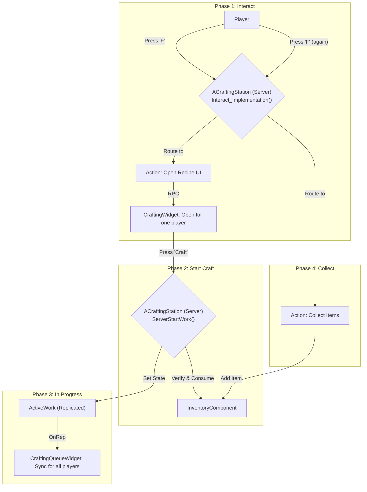

> ### 여러 플레이어가 하나의 제작대를 동시에 사용할 때, 어떻게 데이터 충돌 없이 안전하고 직관적인 제작 시스템을 만들 수 있을까?
> 이 사례 연구는 Sonheim의 제작 시스템이 어떻게 **서버 권위 아키텍처**를 기반으로 동시성 문제를 해결하고, 직관적인 사용자 경험을 제공하는지 그 전체 생명주기를 심층 분석합니다.
>
> *   **서버 권위 상태 라우터:** `Interact_Implementation` 함수가 중앙 라우터 역할을 하여, `F`키라는 단일 입력을 제작대의 현재 상태에 따라 'UI 열기', '제작 돕기', '아이템 수령' 등 각기 다른 행동으로 분기시킵니다.
> *   **`UIOwner`를 이용한 동시성 제어:** 한 번에 한 명의 플레이어만 제작 UI를 열 수 있도록 `UIOwner` 포인터 변수가 '잠금(Lock)' 역할을 수행하여, 여러 플레이어가 동시에 제작을 시작하여 발생하는 데이터 경쟁 상태를 원천적으로 방지합니다.
> *   **안전한 서버 측 검증:** 재료 소모, 아이템 지급 등 모든 핵심적인 데이터 변경은 오직 서버만이 플레이어의 `InventoryComponent`에 직접 접근하여 처리하므로, 클라이언트 조작으로부터 안전하며 데이터 무결성을 100% 보장합니다.
> *   **효율적인 실시간 동기화:** `ReplicatedUsing`으로 지정된 `ActiveWork` 변수를 통해, 제작 진행 상황이 주변의 모든 플레이어에게 불필요한 RPC 호출 없이 효율적으로 전파되어 일관된 시각적 경험을 제공합니다.

# 8.2. 사례 연구: 서버 권위 제작

## 8.2.1. 서론

월드에 단 하나만 존재하는 제작대(Crafting Station)는 여러 플레이어가 동시에 접근하고 상호작용할 수 있는 **공유 객체(Shared Object)**입니다. 이러한 공유 객체를 `F`키라는 단일 상호작용 키로 제어하기 위해서는, 다음과 같은 복잡한 문제들을 해결해야 합니다.

*   **컨텍스트 기반 행동:** 제작대의 현재 상태(대기 중, 제작 중, 완료)에 따라, 동일한 `F`키 입력이 각기 다른 행동(UI 열기, 작업 돕기, 아이템 수령)으로 이어져야 한다.
*   **동시성 제어 (Concurrency):** 여러 플레이어가 동시에 제작 UI를 열려고 시도할 때, 데이터 충돌 없이 단 한 명의 플레이어에게만 제어권을 허용해야 한다.
*   **실시간 상태 동기화 (Real-time State Sync):** 한 명이 제작을 시작하면, 그 진행 상황이 제작대 주변의 모든 플레이어에게 실시간으로 보여야 한다.

이 문서는 Sonheim의 [[6.5 제작 시스템|6.5_Crafting_System]]이 어떻게 **[[2.1 서버 권위 원칙|2.1_Server_Authority_Architecture]]**를 기반으로, 제작의 **전체 생명주기(Lifecycle)**에 걸쳐 이 모든 문제를 해결하고, 안정적이면서도 직관적인 상호작용을 완성했는지 상세히 설명하는 엔드-투-엔드(End-to-End) 사례 연구입니다.

---

## 8.2.2. 아키텍처: 서버의 상태 라우터와 역할 기반 UI

이 시스템의 핵심은, 모든 상호작용의 최종 해석과 실행 권한을 서버 소유의 액터인 `ACraftingStation`이 갖는다는 것입니다. `ACraftingStation`은 자신의 내부 상태 변수(`bHasActiveWork`, `CompletedToCollect` 등)를 기준으로 모든 상호작용을 라우팅하는 **중앙 라우터(Router)** 역할을 합니다. UI는 이 서버의 상태를 \'반영\'하여 사용자에게 적절한 피드백을 제공할 뿐입니다.



---

## 8.2.3. 제작의 전체 생명주기 (The Full Crafting Lifecycle)

#### 1단계: 인지 및 상호작용 시작

*   **흐름:** 플레이어가 제작대에 접근하면, `DetectWidget`은 `ACraftingStation`의 상태를 확인하여 "레시피 선택"이라는 텍스트를 표시합니다. 플레이어가 `F`키를 누르면, `ACraftingStation`의 [[`Interact_Implementation`|6.1_Unified_Interaction_System]] 라우터는 현재 다른 작업이 없으므로 `ServerRequestOpenUI` 함수를 호출합니다.
*   **서버 역할:** 서버는 `UIOwner` 변수에 플레이어를 저장하여 **상태를 잠그고(Locking)**, 해당 플레이어에게만 개인 제어판인 [[`CraftingWidget`|7.6_Designing_a_Collaborative_Crafting_UI]]을 열도록 명령합니다. 이는 다른 플레이어가 동시에 제작을 시작하는 **동시성 문제**를 해결합니다.

#### 2단계: 제작 요청 및 재료 검증 (서버 권위)

*   **흐름:** 플레이어가 `CraftingWidget` UI에서 제작할 아이템과 수량을 선택하고 \'제작\' 버튼을 누릅니다.
*   **서버 역할:** `ServerStartWork` RPC가 호출되면, 서버는 제작의 가장 민감한 부분인 **재료 검증 및 소모**를 직접 수행합니다.
    1.  **재료 확인:** 서버는 요청한 플레이어의 [[`InventoryComponent`|4.2_Inventory_System]]에 직접 접근하여, 요청된 제작법에 필요한 재료가 실제로 충분히 있는지 다시 한번 검증합니다. 클라이언트의 UI에 표시된 정보는 단순한 시각적 피드백일 뿐, 신뢰하지 않습니다.
    2.  **재료 소모:** 검증이 통과되면, 서버는 `InventoryComponent`의 `RemoveItem` 함수를 호출하여 재료를 안전하게 차감합니다.

> [View on GitHub](https://github.com/chungheonLee0325/Sonheim/blob/main/Sonheim/Source/Sonheim/GameObject/Buildings/Crafting/CraftingStation.cpp#L287)
```cpp
// Source/Sonheim/GameObject/Buildings/Crafting/CraftingStation.cpp
void ACraftingStation::ServerStartWork_Implementation(ASonheimPlayer* Requestor, FName RecipeRow, int32 Units)
{
    if (bHasActiveWork || Units <= 0) return; // 이미 작업 중이면 거부
    const FCraftingRecipe* R = FindRecipe(RecipeRow);
    if (!R) return;

    // 1. 플레이어의 인벤토리 컴포넌트를 직접 가져온다.
    UInventoryComponent* Inv = Requestor->GetInventoryComponent();
    if (!Inv) return;

    // 2. 만들 수 있는 최대 수량을 서버에서 다시 계산하고, 재료를 소모시킨다.
    const int32 Max = ComputeMaxCraftable(Inv, *R);
    const int32 ToMake = FMath::Clamp(Units, 0, Max);

    for (int32 i = 0; i < ToMake; ++i)
    {
        // TryConsumeMaterialsForOne은 HasItem과 RemoveItem을 원자적으로 수행
        if (!TryConsumeMaterialsForOne(Inv, *R)) break;
    }

    // 3. 재료 소모가 성공했을 때만, 실제 제작 상태로 전환한다.
    ActiveWork.RecipeRow = RecipeRow;
    // ... (제작 정보 설정) ...
    bHasActiveWork = true;

    // 4. 변경된 상태를 모든 클라이언트에 전파한다.
    ForceNetUpdate();
    OnRep_ActiveWork();
}
```

#### 3단계: 제작 진행 및 상태 동기화

*   **흐름:** `ServerStartWork`가 성공적으로 실행되면, `ACraftingStation`의 `bHasActiveWork` 변수가 `true`로 설정되고, `ActiveWork` 구조체에 제작 정보가 기록됩니다.
*   **서버와 클라이언트의 역할:**
    1.  `ActiveWork` 변수는 `ReplicatedUsing=OnRep_ActiveWork`로 지정되어 있어, 내용이 변경될 때마다 모든 클라이언트에게 자동으로 전파됩니다.
    2.  `OnRep_ActiveWork` 함수는 `OnWorkChanged` 델리게이트를 호출합니다.
    3.  제작대 주변의 모든 플레이어에게 보이는 공개 정보판 [[`CraftingQueueWidget`|7.6_Designing_a_Collaborative_Crafting_UI]]은 이 델리게이트를 구독하고 있다가, 이벤트가 발생하면 `ActiveWork`의 최신 정보를 바탕으로 자신의 프로그레스 바와 아이콘을 갱신합니다.

#### 4단계: 제작 완료 및 아이템 수령

*   **흐름:** 다른 플레이어의 도움(`ServerAddWork`) 등으로 `ActiveWork`의 `WorkAccumulated`가 `WorkRequired`에 도달하면, 서버는 `CompletedToCollect` 변수의 값을 증가시킵니다. 이 변수 역시 리플리케이트되어, `DetectWidget`의 텍스트가 "획득"으로 변경됩니다. 플레이어가 다시 `F`키를 누릅니다.
*   **서버 역할:** `Interact_Implementation` 라우터는 이제 `CompletedToCollect > 0` 조건을 만족하므로, `ServerCollectAll` 함수를 호출합니다. 이 함수는 아이템 지급이라는 최종 단계를 **서버 권위** 하에 안전하게 처리합니다.

> [View on GitHub](https://github.com/chungheonLee0325/Sonheim/blob/main/Sonheim/Source/Sonheim/GameObject/Buildings/Crafting/CraftingStation.cpp#L342)
```cpp
// Source/Sonheim/GameObject/Buildings/Crafting/CraftingStation.cpp
void ACraftingStation::ServerCollectAll_Implementation(ASonheimPlayer* Player)
{
    if (!HasAuthority() || !Player) return;
    if (CompletedToCollect <= 0) return;

    // 1. 플레이어의 인벤토리 컴포넌트를 직접 가져온다.
    if (UInventoryComponent* Inv = Player->GetInventoryComponent())
    {
        // 2. 서버에서 계산된 완료 수량만큼 아이템을 안전하게 추가한다.
        if (CompletedToCollect > 0) 
            Inv->AddItem(ActiveWork.ResultItemID, CompletedToCollect);
    }

    // 3. 지급이 완료된 후, 제작대의 상태를 초기화한다.
    CompletedToCollect = 0;
    // ... (남은 작업이 없으면 ActiveWork 초기화) ...

    // 4. 변경된 상태를 모든 클라이언트에 전파한다.
    ForceNetUpdate();
    OnCompletedChanged.Broadcast();
}
```

---

## 8.2.4. 설계의 이점

*   **완벽한 데이터 무결성:** 재료 소모와 아이템 지급이라는 가장 민감한 과정이 오직 서버의 검증 하에, 서버의 `InventoryComponent`를 직접 조작하는 방식으로만 이루어지므로 데이터의 정합성이 100% 보장됩니다.
*   **컨텍스트 기반의 직관적인 UX:** 플레이어는 단 하나의 키(`F`)만으로 제작대의 복잡한 상태(대기, 진행, 완료)에 맞는 상호작용을 자연스럽게 수행할 수 있습니다.
*   **안전한 동시성 관리:** `UIOwner` 변수를 이용한 간단한 상태 잠금만으로, 여러 플레이어가 동시에 제작 UI를 열어 발생하는 데이터 충돌 문제를 원천적으로 방지했습니다.
*   **효율적인 실시간 동기화:** `ReplicatedUsing`과 델리게이트를 통해 서버의 상태 변경이 UI에 자동으로 전파되므로, 불필요한 네트워크 통신 없이도 모든 플레이어가 일관된 정보를 실시간으로 공유할 수 있습니다.

---

## 8.2.5. 관련 시스템

*   [[2.1 서버 권위 원칙|2.1_Server_Authority_Architecture]]
*   [[2.2 데이터 주도 설계|2.2_Data_Driven_Design]]
*   [[4.2 인벤토리 시스템|4.2_Inventory_System]]
*   [[6.1 통합 상호작용 원칙|6.1_Unified_Interaction_System]]
*   [[6.5 제작 시스템|6.5_Crafting_System]]
*   [[7.6 제작 UI 심층 분석|7.6_Designing_a_Collaborative_Crafting_UI]]
