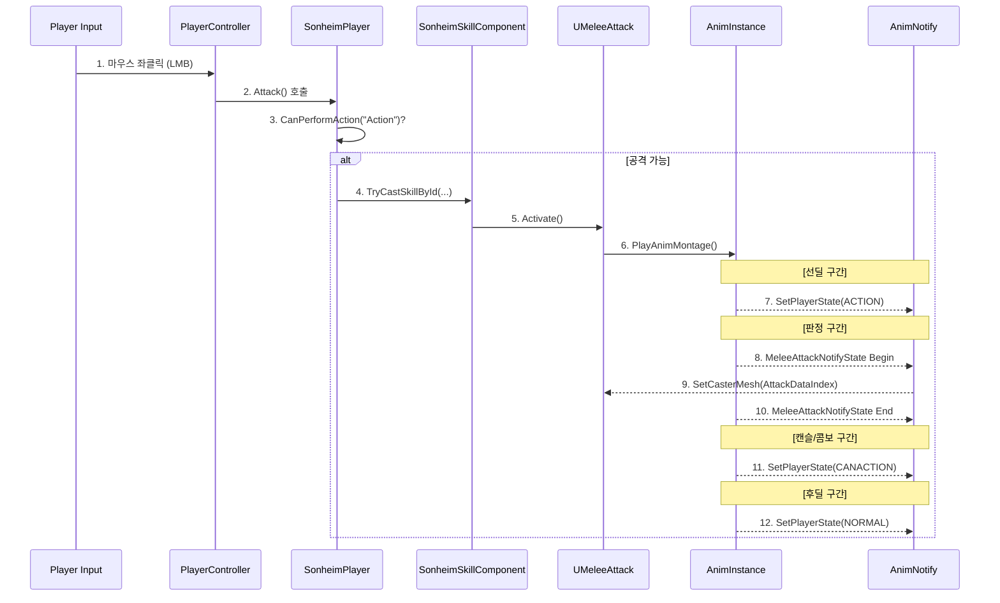

# 8.3. 사례 연구: 데이터 기반 근접 공격

> ### 마우스 클릭부터 실제 데미지 적용까지, `UMeleeAttack`이라는 단일 스킬 클래스가 어떻게 여러 시스템(`Input`, `Player`, `Skill`, `Animation`)과 유기적으로 협력하여 모든 종류의 근접 공격을 구현하는지, 그 전체 데이터와 이벤트 흐름을 추적합니다.
> 
> *   **데이터 기반 공격 판정:** `UMeleeAttack` 스킬은 데이터 테이블에 정의된 `FAttackData` 배열(판정 범위, 모양, 데미지 타입 등)을 읽어오고, 애니메이터는 `MeleeAttackNotifyState`의 `AttackDataIndex`를 통해 각 콤보 타격마다 어떤 판정을 사용할지 직접 지정합니다.
> *   **애니메이션 주도 상태 전환:** `SetPlayerStateNotify`를 활용하여, 공격 애니메이션의 각 구간(선딜, 캔슬 가능, 후딜)마다 플레이어의 상태(`EPlayerState`)를 변경합니다. 이를 통해 프로그래머의 개입 없이 애니메이터가 직접 후딜레이 캔슬, 콤보 연계 타이밍 등 ARPG의 핵심적인 손맛을 디자인할 수 있습니다.

---

> [!VIDEO]
> **[근접 공격 시스템 시연 영상]**
> (영상이나 GIF를 여기에 삽입하세요. 1타 공격 후딜레이를 2타 콤보로 캔슬하는 모습, 또는 공격 직후 회피로 캔슬하는 모습을 보여주는 것이 좋습니다.)

---

## 8.3.1. 구현 기능 목록 (Feature List)

*   **데이터 기반의 다양한 공격:** 단일 `UMeleeAttack` 스킬 클래스를 재사용하여, 데이터 테이블과 애니메이션의 조합만으로 맨손 공격, 다단히트, 무기별 공격 등 수많은 종류의 근접 공격을 생성할 수 있습니다.
*   **애니메이터 주도의 정밀한 판정:** 애니메이터는 몽타주 에디터에서 `MeleeAttackNotifyState`의 시작/끝 지점과 `AttackDataIndex`를 조절하는 것만으로, 각 공격의 판정 타이밍, 지속시간, 범위를 프레임 단위로 완벽하게 제어합니다.
*   **반응성 높은 컨트롤 (후딜 캔슬):** 공격 애니메이션의 특정 프레임 이후, 플레이어는 움직임이나 다른 스킬(회피, 다음 콤보)로 후딜레이 모션을 캔슬하고 즉시 다음 행동으로 연계할 수 있습니다. 이 "캔슬 가능" 타이밍 역시 애니메이터가 `SetPlayerStateNotify`로 직접 조절합니다.

---

## 8.3.2. 전체 시스템 협력도



---

## 8.3.3. 기술 상세: 근접 공격의 전체 라이프사이클

### 8.3.3.1. 1단계: 입력 및 상태 검증

1.  **입력:** 플레이어가 마우스 좌클릭을 하면 `Enhanced Input`을 통해 `ASonheimPlayer`의 `LeftMouse_Triggered` 함수가 호출됩니다.
2.  **상태 검증:** 함수는 가장 먼저 [[`CanPerformAction(CurrentPlayerState, "Action")`|4.1_Player_Character_Control]]을 호출하여, 현재 플레이어의 상태가 공격이 가능한 상태(`NORMAL` 또는 `CANACTION`)인지 서버 권위로 검증합니다. 만약 이미 다른 행동 중(`ACTION`)이라면, 스킬 시전은 무시됩니다.

### 8.3.3.2. 2단계: 공격 시작 및 상태 전이

1.  **스킬 활성화:** 검증을 통과하면, `SkillComponent`를 통해 `UMeleeAttack` 스킬의 `Activate()` 함수가 호출됩니다.
2.  **상태 전이:** `Activate()`는 데이터 테이블에 정의된 공격 애니메이션 몽타주를 재생합니다. 이 몽타주의 특정 프레임에는 `PlayerState`를 `EPlayerState::ACTION`으로 변경하는 `SetPlayerStateNotify`를 **배치할 수 있습니다.** 이를 통해, 일반 공격처럼 자유롭게 움직이며 공격하는 스킬과, 강력한 한 방을 위해 발을 땅에 고정해야 하는 특수한 스킬을 애니메이터가 **선택적으로 디자인**할 수 있습니다.

### 8.3.3.3. 3단계: 데이터 기반 공격 판정 실행

1.  **판정 준비:** 몽타주가 재생되다가 `MeleeAttackNotifyState`의 시작 프레임에 도달하면, `NotifyBegin`이 `UMeleeAttack`의 `SetCasterMesh()`를 호출합니다. 이 함수는 판정에 필요한 모든 사전 준비 작업을 수행합니다.
    *   **판정 기준 메시 설정:** `FAttackData`에 명시된 `MeshComponentTag`를 이용해 판정의 기준이 될 메시(캐릭터의 손, 혹은 장착된 무기)를 결정합니다.
    *   **안정성 확보:** 리슨 서버 환경에서 원거리 캐릭터의 애니메이션이 최적화되어 소켓 위치가 부정확해지는 문제를 막기 위해, 해당 메시의 LOD를 강제로 최고 단계(LOD 0)로 고정합니다.
    *   **중복 히트 방지용 배열 초기화:** 이번 공격 모션에서 이미 피격된 대상을 기록할 `HitActors` 배열을 깨끗하게 비웁니다.

2.  **판정 실행 (`ProcessHitDetection`):** `Notify` 구간 동안, `UMeleeAttack`의 `Tick()` 함수는 매 프레임 `ProcessHitDetection()`을 호출하여 실제 충돌 검사를 수행합니다. 이 함수의 핵심 로직은 다음과 같습니다.
    *   **데이터 기반 판정 생성:** `FAttackData`에 정의된 `DetectionType`에 따라 `SphereTrace`, `CapsuleTrace`, `BoxTrace` 중 적절한 함수를 호출하여, 데이터에 명시된 소켓 위치와 범위 값으로 충돌 판정을 생성합니다.
    *   **중복 히트 방지:** 충돌한 모든 액터에 대해, 먼저 `HitActors` 배열에 이미 포함되어 있는지 검사합니다. 만약 포함되어 있다면, 이번 공격 모션에서 이미 피해를 입은 대상이므로 데미지 처리를 건너뜁니다.
    *   **피해 적용:** 처음 충돌한 대상이라면, `HitActors` 배열에 추가하여 중복 피해를 막고, [[`UGameplayStatics::ApplyDamage`|3.5_Combat_and_Feedback_System]]를 호출하여 실제 피해를 적용합니다.

> [View on GitHub](https://github.com/chungheonLee0325/Sonheim/blob/main/Sonheim/Source/Sonheim/AreaObject/Skill/Common/MeleeAttack.cpp#L105)
```cpp
// MeleeAttack.cpp - ProcessHitDetection()의 핵심 로직
void UMeleeAttack::ProcessHitDetection()
{
    // ...
    // 데이터에 따라 Sphere, Capsule, Box 중 적절한 Trace 함수 호출
    UKismetSystemLibrary::SphereTraceMultiForObjects(...);

    for (const FHitResult& Hit : HitResults)
    {
        AAreaObject* HitActor = Cast<AAreaObject>(Hit.GetActor());
        if (!HitActor || !m_Caster->CanAttack(HitActor)) continue;

        // 중복 히트 방지: 이번 공격에서 이미 맞은 대상은 무시
        if (HitActors.Contains(HitActor))
        {
            continue;
        }
        
        // 처음 맞은 대상이라면, 배열에 추가하고 데미지 적용
        HitActors.Add(HitActor);
        UGameplayStatics::ApplyDamage(HitActor, ...);
    }

    // ... LOD 고정 등 안정성 확보 로직 ...
}
```

#### 예시 1: 맨손 공격 (Skill ID: 10)

이 스킬은 `AttackData` 배열에 2개의 항목을 가집니다. (0번: 오른손, 1번: 왼손)

*   **설명:** `MeshComponentTag`가 `None`으로 설정되어 있어, 캐릭터 자신의 메시를 기준으로 판정이 생성됩니다. 0번 `AttackData`는 `Fire` 속성과 `hand_r` 소켓을, 1번 `AttackData`는 `Dark` 속성과 `hand_l` 소켓을 갖도록 설정되어 있습니다. **하나의 스킬 클래스로, 데이터와 애니메이션 노티파이의 조합만으로 좌/우 공격의 속성을 다르게 구현**한 것입니다.
*   **실제 데이터 (`Skill.json`):**
```json
{
    "SkillID": 10,
    "SkillClass": "/Script/Sonheim.MeleeAttack",
    "AttackData": [
        {
            "AttackElementalAttribute": "Fire",
            "HitBoxData": { "DetectionType": "Sphere", "StartSocketName": "hand_r", "Radius": 30 }
        },
        {
            "AttackElementalAttribute": "Dark",
            "HitBoxData": { "DetectionType": "Sphere", "StartSocketName": "hand_l", "Radius": 30 }
        }
    ]
}
```

#### 예시 2: 곡괭이 공격 (Skill ID: 111)

*   **설명:** `MeshComponentTag`가 "WeaponMesh"로, `DetectionType`이 **`Capsule`**로 설정됩니다. `SetCasterMesh()` 함수는 캐릭터의 컴포넌트 중 "WeaponMesh" 태그를 가진 `SkeletalMeshComponent`(곡괭이)를 찾아, 그 메시의 소켓을 기준으로 **캡슐 형태**의 충돌 판정을 생성합니다. 이는 **캐릭터와 무기의 결합도를 완전히 끊어내는 핵심적인 설계**입니다.
*   **실제 데이터 (`Skill.json`):**
```json
{
    "SkillID": 111,
    "SkillClass": "/Script/Sonheim.MeleeAttack",
    "AttackData": [
        {
            "AttackType": "MineEffective",
            "HitBoxData": {
                "DetectionType": "Capsule",
                "MeshComponentTag": "WeaponMesh",
                "StartSocketName": "ColStart",
                "EndSocketName": "ColEnd",
                "Radius": 30
            }
        }
    ]
}
```

### 8.3.3.4. 4단계: 캔슬 및 콤보 구간 진입 (`CANACTION`)

1.  **상태 전이:** 공격 판정이 끝난 직후의 프레임에, `PlayerState`를 `EPlayerState::CANACTION`으로 변경하는 `SetPlayerStateNotify`가 배치되어 있습니다.
2.  **캔슬/콤보:** `CANACTION` 상태는 `bCanMove`는 `false`지만 `bCanAction`은 `true`입니다. 따라서 플레이어는 아직 움직일 수는 없지만, 마우스 좌클릭을 다시 입력하여 다음 콤보 스킬을 발동하거나, 회피 키를 입력하여 후딜레이를 캔슬하고 즉시 빠져나올 수 있습니다.

### 8.3.3.5. 5단계: 후딜레이 캔슬 및 상태 복귀 (`NORMAL`)

1.  **상태 복귀:** 애니메이션의 거의 끝 부분, 플레이어가 다음 행동을 시작해도 시각적으로 어색하지 않은 프레임에 `PlayerState`를 `EPlayerState::NORMAL`로 되돌리는 `SetPlayerStateNotify`가 배치됩니다.
2.  **후딜 캔슬:** 플레이어는 이 시점부터 몽타주가 완전히 끝나기를 기다릴 필요 없이, 즉시 이동하여 후딜레이를 캔슬하고 자연스럽게 다음 행동으로 이어갈 수 있습니다.

### 8.3.3.6. UMeleeAttack 클래스 설계: 재사용 가능한 데이터 기반 로직 실행기

`UMeleeAttack`은 [[3.3 스킬 시스템|3.3_Skill_Architecture]]의 설계 철학에 따라, 월드에 스폰될 필요가 없는 가벼운 `UObject` 기반의 로직 실행기로 설계되었습니다. 이 설계는 `UMeleeAttack`이 다음과 같은 두 가지 핵심적인 역할을 효율적으로 수행하게 합니다.

1.  **데이터 해석기 (Data Interpreter):** 스킬이 활성화될 때, `UMeleeAttack` 객체는 데이터 테이블에서 자신의 `SkillID`에 맞는 `FAttackData` 배열을 읽어와 소유합니다. 이 데이터는 판정의 모양, 범위, 소켓 위치, 데미지 속성 등 판정에 대한 모든 것을 정의합니다.
2.  **애니메이션 이벤트 수신자 (Animation Event Receiver):** `MeleeAttackNotifyState`로부터 `AttackDataIndex`를 전달받으면, 자신이 소유한 `FAttackData` 배열에서 해당 인덱스의 데이터를 사용하여 `ProcessHitDetection`을 실행합니다.

즉, `UMeleeAttack` 클래스는 "어떻게 충돌을 검사하고 피해를 줄 것인가"라는 **재사용 가능한 로직(How)**만을 담고 있으며, "무엇을, 어디서, 언제 공격할 것인가(What, Where, When)"는 전적으로 **데이터**와 **애니메이션**이 결정합니다. 이는 스킬의 핵심 로직과 콘텐츠를 완벽하게 분리하여, 시스템의 확장성과 유지보수성을 극대화합니다.

---

## 8.3.4. 결론

이 사례는 Sonheim의 핵심 설계 철학인 **\'데이터-로직 분리\'**와 **\'느슨한 결합\'**이 어떻게 시너지를 내어, ARPG의 핵심적인 전투 경험을 완성하는지 보여줍니다. `UMeleeAttack`이라는 단일 클래스는 충돌 검사의 \'방법\'만 제공할 뿐, \'무엇을, 어디에, 언제, 어떤 모양으로\' 검사할지는 **데이터 테이블**과 **애니메이션**이 결정합니다. 더 나아가, \'언제 움직이고, 언제 캔슬할 수 있는지\'에 대한 컨트롤의 \'손맛\'까지도 **애니메이터가 `AnimNotify`를 통해 직접 디자인**할 수 있는, 매우 유연하고 강력한 아키텍처를 구축했습니다. 이 모든 과정은 서버 권위 하에 안전하게 처리되며, 각 시스템은 자신의 역할에만 집중하여 유지보수성과 확장성을 극대화합니다.

---

## 8.3.5. 관련 시스템

*   [[2.2 데이터 주도 설계|2.2_Data_Driven_Design]]
*   [[3.1 AAreaObject 프레임워크|3.1_AreaObject_Framework]]
*   [[3.3 스킬 시스템|3.3_Skill_Architecture]]
*   [[3.4 애니메이션 시스템|3.4_Animation_System]]
*   [[3.5 전투 및 피드백 시스템|3.5_Combat_and_Feedback_System]]
*   [[4.1 플레이어 캐릭터 컨트롤|4.1_Player_Character_Control]]
