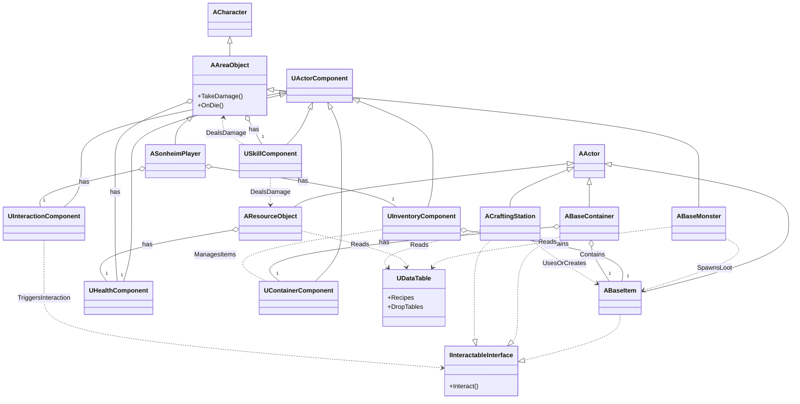

# Sonheim 프로젝트 기술 문서

> 이 문서는 Sonheim 프로젝트의 핵심 시스템 설계와 구현 내용을 종합한 기술 문서입니다.

---

### **주요 기술 시연 (For Busy Interviewer)**
> 바쁘신 분들을 위해, 이 프로젝트의 핵심적인 기술 구현 사례 4가지를 먼저 소개합니다.
*   [[사례 연구: 팰 포획 시퀀스|8.1_Case_Study_Pal_Capture_Sequence]]: 여러 시스템이 협력하여 복잡한 기능을 완성하는 과정
*   [[사례 연구: 서버 권위 제작|8.2_Case_Study_Server_Authority_Crafting]]: 멀티플레이 동시성 문제를 해결하는 방법
*   [[사례 연구: 데이터 기반 근접 공격|8.3_Case_Study_Melee_Attack]]: 데이터와 애니메이션으로 스킬을 확장하는 방법
*   [[사례 연구: 반응형 인벤토리 UX|8.4_Case_Study_Inventory_Interaction]]: 클라이언트 예측으로 온라인 게임의 랙(Lag)을 감추는 방법

### **구현된 기능 한눈에 보기 (Full Feature List)**
> 이 프로젝트에 구현된 모든 기능의 상세 목록과 관련 기술 문서는 [[1.2 주요 기능 요약|1.2_Key_Features]] 문서에서 한눈에 확인하실 수 있습니다.

### **개발 과정 요약 (Development Overview)**
> 6개월간의 개발 과정을 월별로 요약했습니다. 각 항목에 대한 자세한 내용은 전체 개발 일지에서 확인하실 수 있습니다.\
> ➡️ **[[전체 개발 일지 보러가기|10.1_Development_History]]**
*   **(25.09) 프로젝트 안정화 및 문서화** : Wiki 시스템을 개편하고 인벤토리 시스템 안정화 및 주요 버그를 수정했습니다.
*   **(25.08) 게임플레이 시스템 확장** : 상자(Chest) 컨테이너와 제작(Crafting) 시스템을 완성하고 전투 시스템을 고도화했습니다.
*   **(25.07) 전투 경험 다양화** : 신규 무기 'Shotgun'을 추가하고 아이템 희귀도 시스템을 도입했으며, 피드백을 강화했습니다.
*   **(25.06) 아키텍처 리팩토링 및 성능 최적화** : 'Pal' 시스템을 컴포넌트로 분리하고 Object Pooling을 적용해 성능을 최적화했습니다.
*   **(25.04) 월드 탐험 및 콘텐츠 확장** : 'Glider' 이동 시스템을 도입하고 보스 몬스터 등 월드 콘텐츠를 추가했습니다.
*   **(25.03) 핵심 시스템 기반 구축** : Player, Inventory, Skill System 등 핵심 시스템의 기반과 네트워크 아키텍처를 확립했습니다.

---

## 📚 목차 (Table of Contents)

### 1. 프로젝트 개요
> 프로젝트의 비전, 핵심 게임플레이 루프, 그리고 전체 아키텍처를 관통하는 설계 원칙을 소개합니다.
*   [[1.1 프로젝트 비전 및 목표|1.1_Project_Overview]]: 이 프로젝트가 추구하는 핵심 목표와 게임의 전체적인 구조를 설명합니다.
*   [[1.2 주요 기능 요약|1.2_Key_Features]]: 현재 구현된 모든 게임플레이 기능 목록을 상세히 나열하고 관련 시스템을 안내합니다.

### 2. 핵심 설계 원칙
> Sonheim의 아키텍처를 지탱하는 가장 근본적인 기술 철학을 다룹니다.
*   [[2.1 서버 권위 원칙|2.1_Server_Authority_Architecture]]: 멀티플레이어 게임의 보안과 데이터 일관성을 보장하는 서버 중심 아키텍처를 설명합니다.
*   [[2.2 데이터 주도 설계|2.2_Data_Driven_Design]]: 코드 수정 없이 콘텐츠를 확장할 수 있게 하는 데이터 기반 설계 방식을 설명합니다.
*   [[2.3 컴포넌트 기반 설계|2.3_Component_Based_Design]]: 기능의 재사용성과 확장성을 극대화하는 컴포넌트 기반 아키텍처를 설명합니다.
*   [[2.4 플레이어 클래스 아키텍처|2.4_Player_Class_Architecture]]: 데이터 영속성을 위해 언리얼 엔진의 표준 플레이어 클래스(Pawn, Controller, PlayerState)를 어떻게 활용했는지 설명합니다.

### 3. 공용 프레임워크 (AAreaObject)
> 플레이어와 몬스터를 포함한 모든 살아있는 개체(AAreaObject)가 공유하는 공통 기능의 기반을 설명합니다.
*   [[3.1 AAreaObject: 모든 개체의 기반|3.1_AreaObject_Framework]]: 모든 캐릭터가 공유하는 기능들을 어떻게 프레임워크로 제공하는지 설명합니다.
*   [[3.2 어트리뷰트 시스템|3.2_Attribute_System]]: HP, 스태미나, 레벨 등 모든 캐릭터의 기본 능력치를 관리하는 컴포넌트들을 설명합니다.
*   [[3.3 스킬 시스템|3.3_Skill_Architecture]]: 데이터, 상태, 로직을 분리하여 확장성 높은 스킬 시스템을 구축한 방법을 설명합니다.
*   [[3.4 애니메이션 시스템|3.4_Animation_System]]: 애니메이터가 직접 게임플레이 타이밍을 제어하는 애니메이션 주도 설계 방식을 설명합니다.
*   [[3.5 전투 및 피드백 시스템|3.5_Combat_and_Feedback_System]]: 타격감과 전략성을 모두 잡은 전투 시스템의 피해 처리 파이프라인을 설명합니다.

### 4. 플레이어 (ASonheimPlayer)
> 게임의 주인공인 플레이어 캐릭터의 고유한 기능들을 심층적으로 다룹니다.
*   [[4.1 플레이어 캐릭터 컨트롤|4.1_Player_Character_Control]]: 안정적인 네트워크 이동과 반응성 높은 컨트롤을 모두 만족시킨 방법을 설명합니다.
*   [[4.2 인벤토리 시스템|4.2_Inventory_System]]: 네트워크에 최적화된 반응형 인벤토리의 백엔드 시스템을 설명합니다.
*   [[4.3 스탯 시스템|4.3_Stat_System]]: 장비와 버프에 따라 실시간으로 능력치가 변하는 동적 스탯 계산 파이프라인을 설명합니다.
*   [[4.4 팰 관리 시스템|4.4_Pal_Management_System]]: 팰의 포획, 보관, 활용으로 이어지는 전체 생명주기를 관리하는 컴포넌트들의 협력 구조를 설명합니다.

### 5. AI (ABaseMonster)
> 살아있는 생명체처럼 행동하는 몬스터의 인공지능을 다룹니다.
*   [[5.1 FSM 기반 AI 프레임워크|5.1_FSM_based_AI]]: 상태 패턴을 활용하여 확장 가능한 FSM(유한 상태 머신) AI 프레임워크를 직접 구현한 과정을 설명합니다.
*   [[5.2 파트너 AI|5.2_Partner_AI]]: FSM 프레임워크를 확장하여, 플레이어를 따라다니며 전투를 돕는 동료 AI를 구현한 방법을 설명합니다.

### 6. 월드와 상호작용
> 플레이어가 월드에 존재하는 다양한 오브젝트들과 상호작용하는 방식을 설명합니다.
*   [[6.1 통합 상호작용 원칙|6.1_Unified_Interaction_System]]: 성격이 다른 두 종류의 상호작용(의도/물리)을 각기 다른 시스템으로 분리하여 처리하는 방법을 설명합니다.
*   [[6.2 아이템 시스템|6.2_Item_System]]: 월드에 드롭되는 아이템의 데이터와 동작 방식을 분리하여 유연성을 확보한 설계를 설명합니다.
*   [[6.3 자원 시스템|6.3_Resource_System]]: 전투 시스템을 재활용하여 타격감 있는 자원 채집 시스템을 구현한 방법을 설명합니다.
*   [[6.4 보관함 시스템|6.4_Container_System]]: 대규모 월드에서도 효율적으로 동작하는 공유 보관함의 네트워크 최적화 기법을 설명합니다.
*   [[6.5 제작 시스템|6.5_Crafting_System]]: 멀티플레이 환경에서 동시성 문제를 해결한 서버 권위 제작 시스템의 백엔드를 설명합니다.

### 7. UI 시스템
> UI 시스템의 근간을 이루는 **설계 원칙**부터, 공통 문제를 해결하는 **솔루션**, 그리고 이 모든 것을 종합하여 완성한 **핵심 시스템 심층 분석**까지, 체계적인 접근 방식을 통해 UI 시스템을 구축한 과정을 설명합니다.
*   **UI Architecture Principles**
    *   [[7.1 이벤트 기반 아키텍처|7.1_Event-Driven_UI_Architecture]]: 데이터와 UI의 의존성을 분리하는 이벤트 기반 UI 업데이트 방식을 설명합니다.
    *   [[7.2 중앙화된 디자인 시스템|7.2_Centralized_UI_Design_System]]: 프로젝트 전체의 UI 스타일 일관성을 유지하는 중앙화된 디자인 시스템을 설명합니다.
*   **Solving Common UI Problems**
    *   [[7.3 UI 최적화: 오브젝트 풀링|7.3_Optimizing_UI_with_Object_Pooling]]: UI 요소의 사용 패턴에 따라 각기 다른 최적화 전략을 적용한 사례를 설명합니다.
    *   [[7.4 확장 가능한 컨텍스트 UI|7.4_Scalable_Contextual_UI]]: 인터페이스를 활용하여 새로운 상호작용 UI를 코드 수정 없이 확장하는 방법을 설명합니다.
*   **UI System Deep Dives**
    *   [[7.5 인벤토리 UI 심층 분석|7.5_Building_a_Reusable_Inventory_UI]]: 전략 패턴을 활용하여 재사용 가능한 인벤토리 UI를 구축한 과정을 심층 분석합니다.
    *   [[7.6 제작 UI 심층 분석|7.6_Designing_a_Collaborative_Crafting_UI]]: 여러 플레이어의 협력 플레이를 고려한 제작 UI의 내부 설계를 심층 분석합니다.

### 8. 사례 연구
> 각 시스템들이 어떻게 유기적으로 협력하여 하나의 완전한 기능을 완성하는지 실제 사례를 통해 보여줍니다.
*   [[8.1 팰 포획 시퀀스|8.1_Case_Study_Pal_Capture_Sequence]]: 여러 시스템이 협력하여 복잡한 팰 포획 기능을 완성하는 전체 데이터 흐름을 추적합니다.
*   [[8.2 서버 권위 제작|8.2_Case_Study_Server_Authority_Crafting]]: 멀티플레이 환경에서 제작 시스템의 동시성 문제를 해결하는 과정을 심층 분석합니다.
*   [[8.3 데이터 기반 근접 공격|8.3_Case_Study_Melee_Attack]]: 데이터와 애니메이션의 조합만으로 다양한 근접 공격을 대량 생산하는 아키텍처를 분석합니다.
*   [[8.4 반응형 인벤토리 UX|8.4_Case_Study_Inventory_Interaction]]: 클라이언트 예측을 통해 온라인 게임의 랙(Lag)을 감추는 방법을 실제 코드로 분석합니다.

### 9. 회고 및 향후 계획
> 프로젝트를 통해 얻은 기술적 교훈과 미래 발전 가능성을 다룹니다.
*   [[9.1 프로젝트 회고|9.1_Project_Retrospective]]: 프로젝트 전체를 진행하며 얻은 기술적 교훈과 성장 과정을 기록합니다.
*   [[9.2 향후 작업 계획|9.2_Future_Work]]: 현재 시스템의 한계점을 분석하고, 앞으로 개선해나갈 기술 부채 목록을 정리합니다.

### 10. 부록
> 프로젝트의 진행 과정 및 기타 자료를 포함합니다.
*   [[10.1 전체 개발 일지|10.1_Development_History]]: 7개월간의 프로젝트 개발 과정을 월별로 상세히 기록한 문서입니다.

---
## 시스템 개요 (아키텍처)

<b> 전체 시스템 아키텍처 다이어그램 펼쳐보기 </b>

 

 

