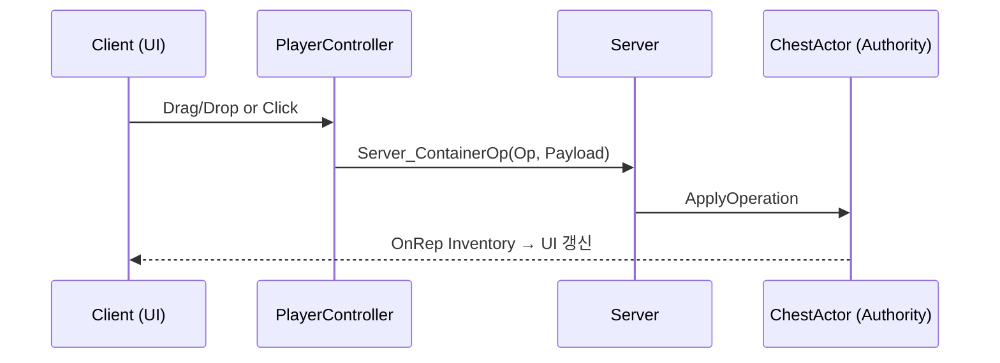
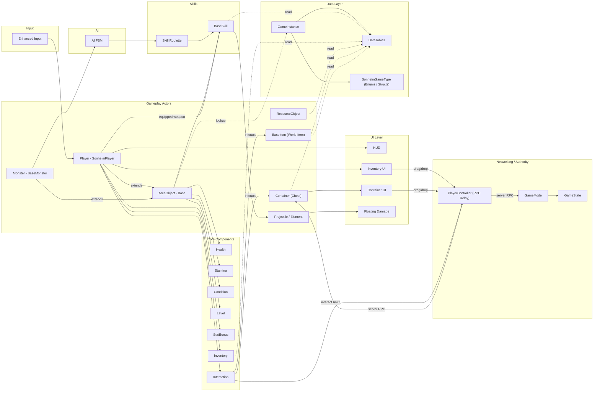

# Sonheim.Source — source-only mirror

> 이 리포는 **소스 코드 전용 미러**입니다.
> 전체 프로젝트(에셋 포함)와 **풀 README**는 원본 리포에서 확인하세요:
> 👉 [Sonheim (Main Repo)](https://github.com/chungheonLee0325/Sonheim)

포함: `Source/`, `Config/`, `Plugins/*/Source`, `Sonheim.uproject`, `Doc/`
제외: `Content/`, `Binaries/`, `Intermediate/`

---

<details><summary><b>Full README (from main repo)</b></summary>

# Sonheim — 멀티플레이어 3D 액션 어드벤처


**Unreal Engine 5.5 / C++** 기반. 팰월드(Palworld)에서 영감을 받은 **수집·전투·협동** 루프를
처음부터 **완전한 멀티플레이어**로 설계했습니다. *데이터 테이블*로 몬스터/플레이어/상자/아이템/자원 등
모든 오브젝트를 운용하여 **컴파일 없이 컨텐츠 추가/밸런스 패치**가 가능합니다.

---

## 핵심 특징

- **멀티플레이어 아키텍처**: 서버 권위 + 예측/보정 + Steam 세션
- **데이터 주도 아키텍처**: 몬스터·플레이어·상자·아이템·자원·스킬을 DataTable로 설정 → **빌드 없이** 밸런스/콘텐츠 업데이트
- **완성된 게임플레이 루프**: 포획 → 파트너 동행/스킬 → 전투 → 자원 채집/제작 → 장비/인벤토리
- **풍부한 플레이어 액션**: 글라이더, 질주/회피, 무기 전환 시 스탯·스킬 즉시 동기화
- **UI/UX 완비**: 인벤·장비·툴팁, 몬스터 HP/속성, 플로팅 데미지(풀링), 로비/방


## **프로젝트 하이라이트**
### 📌 결과물 요약
프로젝트의 주요 결과물과 핵심 기능을 한눈에 볼 수 있는 영상입니다. \
아래 gif를 클릭하면 유튜브 영상을 시청할 수 있습니다.

[](https://www.youtube.com/watch?v=TDRRWp6M_9E)

- 📄 자세한 기술 문서: [Portfolio](https://possible-recess-c3b.notion.site/3D-1ff6058f0c2e8032b39fccd10bf7ca00?source=copy_link)


---

## 핵심 시스템 요약

- **플레이어 시스템 (`SonheimPlayer`)**
    - Enhanced Input 기반 3인칭 조작(이동/시점/점프/질주/회피)
    - 무기 & 팰 스피어 중심의 공격/조준, 기본공격 스킬 슬롯화
    - 글라이더(활강) 이동: 중력/공중제어/수평속도 동적 제어
    - 상태 머신(`EPlayerState`) 기반 행동 전환(Idle/Combat/Glide/Down 등)
    - 팰 소유·선택·소환/회수, 파트너 스킬 트리거
    - 사냥을 통한 경험치 획득과 레벨 관리 기능

- **Pal(몬스터) 시스템 (`BaseMonster`)**
    - Pal 데이터(DataTable `FAreaObjectData`)로 종류/속성/레벨/표정(`EFaceType`) 관리
    - FSM AI(`BaseAiFSM`): 전투/파트너/작업(벌목 등) 상태와 전이
    - 스킬 룰렛(`BaseSkillRoulette`)로 상황별 스킬 확률 선택
    - 포획: `APalSphere` 충돌 판정, HP 비율 연동 확률(≤30% 100%)

- **전투 & 스킬 (`BaseSkill`, `FSkillData`, `FAttackData`)**
    - 데이터 테이블 기반 스킬 파이프라인(애님 몽타주/노티파이 연동, 이펙트/사운드)
    - 근접(`MeleeAttack`) 및 원거리(발사체 `BaseElement`) 스킬
    - 히트 감지(캡슐/구/박스 등 충돌체, 틱 보간 기능), 히트스톱/넉백/경직
    - 9속성(`EElementalAttribute`) 상성 + **STAB 1.2×**(자속 보너스), 다중 방어속성 누적 곱
    - 예시(상성 테이블 발췌):
    ```cpp
    // SonheimUtility.cpp — [방어][공격] 9×9 테이블
    static const float DamageMultiplierTable[9][9] = {
        /*Grass*/{1.0f,2.0f,1.0f,1.0f,0.5f,1.0f,1.0f,1.0f,1.0f},
        /*Fire*/ {0.5f,1.0f,2.0f,1.0f,1.0f,0.5f,1.0f,1.0f,1.0f},
        /*Water*/{1.0f,0.5f,1.0f,2.0f,1.0f,1.0f,1.0f,1.0f,1.0f},
        // ...
        /*Neut*/ {1.0f,1.0f,1.0f,1.0f,1.0f,1.0f,1.0f,2.0f,1.0f}
    };
    ```

- **아이템·인벤토리·상호작용·컨테이너**
    - **BaseItem(월드 아이템 액터)**: `IInteractableInterface` 구현, **즉시/홀드 상호작용**, 드롭/픽업, 수명·자동픽업 지연·물리투영 등 정책 지원
    - 아이템/장비: `FItemData(FEquipmentData)` 기반, 슬롯 인벤토리 & 장비창(`InventoryWidget`)
    - **상호작용 인터페이스**(즉시/홀드, 거리·시야 검증): 줍기/사용/버리기/열기 공통 처리
    - 드래그앤드롭: `NativeOnDragDetected` / `NativeOnDrop` (인벤↔장비, 인벤↔상자 교차 이동)
    - 장비 스탯 적용: `StatBonusComponent`로 동적 합산, **무기 스왑 시 스킬/스탯 즉시 갱신**
    - **상자(컨테이너)**: 서버 권한 잠금(`bIsOpen/CurrentUser`), PlayerController RPC 중계, OnRep 동기화

- **자원 채집 (`ResourceObject`)**
    - HP **구간(예: 10%)** 하락마다 **다단 드롭**(`DamageThresholdPct`)
    - 무기 타입 약점 배율(`WeaknessAttackMap`)로 채집 효율 차등
    - 파괴 시 최종 드롭 + 리스폰 타이머

- **온라인 멀티플레이(네트워킹)**
    - 서버 권위 판정/스폰, 조건부 복제(`COND_OwnerOnly`)로 트래픽 절감
    - PlayerController **RPC 중계**로 권한/거리 검증 중앙화(컨테이너 등 서버 소유 Actor)
    - 클라이언트 예측 + OnRep 보정으로 입력 반응성 확보

- **데이터 기반 설계 (`SonheimGameType`, DataTables)**
    - `FAreaObjectData`, `FSkillData/FAttackData`, `FItemData(FEquipmentData)`, `FResourceObjectData`,
      `FLevelData`, `FContainerData`를 통해 **컴파일 없이** 밸런스/콘텐츠 업데이트

- **UI/UX & 피드백(UMG)**
    - HUD(HP/스태미나/EXP/레벨/파트너 슬롯), 인벤/장비/스탯/툴팁
    - 몬스터 HP/속성/피아식별, 플로팅 데미지 **오브젝트 풀링**(성능 안정)

---

## 멀티플레이 설계

- **서버 권위 & 복제**: 주요 상태는 서버 단일 소스에서 판정·복제
- **조건부 복제**: 민감 데이터는 `COND_OwnerOnly`로 소유자만 복제
- **PlayerController RPC 중계**: 상자 등 서버 소유 액터 작업을 PC 단일 진입점에서 처리
- **클라 예측 + OnRep 보정**: UI 즉시 반응, 서버 확정 시 교정



---

## 시스템 개요 (아키텍처)

---

## 설치 & 실행

1) **요구사항**: UE 5.5, Visual Studio 2022(C++), (멀티 테스트 시) Steam 실행  
2) **빌드**: `Sonheim.uproject` → *Generate Visual Studio project files* → `Sonheim.sln` 열어
   구성 `Development Editor`로 `Sonheim` 빌드  
3) **실행**: 에디터에서 `Lobby` 또는 `Game` 맵 열기 → **Play**  
   - Net Mode: *Listen Server / Client* 또는 Standalone 다중 인스턴스

---

## 주요 조작키

* **이동:** W, A, S, D
* **시점 조작:** 마우스 이동
* **공격/상호작용:** 마우스 좌클릭
* **조준/보조 액션:** 마우스 우클릭
* **점프/글라이더:** 스페이스 바 (공중에서 Space 홀드하면 글라이더 유지, V 로 글라이더 토글 가능)
* **질주:** Shift
* **회피:** Ctrl
* **재장전:** R
* **무기 전환:** 마우스 휠
* **파트너 스킬:** F
* **팰 소환/회수:** E
* **팰 전환:** 1, 3
* **팰 스피어 던지기:** Q (누르고 떼기)
* **상호작용:** F
* **메뉴:** Tab

---

## 프로젝트 구조
```
Sonheim/
├─ Animation/           # AnimInstance, Notifies
├─ AreaObject/          # AI(FSM), Attribute, Base, Monster, Player, Skill, Utility
├─ Element/             # 발사체/효과 액터
├─ GameManager/         # GameInstance, GameMode, GameState
├─ GameObject/          # Items, Buildings/Storage(Container), ResourceObject
├─ ResourceManager/     # SonheimGameType(Enums/Structs)
├─ UI/                  # Widgets, FloatingDamageActor
└─ Utilities/           # LogMacro, SessionUtil, SonheimUtility
```

---

## 미디어
<!-- 영상: ① 프로젝트 오버뷰 ② 포획·파트너 ③ 채집·상자 교차 DnD (각 30–60초) -->
<!-- 스샷: 전투 HUD / 인벤·장비·툴팁 / 몬스터 HP·속성 / 글라이더 / 상자 UI -->

---

## 팀원 및 역할

* **이충헌:** ( *플레이어 시스템, 기본 전투 메카닉, AI 프레임워크 구현, 아이템/인벤토리 시스템 구현, 자원 시스템, UI 시스템* )
* **이도윤:** ( *몬스터 AI 및 스킬 구현, 온라인 시스템 및 세션 관리* )

---
</details>

