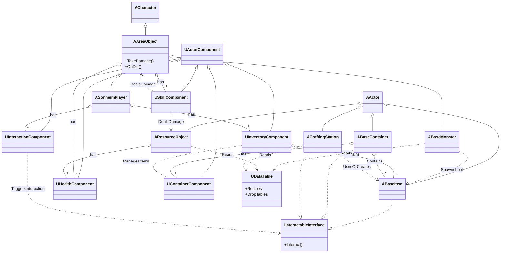

# Sonheim.Source — source-only mirror

> 이 리포는 **소스 코드 전용 미러**입니다.
> 전체 프로젝트(에셋 포함)와 **풀 README**는 원본 리포에서 확인하세요:
> 👉 [Sonheim (Main Repo)](https://github.com/chungheonLee0325/Sonheim)

포함: `Source/`, `Config/`, `Plugins/*/Source`, `Sonheim.uproject`, `Doc/`
제외: `Content/`, `Binaries/`, `Intermediate/`

---

<details><summary><b>Full README (from main repo)</b></summary>

# Sonheim — Multiplayer 3D Action Adventure


**Unreal Engine 5.5 / C++** 기반. 팰월드(Palworld)에서 영감을 받은 **수집·전투·협동** 루프를
처음부터 **완전한 멀티플레이어**로 설계했습니다. 데이터 테이블로 몬스터/플레이어/상자/아이템/자원 등
모든 오브젝트를 운용하여 **컴파일 없이 컨텐츠 추가/밸런스 패치**가 가능합니다.

---

## **✨ 개발 과정 및 기여 내역 (Development Process & Contributions)**

이 프로젝트는 초기 팀 빌딩 단계부터 개인 심화 개발까지 약 5개월(팀 1M + 개인 4M)간 진행되었습니다. **README와 [Git Wiki(Tech Doc)](https://github.com/chungheonLee0325/Sonheim/wiki)에 기술된 모든 기능은 아래 과정 속에서 제가 직접 설계하고 구현**했습니다.

### **🚀 Phase 1: 핵심 기반 구축 (2025.03 ~ 2025.04(1M), 2인 팀)**

* **담당 역할**: 시스템 아키텍트 및 클라이언트 프로그래머  
* **주요 활동**: 프로젝트의 핵심 아키텍처(서버 권위, 데이터 주도)를 설계하고, 기본 전투 시스템(속성, 스킬, 데미지 처리), 플레이어 구현, 자원 및 상호작용 등 게임의 핵심 기반을 구축했습니다.

### **🛠️ Phase 2: 심화 개발 및 완성 (2025.06 ~ 2025.09(4M), 개인)**

* **담당 역할**: 모든 시스템의 단독 개발 및 고도화  
* **주요 활동**: 초기 버전을 기반으로 **팰 포획** 및 **제작(Crafting) 시스템 등 추가 시스템**들을 완성했습니다. 인벤토리와 스킬 시스템의 네트워크 로직을 리팩토링하여 **안정성**과 **반응성(클라이언트 예측)** 을 크게 향상시켰으며, **오브젝트 풀링**, **Fast Array 적용** 등 최적화 작업을 진행했습니다. 또한, 전체 시스템을 완성하고 Wiki/README 문서화를 통해 프로젝트를 마무리했습니다.

---

## 🎬 프로젝트 시연 영상
프로젝트의 주요 결과물과 핵심 기능을 한눈에 볼 수 있는 영상입니다.

 <p align="center">
 <a href="https://www.youtube.com/watch?v=TDRRWp6M_9E">
 
 </a>
 </p>
 <p align="center">
 <a href="https://www.youtube.com/watch?v=TDRRWp6M_9E"><b>▶ YouTube에서 고화질로 시청하기</b></a>
 </p>

---

### 💡 프로젝트 탐색 가이드
> 이 README는 프로젝트의 핵심 기능을 요약한 '쇼케이스'입니다. 더 깊은 기술적 내용이 궁금하다면 Tech Docs를 확인해 보세요.

| 문서                                                                         | 역할                | 내용 |
|:---------------------------------------------------------------------------|:------------------|:---|
| 📋 [Project Gallery](https://github.com/chungheonLee0325/chungheonLee0325) | Root (전체 개요)      | 주요 프로젝트 목록, 핵심 역량 요약        |
| 📁 **Repository README**                                                   | **What (개요)**     | 프로젝트 요약, 데모 영상, 핵심 기능 목록 |
| 🔗 [Tech Docs (Wiki)](https://github.com/chungheonLee0325/Sonheim/wiki)   | How & Why (상세 구현) | 코드 분석, 설계 과정, 기술 회고, 트러블슈팅 |

---

## 목차 (Table of Contents)

1.  [팰 포획 시스템](#팰-포획-시스템-pal-capture-system)
2.  [아이템 및 상호작용 시스템](#아이템-및-상호작용-시스템-items--interaction)
3.  [전투 및 피드백 시스템](#전투-및-피드백-시스템-combat--feedback)
4.  [플레이어 액션 및 스킬 시스템](#플레이어-액션-및-스킬-시스템-player-actions--skills)
5.  [멀티플레이 아키텍처 및 세션](#멀티플레이-아키텍처-및-세션-multiplayer--session)


---

## 주요 기능 (Implemented Features)

###  팰 포획 시스템 (Pal Capture System)
> 팰월드의 핵심 재미인 몬스터 포획 시스템을 구현했습니다. 플레이어는 팰 스피어를 조준하여 던질 수 있으며, 조준 중인 대상 몬스터의 HP에 따라 실시간으로 계산되는 포획 확률을 UI로 확인할 수 있습니다. 포획 시도 시, 서버는 성공 여부를 즉시 판정하지만, 클라이언트에서는 긴장감 넘치는 연출 시퀀스가 재생된 후 최종 결과가 공개됩니다.
>
> 🔗 **관련 위키:** [8.1 Case Study: Pal Capture Sequence](https://github.com/chungheonLee0325/Sonheim/wiki/8.1_Case_Study_Pal_Capture_Sequence)

► **주요 기술:**
1.  **조준:** `UInteractionComponent`가 전방의 몬스터를 탐지하고, `UPalCaptureComponent`는 이 정보를 받아 `CalculateCaptureRate` 함수로 HP 기반 포획률을 실시간 계산하여 UI에 표시합니다.
2.  **투척:** `SuggestProjectileVelocity_CustomArc` 함수를 사용하여 목표 지점을 향하는 자연스러운 포물선 궤도를 계산하고 `APalSphere`를 발사합니다.
3.  **판정 및 연출:** 서버는 포획 성공 여부를 즉시 판정하고, `Multicast` RPC로 연출 데이터만 클라이언트에 전송합니다. 클라이언트의 `UCaptureProgressWidget`은 이 데이터를 받아 연출을 "지휘"하고, 서버는 연출 시간에 맞춰 실제 결과를 게임 월드에 적용합니다.

#### 시연 영상 - 팰 포획 기능
https://github.com/user-attachments/assets/57246d79-bd3b-473f-85fc-762670023729


### 아이템 및 상호작용 시스템 (Items & Interaction)
> 클라이언트 예측을 적용한 반응형 인벤토리, 데이터 기반 제작 시스템, 그리고 네트워크 최적화가 적용된 공유 보관함을 구현했습니다.
>
> 🔗 **관련 위키:** [6.1 Unified Interaction System](https://github.com/chungheonLee0325/Sonheim/wiki/6.1-Unified-Interaction-System), [8.4 Case Study: Inventory Interaction](https://github.com/chungheonLee0325/Sonheim/wiki/8.4_Case_Study_Inventory_Interaction), [8.2 Case Study: Server-Authority Crafting](https://github.com/chungheonLee0325/Sonheim/wiki/8.2_Case_Study_Server_Authority_Crafting)

► **주요 기술:**
*   **인벤토리 (반응성):** `PerformClientPrediction_...` 함수로 UI를 먼저 업데이트(낙관적 업데이트)하고, 서버 RPC로 실제 처리를 요청합니다. 서버의 최종 데이터가 도착하면 `OnRep` 함수가 UI 상태를 보정하여 데이터 정합성을 100% 보장합니다. 또한, `UInventoryComponent`와 `UContainerComponent` 모두 `FFastArraySerializer`를 사용하여 변경된 슬롯만 전송하는 **델타 복제**로 네트워크 부하를 극단적으로 줄였습니다.
*   **제작 (동시성 제어):** `ACraftingStation`의 `UIOwner` 변수를 일종의 Mutex로 사용하여, 여러 플레이어가 동시에 제작 UI를 열려고 할 때 발생하는 경쟁 상태(Race Condition)를 방지합니다.
*   **보관함 (네트워크 최적화):** `UContainerComponent`의 `PreReplication` 함수에서 구독자(`Subscribers`) 유무를 확인하여, `DOREPLIFETIME_ACTIVE_OVERRIDE` 매크로로 아이템 목록의 복제를 동적으로 활성화/비활성화하는 **구독 기반 복제**를 구현했습니다.

#### 시연 영상 - 인벤토리, 상자 기능
https://github.com/user-attachments/assets/c594e8a3-2840-456c-ae04-cabaaeb4d8ca


### ️전투 및 피드백 시스템 (Combat & Feedback)
> 9가지 원소 속성 간의 상성 관계를 적용한 전략적인 전투 시스템을 구현했습니다. 공격은 `ApplyDamage`라는 단일 함수로 시작되지만, `TakeDamage` 가상 함수를 오버라이드한 대상(몬스터, 자원 등)에 따라 전혀 다른 결과(피해, 자원 생성)가 발생하는 다형적 구조입니다. 타격 시 히트스톱, 넉백과 함께, 속성, 약점 여부에 따라 색상과 스타일이 변하는 플로팅 데미지 UI가 표시됩니다.
>
> 🔗 **관련 위키:** [3.5 Combat and Feedback System](https://github.com/chungheonLee0325/Sonheim/wiki/3.5-Combat-and-Feedback-System), [8.3 Case Study: Melee Attack](https://github.com/chungheonLee0325/Sonheim/wiki/8.3_Case_Study_Melee_Attack)

► **주요 기술:**
*   **템플릿 메서드 패턴:** `AAreaObject::TakeDamage`를 템플릿 메서드로 사용하여, `ABaseMonster`(HP 감소), `ABaseResourceObject`(자원 생성) 등 각 클래스가 피격 반응을 자신만의 로직으로 재정의(Override)합니다.
*   **데이터 기반 상성:** `USonheimUtility` 클래스에 `static const` 2D 배열로 9x9 상성 데미지 배율표를 정의하여, 컴파일 타임에 규칙을 확정하고 빠른 조회를 보장합니다.
*   **오브젝트 풀링:** `AFloatingDamagePool` 싱글톤 매니저가 `AFloatingDamageActor`를 재활용하여, 다수의 데미지 숫자가 표시될 때의 UI 생성 오버헤드를 제거하고 성능을 안정화했습니다.


### 플레이어 액션 및 스킬 시스템 (Player Actions & Skills)
> `Enhanced Input`을 기반으로 캐릭터의 모든 행동을 `UBaseSkill`이라는 객체로 캡슐화했습니다. 구르기, 달리기, 공격 등 모든 행동은 독립된 스킬 객체이며, 데이터 테이블에 애니메이션, 이펙트, 비용 등을 정의하여 관리합니다. 특히 무기 교체 시, `OnWeaponChanged` 델리게이트가 `StatBonusComponent`와 `SkillComponent`에 변경사항을 전파하여 플레이어의 스탯과 사용 가능한 공격 스킬이 실시간으로 업데이트됩니다.
>
> 🔗 **관련 위키:** [3.3 Skill Architecture](https://github.com/chungheonLee0325/Sonheim/wiki/3.3-Skill-Architecture), [4.1 Player Character Control](https://github.com/chungheonLee0325/Sonheim/wiki/4.1-Player-Character-Control)

► **주요 기술:**
*   **커맨드 패턴:** 모든 행동을 `UBaseSkill`(`Command`)로 객체화하고, `USkillComponent`(`Invoker`)를 통해 실행하여 행동의 재사용성과 확장성을 확보했습니다.
*   **데이터 기반 스킬:** `FSkillData` 구조체와 데이터 테이블을 통해 스킬의 속성(애니메이션, 비용, 쿨다운)을 정의하므로, C++ 코드 변경 없이 새로운 스킬을 쉽게 추가할 수 있습니다.
*   **글라이더:** `ReplicatedUsing` 변수로 상태를 동기화하고, `OnRep` 함수 내에서 `CharacterMovementComponent`의 물리 값(중력, 마찰력)을 동적으로 제어하여 활강을 구현했습니다.


### 멀티플레이 아키텍처 및 세션 (Multiplayer & Session)
> 모든 기능은 서버 권위(Server-Authoritative) 모델을 기반으로 설계되었으며, Steam API를 연동하여 멀티플레이 세션 생성, 검색, 참여 기능을 구현했습니다. 복잡한 Online Subsystem(OSS) 로직은 `FSessionUtil` 유틸리티 클래스에 캡슐화하여 다른 시스템과의 결합도를 낮췄습니다.
>
> 🔗 **관련 위키:** [2.1 Server Authority Architecture](https://github.com/chungheonLee0325/Sonheim/wiki/2.1-Server-Authority-Architecture)

► **주요 기술:**
*   **서버 권위 모델:** 모든 핵심 게임플레이 판정(데미지, 아이템 이동 등)은 서버에서만 이루어져 데이터 정합성과 보안을 100% 보장합니다.
*   **RPC 중계 패턴:** 클라이언트가 소유권이 없는 액터(보관함 등)와 상호작용할 때, 자신의 `PlayerController`를 통해 서버 RPC를 중계하여 모든 요청의 진입점을 중앙화하고 안전하게 검증합니다.
*   **비동기 처리:** 세션 생성, 검색 등 모든 네트워크 작업은 비동기적으로 처리되고, 작업 완료 시 `GameInstance`에 등록된 델리게이트를 콜백으로 호출하여 UI 반응성을 유지합니다.


---
## 시스템 개요 (아키텍처)

```mermaid
classDiagram
    direction TB

    class ACharacter
    class AActor
    class UActorComponent

    class AAreaObject {
        +TakeDamage()
        +OnDie()
    }
    class ASonheimPlayer
    class ABaseMonster
    class AResourceObject
    class ABaseItem
    class ABaseContainer
    class ACraftingStation

    class UHealthComponent
    class USkillComponent
    class UInteractionComponent
    class UInventoryComponent
    class UContainerComponent

    class IInteractableInterface {
        +Interact()
    }
    class UDataTable{
        +Recipes
        +DropTables
    }

%% Inheritance
    ACharacter <|-- AAreaObject
    AAreaObject <|-- ASonheimPlayer
    AAreaObject <|-- ABaseMonster

    AActor <|-- AResourceObject
    AActor <|-- ABaseItem
    AActor <|-- ABaseContainer
    AActor <|-- ACraftingStation

    UActorComponent <|-- UHealthComponent
    UActorComponent <|-- USkillComponent
    UActorComponent <|-- UInteractionComponent
    UActorComponent <|-- UInventoryComponent
    UActorComponent <|-- UContainerComponent

%% Composition / Aggregation
AAreaObject o-- "1" UHealthComponent : has
AAreaObject o-- "1" USkillComponent  : has
AResourceObject o-- "1" UHealthComponent : has
ASonheimPlayer o-- "1" UInventoryComponent : has
ASonheimPlayer o-- "1" UInteractionComponent : has
ABaseContainer o-- "1" UContainerComponent : has

%% Interface Implementation
ABaseItem ..|> IInteractableInterface
ABaseContainer ..|> IInteractableInterface
ACraftingStation ..|> IInteractableInterface

%% Item & Loop Relations
ABaseMonster ..> ABaseItem : SpawnsLoot
UInventoryComponent o-- "*" ABaseItem : Contains
ABaseContainer   o-- "*" ABaseItem : Contains
ACraftingStation ..> ABaseItem : UsesOrCreates

%% Key Dependencies
UInteractionComponent ..> IInteractableInterface : TriggersInteraction
USkillComponent ..> AAreaObject     : DealsDamage
USkillComponent ..> AResourceObject : DealsDamage
UInventoryComponent .. UContainerComponent : ManagesItems

%% Data Lookups
ABaseMonster    ..> UDataTable : Reads
AResourceObject ..> UDataTable : Reads
ACraftingStation..> UDataTable : Reads
```

---

## 📖 상세 기술 위키 (Technical Wiki)

> 본 프로젝트의 상세한 아키텍처, 전체 시스템 설계, 각 클래스의 역할, 핵심 코드 분석, 그리고 프로젝트 회고에 대한 내용은 아래 기술 위키에서 확인하실 수 있습니다.
> 
> ### **➡️ [프로젝트 기술 위키 바로가기 (Click here for the Project's Technical Wiki)](https://github.com/chungheonLee0325/Sonheim/wiki)**

---

## **개발 과정 요약 (Development Overview)**
> 6개월간의 개발 과정을 월별로 요약했습니다. 각 항목에 대한 자세한 내용은 전체 개발 일지에서 확인하실 수 있습니다.\
> ➡️ **[전체 개발 일지 보러가기](https://github.com/chungheonLee0325/Sonheim/wiki/10.1_Development_History)**
*   **(25.09) 프로젝트 안정화 및 문서화** : Wiki 시스템을 개편하고 인벤토리 시스템 안정화 및 주요 버그를 수정했습니다.
*   **(25.08) 게임플레이 시스템 확장** : 상자(Chest) 컨테이너와 제작(Crafting) 시스템을 완성하고 전투 시스템을 고도화했습니다.
*   **(25.07) 전투 경험 다양화** : 신규 무기 'Shotgun'을 추가하고 아이템 희귀도 시스템을 도입했으며, 피드백을 강화했습니다.
*   **(25.06) 아키텍처 리팩토링 및 성능 최적화** : 'Pal' 시스템을 컴포넌트로 분리하고 Object Pooling을 적용해 성능을 최적화했습니다.
*   **(25.04) 월드 탐험 및 콘텐츠 확장** : 'Glider' 이동 시스템을 도입하고 보스 몬스터 등 월드 콘텐츠를 추가했습니다.
*   **(25.03) 핵심 시스템 기반 구축** : Player, Inventory, Skill System 등 핵심 시스템의 기반과 네트워크 아키텍처를 확립했습니다.

---

## 프로젝트 구조
```
Sonheim/
├─ Animation/           # AnimInstance, Notifies
├─ AreaObject/          # AI(FSM), Attribute, Base, Monster, Player, Skill, Utility
├─ Element/             # 발사체/효과 액터
├─ GameManager/         # GameInstance, GameMode, GameState
├─ GameObject/          # Items, Buildings/Storage(Container), ResourceObject
├─ ResourceManager/     # SonheimGameType(Enums/Structs)
├─ UI/                  # Widgets, FloatingDamageActor
└─ Utilities/           # LogMacro, SessionUtil, SonheimUtility
```

--- 

## 설치 & 실행

1) **요구사항**: Unreal Engine 5.5, Visual Studio 2022 (C++), (멀티 테스트 시) Steam 클라이언트 실행
2) **빌드**: `Sonheim.uproject` 우클릭 → *Generate Visual Studio project files* → `Sonheim.sln` 열어 `Development Editor` 구성으로 `Sonheim` 빌드
3) **실행**: 에디터에서 `Lobby` 또는 `Game` 맵 열기 → **Play**
   - Net Mode: *Listen Server / Client* 또는 Standalone 다중 인스턴스

---

## 주요 조작키

* **이동:** W, A, S, D
* **시점 조작:** 마우스 이동
* **공격/상호작용:** 마우스 좌클릭
* **조준/보조 액션:** 마우스 우클릭
* **점프/글라이더:** 스페이스 바 (공중에서 Space 홀드하면 글라이더 유지, V 로 글라이더 토글 가능)
* **질주:** Shift
* **회피:** Ctrl
* **재장전:** R
* **무기 전환:** 마우스 휠
* **상호작용 / 파트너 스킬:** F
* **팰 소환/회수:** E
* **팰 전환:** 1, 3
* **팰 스피어 던지기:** Q (누르고 떼기)
* **상호작용:** F
* **메뉴:** Tab

---

</details>

